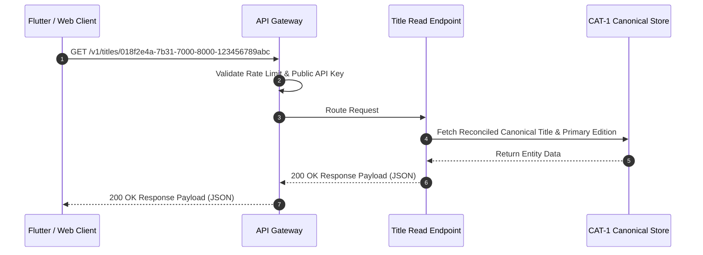
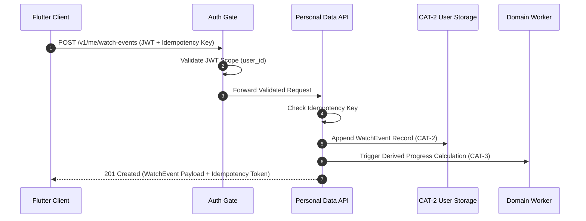
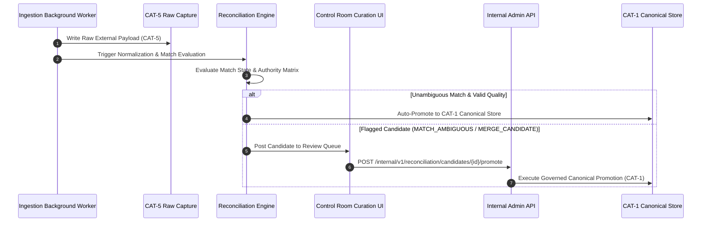
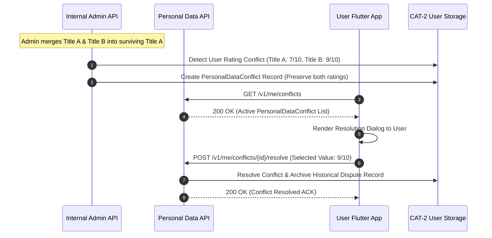

# CineVault OS — API Specification V1

**Document Type:** Master API Architecture Specification  
**Status:** Architecture Baseline Specification (Post-Owner Approval Pass — Approved with Deferred API Decisions)  
**Date:** 2026-08-08  
**Scope:** Client API Contracts, Internal Operational APIs, Personal Data Boundaries, Offline Sync Protocol, Ingestion & Reconciliation Interfaces, Idempotency, Error Models, and Resource Matrices  

---

## 1. Purpose

The purpose of the **CineVault OS API Specification V1** is to define the formal conceptual interface contract governing interactions between CineVault clients (Web, Mobile, Desktop), internal background services, and external administrative operations.

This specification ensures that CineVault's canonical entertainment domain (`CAT-1`) and user-owned personal data (`CAT-2`) are exposed securely, deterministically, and with complete isolation from external provider mechanics, raw ingestion staging (`CAT-5`), and unverified AI proposals (`CAT-6`).

---

## 2. Scope

### In-Scope
* Conceptual API boundary definition (Public Client API vs Internal Operational API vs Provider Integration Boundary).
* Canonical identity routing enforcing **ADR-001** (UUIDv7 resource keys, display ID lookups, external ID mappings).
* Read API contracts for Titles, Editions, Releases, Seasons, Episodes, Franchises, People, Credits, Awards, Festivals, and Platform Offers.
* Write API permission boundaries (Client-Writable vs Read-Only vs Admin-Writable vs System-Writable).
* Personal Data API contracts adhering to **ADR-003** (Append-only Watch Events, UserTitleState, Ratings, Notes, Reviews).
* Offline Synchronization API Protocol adhering to **ADR-004** (Outbox mutation pushing, pull deltas, sync cursors, sequence tracking, idempotency).
* Personal Data Conflict API contracts (`PersonalDataConflict`, `UserSplitResolution`).
* Internal Ingestion & Control Room Curation API contracts (Ingestion run inspection, reconciliation candidate review, promotion approval/rejection).
* Provenance and evidence disclosure APIs.
* Rights and licensing isolation rules (Metadata vs Media/Image rights).
* AI proposal API rules (`CAT-6` proposal governance).
* Canonical Search API specification.
* Error model, status codes, cursor-based pagination, rate-limiting, and security boundaries.
* OpenAPI 3.1 contract recommendation.
* Resource ownership, access, and authorization matrices.
* 5 Mermaid architecture sequence and flow diagrams.
* Representative API request/response specification examples.

### Out-of-Scope (Prohibited in this Phase)
* Application code, FastAPI routes, Python controllers, services, repositories.
* Database code, PostgreSQL DDL, tables, indexes, migrations, ORM models.
* API client libraries, provider adapters, scraping scripts.
* Authentication middleware implementation, rate-limiting code, Redis caching scripts.
* Background workers, sync queue processors, production deployment configurations.

---

## 3. Architectural Principles

1. **Canonical Identity Independence (ADR-001):** API path parameters use internally generated **UUIDv7** identifiers (e.g. `/v1/titles/{uuidv7}`). Human-readable display IDs (`MOV-000001`) and external provider IDs (TMDb, TVDB, KOBIS, Wikidata Q-ID) exist as secondary query parameters or sub-resource lookups, NEVER as canonical path keys.
2. **Strict Domain Model Representation (ADR-002):** API contracts reflect CineVault's `Title -> Edition -> Release` and `Title -> Season -> Episode` domain hierarchies. Raw provider-specific schemas MUST NOT leak into public client endpoints.
3. **Personal Data Isolation & Non-Destruction (ADR-003, ADR-004):** `CAT-2` User-Owned Personal Data endpoints are isolated from canonical catalog updates. Watch Events are append-only. Personal data conflicts generated during canonical entity merges/splits are surfaced for explicit user resolution and CANNOT be silently overwritten or deleted.
4. **Offline Synchronization & Idempotency (ADR-004):** State-changing client mutations receive stable client-generated UUIDv7 `mutation_id` keys to ensure deterministic idempotency during offline sync retries.
5. **Separation of API Boundaries:** Public Client APIs, Internal Administrative APIs, and Provider Integration Boundaries are logically separated with distinct authorization rules and schemas.
6. **Metadata vs. Media Rights Segregation:** Metadata availability does NOT imply image hosting or proxy rights. Media responses return authorized CDN URLs or license status flags.
7. **AI Proposal Isolation (ADR-004):** AI-generated suggestions are exposed exclusively via `CAT-6` proposal endpoints. AI endpoints CANNOT directly write to `CAT-1` Canonical Platform Data.
8. **Explainable Decision Lineage:** Authorized clients and curators can inspect field provenance and evidence lineage ("Why CineVault believes this fact").
9. **Deterministic Error Responses:** All API errors conform to a standard, structured error payload with stable error codes, correlation IDs, and field-level validation detail.
10. **OpenAPI-Compatible Specification:** Contracts are structured so that an unambiguous OpenAPI 3.1 specification can be compiled during the physical implementation phase.

---

## 4. Terminology

* **Public Client API:** The RESTful interface consumed by end-user mobile apps, web applications, and desktop clients (`/v1/...`).
* **Internal Operational API:** Administrative and curation endpoints consumed by internal control room interfaces and background pipelines (`/internal/v1/...`).
* **Sync Cursor:** An opaque, sequential change marker used by clients to fetch incremental delta updates from the server.
* **Mutation ID:** A unique UUIDv7 generated by a client for a state-changing operation to enforce idempotency.
* **Derived Progress:** Read-only computed viewing statistics generated on-demand or cached from append-only Watch Events (`CAT-3`).
* **Evidence Lineage:** Provenance metadata explaining the source, timestamp, and authority rule behind a canonical value.

---

## 5. API Boundaries

The CineVault API is partitioned into three distinct logical boundaries:

```text
┌─────────────────────────────────────────────────────────────────────────────────┐
│                           CINEVAULT API BOUNDARIES                              │
├───────────────────────────┬───────────────────────────┬─────────────────────────┤
│ PUBLIC CLIENT API         │ INTERNAL OPERATIONAL API  │ PROVIDER INTEGRATION    │
│ Endpoint Prefix: `/v1/`   │ Prefix: `/internal/v1/`   │ Boundary (Background)   │
├───────────────────────────┼───────────────────────────┼─────────────────────────┤
│ Consumed by:              │ Consumed by:              │ Consumed by:            │
│ • Flutter Client          │ • Control Room Curation UI│ • Ingestion Connectors  │
│ • Web Application         │ • System Monitoring       │ • License Gate Checker  │
│ • Public Integrations     │ • Admin Tools             │ • Raw Payload Capture   │
├───────────────────────────┼───────────────────────────┼─────────────────────────┤
│ Features:                 │ Features:                 │ Features:               │
│ • Canonical Catalog Read  │ • Ingestion Run Audits    │ • Rate-limited Fetch    │
│ • Personal Data Mutations │ • Reconciliation Curation │ • Raw Staging (CAT-5)   │
│ • Offline Sync Protocol   │ • Merge/Split Governance  │ • Checkpoint Triggers   │
│ • Search & Discovery      │ • AI Proposal Validation  │ • Zero Public Access    │
└───────────────────────────┴───────────────────────────┴─────────────────────────┘
```

> [!IMPORTANT]
> External metadata provider APIs (e.g. TMDb REST, Wikidata SPARQL, TheTVDB API) are NEVER exposed directly through the Public Client API. All public data flows strictly from `CAT-1` Canonical Platform Data.

---

## 6. Canonical Identity & Resource Model

API resources directly mirror the approved CineVault domain model. Resources are identified by internal UUIDv7 keys in request paths.

```text
/v1/titles/{title_id}
/v1/titles/{title_id}/editions/{edition_id}
/v1/titles/{title_id}/editions/{edition_id}/releases/{release_id}
/v1/titles/{title_id}/seasons/{season_id}
/v1/seasons/{season_id}/episodes/{episode_id}
/v1/people/{person_id}
/v1/franchises/{franchise_id}
/v1/awards/{award_id}
/v1/festivals/{festival_id}
/v1/me/watch-events
/v1/me/title-states/{title_id}
/v1/me/ratings
/v1/me/notes
/v1/me/reviews
/v1/me/conflicts
```

### Identifier Routing Rules
1. **Canonical Path Lookup:** `GET /v1/titles/018f2e4a-7b31-7000-8000-123456789abc` (Primary lookup by UUIDv7).
2. **Display ID Lookup:** `GET /v1/titles/lookup?display_id=MOV-000001` (Secondary lookup redirecting to UUIDv7).
3. **External ID Mapping Lookup:** `GET /v1/titles/lookup?provider=TMDB&external_id=550` (Resolves provider mapping to internal UUIDv7).
4. **Immutable Identity Invariant:** Changing classification (`content_type`) or provider mappings MUST NEVER alter the entity's UUIDv7 primary key or display ID (`ADR-001`).

---

## 7. Read API Contracts

Read endpoints provide access to reconciled canonical metadata (`CAT-1`).

### Query Parameters & Conventions
* **Filtering:** Standardized field filters (e.g. `?content_type=MOVIE`, `?production_year=2023`, `?origin_country=KR`).
* **Sorting:** Format: `?sort=-production_year,canonical_title` (`-` prefix denotes descending order).
* **Pagination:** Opaque cursor-based pagination: `?limit=25&cursor=eyJpZCI6IjAxOGYyZ...`.
* **Expansion (`include`):** Controlled graph expansion to prevent N+1 payload queries (e.g. `?include=primary_edition,genres,credits`).
* **Search Semantics:** Multi-field, script-normalized search (`?q=Parasite`).

---

## 8. Write API Contracts & Access Boundaries

To protect canonical data integrity and isolate personal data, write permissions are categorized across 5 access classes:

```text
┌─────────────────────────┬───────────────────────────────┬───────────────────────────────────────────┐
│ Resource Category       │ Permitted HTTP Verbs          │ Access Permission Class                   │
├─────────────────────────┼───────────────────────────────┼───────────────────────────────────────────┤
│ Canonical Catalog Data  │ `GET` Only                    │ `READ_ONLY` for Public Clients;           │
│ (`CAT-1`)               │ (`POST`/`PATCH` Admin Only)   │ `ADMIN_WRITE` via Internal API            │
├─────────────────────────┼───────────────────────────────┼───────────────────────────────────────────┤
│ User Personal Data      │ `GET`, `POST`, `PATCH`,       │ `CLIENT_WRITABLE` (Authenticated User    │
│ (`CAT-2`)               │ `DELETE`                      │ scoped to `/v1/me/...`)                   │
├─────────────────────────┼───────────────────────────────┼───────────────────────────────────────────┤
│ Derived Read Models     │ `GET` Only                    │ `SYSTEM_WRITABLE` (Calculated in          │
│ (`CAT-3`)               │                               │ background by domain services)            │
├─────────────────────────┼───────────────────────────────┼───────────────────────────────────────────┤
│ Raw Ingestion Payloads  │ `GET` Internal Only           │ `INGESTION_WRITABLE` (Ingestion background│
│ (`CAT-5`)               │                               │ pipelines only)                           │
├─────────────────────────┼───────────────────────────────┼───────────────────────────────────────────┤
│ AI Proposal Candidates  │ `GET`, `POST` Internal Only   │ `AI_SYSTEM` proposal submission;          │
│ (`CAT-6`)               │                               │ requires human curation promotion         │
└─────────────────────────┴───────────────────────────────┴───────────────────────────────────────────┘
```

---

## 9. Personal Data API Contracts (ADR-003)

Personal data endpoints (`/v1/me/...`) govern user-owned entertainment logs.

### Personal Data Governance Rules
1. **Append-Only Watch Events:** `POST /v1/me/watch-events` creates immutable historical log entries. Watch events cannot be updated in-place. Corrections use tombstone / replacement references (`ADR-003`).
2. **Title-Scoped Ratings:** `POST /v1/me/ratings` updates or creates user title ratings (1–10 scale). Ratings are Title-scoped by default.
3. **Distinct Notes vs. Reviews:** `POST /v1/me/notes` (private personal notes) is strictly isolated from `POST /v1/me/reviews` (potentially publishable reviews with distinct privacy rules).
4. **Zero Silent Merges:** Merges of canonical titles NEVER merge or average user ratings or watch events (`ADR-003`).

---

## 10. User Title State API

User Title State manages library membership, watch status, and preferred edition selection.

```text
UserTitleState
├── derived_status          (Read-only, calculated from WatchEvents)
├── manual_status_override  (User explicit override: COMPLETED, WATCHING, PLAN_TO_WATCH, DROPPED)
├── is_favorite             (Boolean current state)
├── preferred_edition_id    (Optional UUIDv7 FK to Edition)
└── updated_at              (Timestamp)
```

* Endpoints: `GET /v1/me/title-states/{title_id}`, `PATCH /v1/me/title-states/{title_id}`.
* The exact status transition state machine remains deferred; the API accepts valid status enums while preserving manual vs derived state separation.

---

## 11. Offline Synchronization API Protocol (ADR-004)

The Synchronization API supports durable, offline-first client mutations using the Outbox pattern.

```text
Client Local Storage ──▶ Durable Outbox Queue ──▶ POST /v1/sync/push ──▶ Server Idempotency Check ──▶ Domain Commit
                                                                                                        │
Client Local Storage ◀── ACK + Updated Cursor ◀── GET /v1/sync/pull  ◀── Server Change Stream ──────────┘
```

### Sync Protocol Endpoints
1. `POST /v1/sync/push`: Submits a batch of client mutations recorded while offline.
2. `GET /v1/sync/pull`: Retrieves server-side delta changes occurring since the client's last `sync_cursor`.

### Push Mutation Payload Structure
Each pushed mutation contains:
* `mutation_id` (UUIDv7, generated by client at action time)
* `mutation_type` (Enum: `CREATE_WATCH_EVENT`, `SET_RATING`, `UPSERT_NOTE`, `UPDATE_TITLE_STATE`)
* `client_timestamp` (ISO-8601 UTC)
* `payload` (JSON mutation parameters)

### Pull Response Payload Structure
* `sync_cursor` (Opaque string for subsequent pull)
* `has_more` (Boolean)
* `changes` (Array of changed entity records with sequence version tokens)

---

## 12. Idempotency Specification

State-changing API operations (mutations, watch events, ratings, sync pushes) enforce strict idempotency to prevent duplicate side-effects during retries or network failures.

### Idempotency Header & Mechanics
* Clients supply header: `X-Idempotency-Key: <UUIDv7>` (or pass `mutation_id` in sync payload).
* The API records processing status for every `(user_id, idempotency_key)` tuple.
* Re-sending a request with an identical idempotency key returns the cached successful response without re-executing domain mutations.

---

## 13. Personal Data Conflict API

When canonical entity merges or splits occur, ambiguous user-owned data generates conflict records that clients fetch and resolve through explicit user choices.

### Conflict Endpoints
1. `GET /v1/me/conflicts`: Retrieves active user conflicts (`PersonalDataConflict` or `UserSplitResolution`).
2. `POST /v1/me/conflicts/{conflict_id}/resolve`: Submits the user's explicit resolution choice (e.g. selecting which rating to preserve, or re-associating a watch event to a split title).

---

## 14. Internal Ingestion & Operational API

Internal administrative endpoints (`/internal/v1/...`) support operational control, ingestion monitoring, and human curation workflows.

### Administrative & Curation Endpoints
* `GET /internal/v1/ingestion/runs`: Inspects historical and active ingestion pipeline execution telemetry.
* `GET /internal/v1/ingestion/raw-payloads/{raw_payload_id}`: Retrieves immutable raw provider payload (`CAT-5`).
* `GET /internal/v1/reconciliation/candidates`: Fetches reconciliation candidate matches flagged as `REQUIRES_REVIEW`, `MATCH_AMBIGUOUS`, `MERGE_CANDIDATE`, or `SPLIT_CANDIDATE`.
* `POST /internal/v1/reconciliation/candidates/{candidate_id}/promote`: Approves human curation decision and promotes record to `CAT-1` Canonical Platform Data.
* `POST /internal/v1/reconciliation/candidates/{candidate_id}/reject`: Rejects candidate payload with logged audit rationale.

---

## 15. Provider Isolation Boundaries

Public client API contracts (`/v1/...`) MUST NOT contain provider-specific raw fields or leak external API structures.

```text
┌───────────────────────────────────────────────────────────────────┐
│                      ISOLATION MAPPER LAYER                       │
├───────────────────────────────────┬───────────────────────────────┤
│ External Provider Payload (CAT-5) │ Public API Response (CAT-1)   │
├───────────────────────────────────┼───────────────────────────────┤
│ `tmdb_id: 550`                    │ `id: "018f2e4a-..." (UUIDv7)` │
│ `original_name: "Fight Club"`     │ `original_title: "Fight Club"`│
│ `vote_average: 8.4`               │ Excluded from public canonical│
│ `poster_path: "/adw2..."`         │ `poster_url: "https://..."`   │
└───────────────────────────────────┴───────────────────────────────┘
```

External provider IDs are exposed exclusively via the `external_mappings` sub-resource or array when explicitly requested by authorized clients.

---

## 16. Provenance API

Authorized clients, curators, and audit processes can query field-level provenance to inspect attribute lineage.

### Provenance Sub-Resource Endpoint
`GET /v1/titles/{title_id}/provenance`

Returns:
* `field_name` (e.g. `"canonical_title"`, `"production_year"`)
* `source_provider` (e.g. `"KOBIS"`, `"TMDB"`, `"WIKIDATA"`)
* `observation_timestamp` (ISO-8601 UTC)
* `applied_rule_id` (e.g. `"RULE-KOREAN-FILM-PRIMARY-KOBIS"`)
* `is_manually_overridden` (Boolean)

---

## 17. Rights & Licensing API Rules

1. **Segregated Rights Evaluation:** Structured metadata rights and image/media rights are governed independently.
2. **Authorized Media URLs:** `poster_url` and `backdrop_url` attributes return fully resolved HTTPS URLs from CineVault's authorized CDN proxy or permissioned partner endpoints. Unlicensed image references return `null`.
3. **Fallback Media Flag:** Responses include `has_licensed_artwork` boolean to allow client UI to render localized placeholder artwork cleanly.

---

## 18. AI-Generated Data API Rules (ADR-004)

1. **`CAT-6` Proposal Endpoints:** AI suggestions (e.g. auto-generated synopses, keyword tags) are accessible ONLY via `/internal/v1/ai/proposals`.
2. **Mandatory Tagging:** All AI responses carry `provenance_type = "AI_GENERATED"`, model identifier, and proposal confidence.
3. **Canonical Write Prohibition:** AI proposal endpoints CANNOT directly insert or mutate `CAT-1` canonical entities. Promotion requires clearing the human review curation gate.

---

## 19. Search API Specification

The Search API (`GET /v1/search`) supports unified multi-entity discovery across Titles, People, Franchises, Awards, and Festivals.

### Search Request Parameters
* `q`: Raw query string (script-normalized, unicode-folded).
* `type`: Entity filter (`TITLE`, `PERSON`, `FRANCHISE`, `AWARD`, `FESTIVAL`, `ALL`).
* `content_type`: Title classification filter (`MOVIE`, `TV_SERIES`, `ANIME`).
* `year`: Release year filter.
* `limit` / `cursor`: Pagination controls.

### Search Response Payload
Returns structured search results sorted by relevance, with match highlight metadata and canonical UUIDv7 references.

---

## 20. Error Model & Status Codes

All API errors return a standardized JSON error response with HTTP status codes adhering to RFC 7807 problem details semantics:

```json
{
  "error": {
    "code": "ENTITY_NOT_FOUND",
    "message": "The requested Title entity was not found.",
    "status": 404,
    "correlation_id": "req_018f2e4a_99a1",
    "timestamp": "2026-08-08T12:00:00Z",
    "details": [
      {
        "field": "title_id",
        "issue": "No Title exists with UUIDv7 018f2e4a-7b31-7000-8000-000000000000"
      }
    ]
  }
}
```

### Standardized Status Codes
* **`400 Bad Request`:** Invalid syntax or malformed JSON payload.
* **`401 Unauthorized`:** Missing or invalid authentication token.
* **`403 Forbidden`:** Insufficient privileges for action or resource scope.
* **`404 Not Found`:** Target entity UUIDv7 or path does not exist.
* **`409 Conflict`:** Idempotency key conflict or state transition failure.
* **`422 Validation Error`:** Business rule validation failure (field range, required parameters).
* **`429 Rate Limited`:** Client exceeded API request quota.
* **`500 Internal Error`:** Unexpected server error.
* **`503 Dependency Unavailable`:** Downstream service or storage temporarily unavailable.

---

## 21. API Versioning Strategy

1. **URI Path Versioning:** All public endpoints use explicit major version prefixes (`/v1/...`).
2. **Non-Breaking Changes:** Adding optional response attributes, new query parameters, or new endpoints is non-breaking and does NOT bump major version.
3. **Breaking Change Policy:** Removing attributes, altering attribute data types, or changing path structures requires a new major version prefix (`/v2/...`) alongside a minimum 180-day sunset deprecation window.

---

## 22. Pagination Specification

All collection endpoints (`GET /v1/titles`, `GET /v1/me/watch-events`, `GET /v1/sync/pull`) enforce **Cursor-Based Pagination**.

```json
{
  "data": [ ... ],
  "pagination": {
    "next_cursor": "eyJpZCI6IjAxOGYyZTRhLTdiMzEtNzAwMC04MDAwLTEyMzQ1Njc4OWFiYyIsInRzIjoxNzIzMTIxNjAwMDAwfQ==",
    "has_more": true,
    "limit": 25
  }
}
```

Cursor tokens are base64-encoded, opaque change-sequence or primary key pointers that guarantee stable page iteration even during ongoing record insertions.

---

## 23. Rate Limiting Policy

Rate limiting is enforced at the API gateway layer per client identity / IP:

```text
┌─────────────────────────┬───────────────────────────────┬───────────────────────────────┐
│ API Scope               │ Request Limit                 │ Burst Capacity                │
├─────────────────────────┼───────────────────────────────┼───────────────────────────────┤
│ Public Read API (`/v1`) │ 600 requests / minute         │ 100 requests / burst          │
│ Search API (`/search`)  │ 120 requests / minute         │ 20 requests / burst           │
│ Sync API (`/sync`)      │ 60 requests / minute          │ 10 requests / burst           │
│ Personal Data Write     │ 120 requests / minute         │ 30 requests / burst           │
│ Internal Admin API      │ 1,200 requests / minute       │ 200 requests / burst          │
└─────────────────────────┴───────────────────────────────┴───────────────────────────────┘
```

Excess requests return HTTP `429 Rate Limited` with `Retry-After` header in seconds.

---

## 24. Authentication & Authorization Model

The API employs a multi-tiered security model based on Role-Based Access Control (RBAC):

* **Public Unauthenticated Read:** `GET /v1/titles`, `GET /v1/search` accessible with public API key or anonymous token.
* **Authenticated User Access:** Bearer JWT token required for all `/v1/me/...` and `/v1/sync/...` endpoints. Token scope restricts access strictly to the user's own data (`user_id`).
* **Service-to-Service Authorization:** Internal microservices authenticate via mTLS or service account JWTs for background sync and read model calculations.
* **Admin / Curator Access:** Control room endpoints (`/internal/v1/...`) require `ROLE_ADMIN` or `ROLE_CURATOR` explicit JWT claims.

---

## 25. Security & PII Protection Boundaries

1. **PII Protection:** User email addresses, IP logs, and private notes (`CAT-2`) are encrypted at rest and omitted from general public responses.
2. **Credential Isolation:** API keys, provider OAuth secrets, and internal database connection credentials are strictly isolated from client-facing API environments.
3. **Input Sanitization:** All incoming path, query, and body parameters undergo strict input validation and unicode normalization prior to domain processing.

---

## 26. Observability & Telemetry Requirements

Every API request generates standard execution telemetry:

* `request_id` (UUIDv7)
* `correlation_id` (Propagated header for distributed tracing)
* `actor_id` (User UUIDv7 or Anonymous)
* `endpoint_path` & `http_method`
* `status_code` & `execution_duration_ms`
* `user_agent` & `client_ip` (redacted in audit logs per privacy policy)

---

## 27. Contract Format & OpenAPI Recommendation

It is formally **PROPOSED** (`DEC-API-PRP-01`) that the physical API implementation utilize **OpenAPI 3.1** as the machine-readable contract standard.

* Enables automated client SDK generation for Flutter / Dart and Web environments.
* Supports JSON Schema 2020-12 validation rules.
* Guarantees strict documentation synchronization with implementation code.

---

## 28. API Resource Matrices

### A. Resource Operations Matrix

```text
┌────────────────────────┬────────┬────────┬────────┬────────┬───────────────────┬────────────┐
│ Resource               │ Read   │ Create │ Update │ Delete │ Actor             │ Visibility │
├────────────────────────┼────────┼────────┼────────┼────────┼───────────────────┼────────────┤
│ Title (`/titles`)      │ Yes    │ Admin  │ Admin  │ Admin  │ Public / Admin    │ Public     │
│ Edition (`/editions`)  │ Yes    │ Admin  │ Admin  │ Admin  │ Public / Admin    │ Public     │
│ Release (`/releases`)  │ Yes    │ Admin  │ Admin  │ Admin  │ Public / Admin    │ Public     │
│ Season / Episode       │ Yes    │ Admin  │ Admin  │ Admin  │ Public / Admin    │ Public     │
│ Person / Credit        │ Yes    │ Admin  │ Admin  │ Admin  │ Public / Admin    │ Public     │
│ WatchEvent             │ User   │ User   │ No*    │ User   │ Authenticated User│ Private    │
│ UserTitleState         │ User   │ User   │ User   │ User   │ Authenticated User│ Private    │
│ Rating / Note / Review │ User   │ User   │ User   │ User   │ Authenticated User│ Private    │
│ PersonalDataConflict   │ User   │ System │ User   │ User   │ Authenticated User│ Private    │
│ IngestionRun           │ Admin  │ System │ System │ Admin  │ Operator / System │ Internal   │
│ ReconciliationCandidate│ Admin  │ System │ Admin  │ Admin  │ Curator / System  │ Internal   │
└────────────────────────┴────────┴────────┴────────┴────────┴───────────────────┴────────────┘
* Note: WatchEvents are append-only; corrections use tombstone references rather than in-place update.
```

---

### B. Data Ownership & Authorization Matrix

```text
┌────────────────────────┬──────────────────────┬─────────────────────────┬─────────────────────┐
│ Category ID            │ Ownership Class      │ Primary Data Scope      │ Auth Permission     │
├────────────────────────┼──────────────────────┼─────────────────────────┼─────────────────────┤
│ `CAT-1`                │ Canonical Platform   │ Public Catalog          │ Read: Public        │
│                        │ Data                 │                         │ Write: Admin        │
├────────────────────────┼──────────────────────┼─────────────────────────┼─────────────────────┤
│ `CAT-2`                │ User Personal Data   │ Personal Library & Logs │ Read: Owner User    │
│                        │                      │                         │ Write: Owner User   │
├────────────────────────┼──────────────────────┼─────────────────────────┼─────────────────────┤
│ `CAT-3`                │ Derived Read Models  │ Progress & Stats        │ Read: Owner User    │
│                        │                      │                         │ Write: System       │
├────────────────────────┼──────────────────────┼─────────────────────────┼─────────────────────┤
│ `CAT-4`                │ Operational / Audit  │ Telemetry & Audit Logs  │ Read: Admin / System│
│                        │                      │                         │ Write: System       │
├────────────────────────┼──────────────────────┼─────────────────────────┼─────────────────────┤
│ `CAT-5`                │ Raw Source Data      │ Provider Payloads       │ Read: Internal Only │
│                        │                      │                         │ Write: Ingestion    │
├────────────────────────┼──────────────────────┼─────────────────────────┼─────────────────────┤
│ `CAT-6`                │ AI Proposals         │ Unverified Candidates   │ Read: Curator       │
│                        │                      │                         │ Write: AI System    │
└────────────────────────┴──────────────────────┴─────────────────────────┴─────────────────────┘
```

---

## 29. API Flow Diagrams

### Diagram 1: Public Read Request Flow



---

### Diagram 2: Personal Data Write Flow (Watch Event Creation)



---

### Diagram 3: Offline Synchronization Flow

```mermaid
sequenceDiagram
    autonumber
    participant Client as Offline Flutter Client
    participant SyncAPI as Sync Engine Endpoint
    participant Outbox as Idempotency & Sync Store
    participant UserStore as CAT-2 User Storage

    Note over Client: Client operates offline; accumulates mutations in local outbox
    Client->>SyncAPI: POST /v1/sync/push (Batch Mutations with Mutation IDs)
    SyncAPI->>Outbox: Deduplicate Mutations via Mutation IDs
    SyncAPI->>UserStore: Process Unseen Mutations in Order
    SyncAPI-->>Client: 200 OK Sync ACK (Processed Mutation IDs + Server Sequence)

    Client->>SyncAPI: GET /v1/sync/pull?cursor=seq_1045
    SyncAPI->>UserStore: Fetch Server Delta Changes > seq_1045
    SyncAPI-->>Client: 200 OK (Delta Records + New Cursor seq_1090)
    Note over Client: Client updates local database & advances sync cursor
```

---

### Diagram 4: Ingestion → Reconciliation → Canonical Promotion Flow



---

### Diagram 5: Conflict Resolution Flow



---

## 30. Representative API Contract Examples

### Example 1: GET Title by Canonical UUIDv7

**Request:**  
`GET /v1/titles/018f2e4a-7b31-7000-8000-123456789abc?include=primary_edition,genres`

**Response (`200 OK`):**
```json
{
  "data": {
    "id": "018f2e4a-7b31-7000-8000-123456789abc",
    "display_id": "MOV-000001",
    "content_type": "MOVIE",
    "canonical_title": "Parasite",
    "original_title": "기생충",
    "production_year": 2019,
    "synopsis": "Greed and class discrimination threaten the newly formed symbiotic relationship between the wealthy Park family and the destitute Kim clan.",
    "primary_edition": {
      "id": "018f2e4a-7b31-7000-8001-987654321xyz",
      "edition_name": "Theatrical Cut",
      "is_primary": true,
      "runtime_minutes": 132,
      "aspect_ratio": "2.39:1"
    },
    "genres": [
      { "id": "018f2e4a-7b31-7000-8002-000000000001", "name": "Thriller" },
      { "id": "018f2e4a-7b31-7000-8002-000000000002", "name": "Drama" }
    ],
    "created_at": "2026-08-08T10:00:00Z",
    "updated_at": "2026-08-08T12:00:00Z"
  }
}
```

---

### Example 2: POST Watch Event (Append-Only Personal Data)

**Request:**  
`POST /v1/me/watch-events`  
`X-Idempotency-Key: 018f2e4a-9900-7000-8000-abcdef123456`
```json
{
  "title_id": "018f2e4a-7b31-7000-8000-123456789abc",
  "edition_id": "018f2e4a-7b31-7000-8001-987654321xyz",
  "watched_at": "2026-08-08T14:30:00Z",
  "device_type": "MOBILE_FLUTTER",
  "notes": "Rewatching in 4K."
}
```

**Response (`201 Created`):**
```json
{
  "data": {
    "id": "018f2e4a-9911-7000-8000-555555555555",
    "user_id": "018f2e4a-0000-7000-8000-111111111111",
    "title_id": "018f2e4a-7b31-7000-8000-123456789abc",
    "edition_id": "018f2e4a-7b31-7000-8001-987654321xyz",
    "watched_at": "2026-08-08T14:30:00Z",
    "device_type": "MOBILE_FLUTTER",
    "created_at": "2026-08-08T15:00:00Z"
  }
}
```

---

### Example 3: POST Sync Push (Offline Mutation Outbox)

**Request:**  
`POST /v1/sync/push`
```json
{
  "mutations": [
    {
      "mutation_id": "018f2e4a-aaaa-7000-8000-000000000001",
      "mutation_type": "CREATE_WATCH_EVENT",
      "client_timestamp": "2026-08-08T14:00:00Z",
      "payload": {
        "title_id": "018f2e4a-7b31-7000-8000-123456789abc",
        "watched_at": "2026-08-08T14:00:00Z"
      }
    },
    {
      "mutation_id": "018f2e4a-aaaa-7000-8000-000000000002",
      "mutation_type": "SET_RATING",
      "client_timestamp": "2026-08-08T14:05:00Z",
      "payload": {
        "title_id": "018f2e4a-7b31-7000-8000-123456789abc",
        "rating_value": 10
      }
    }
  ]
}
```

**Response (`200 OK`):**
```json
{
  "processed_mutation_ids": [
    "018f2e4a-aaaa-7000-8000-000000000001",
    "018f2e4a-aaaa-7000-8000-000000000002"
  ],
  "rejected_mutations": [],
  "server_sequence": "seq_1095"
}
```

---

## 31. Caching Strategy

1. **Canonical Platform Data (`CAT-1`):** High cacheability. Responses carry HTTP cache headers `Cache-Control: public, max-age=86400, s-maxage=604800` with `ETag` validation tokens based on entity `updated_at` timestamps.
2. **User Personal Data (`CAT-2`):** Private non-cacheable responses (`Cache-Control: private, no-cache, no-store`).
3. **Platform Offers & Availability:** Short cache window (`max-age=3600`) due to streaming licensing fluctuations.

---

## 32. Temporal API Semantics

API models strictly distinguish temporal concepts to prevent data blurring:

* `production_year`: Creative manufacturing year (`Title.production_year`).
* `release_date`: Real-world distribution event date (`Release.release_date`).
* `mastering_date`: Technical edition creation date (`Edition.mastering_date`).
* `valid_from` / `valid_to`: Streaming offer availability window (`PlatformOffer`).
* `observed_at`: Ingestion pipeline observation timestamp (`CAT-5` / Provenance).

---

## 33. Auditability Specification

All administrative and write operations generate immutable audit events in `CanonicalAuditLog`:

* `audit_id` (UUIDv7)
* `actor_id` (User/System UUIDv7)
* `action_type` (e.g. `PROMOTE_CANONICAL_ENTITY`, `RESOLVE_USER_CONFLICT`, `RECLASSIFY_CONTENT_TYPE`)
* `resource_type` & `resource_id`
* `previous_state` & `resulting_state` (JSON snapshots)
* `audit_timestamp` (ISO-8601 UTC)

---

## 34. Deferred Decisions

| Decision ID | Deferred Topic | Reason for Deferral | Target Phase |
|---|---|---|---|
| `DEC-API-DEF-01` | Physical OpenAPI 3.1 YAML File Generation | Spec document creation; code/YAML generation deferred. | Implementation & OpenAPI Phase |
| `DEC-API-DEF-02` | Authentication Provider & OAuth Server Selection | OAuth2 server infrastructure design deferred. | Security & Auth Architecture Phase |
| `DEC-API-DEF-03` | API Gateway & Reverse Proxy Topology | Gateway technology selection (Kong, Envoy, NGINX) deferred. | Infrastructure & Deployment Phase |
| `DEC-API-DEF-04` | Physical Cache Storage & Redis Key Schemas | Storage engineering deferred. | Physical Storage Design Phase |
| `DEC-API-DEF-05` | Sync Payload Protobuf / JSON Encoding Choice | Serialization protocol choice deferred. | Offline Sync Implementation Phase |

---

## 35. Key Architectural Risks

1. **Leaking External Provider Schemas into Public API:** High risk of API instability if provider fields pollute `/v1/...` endpoints; mitigated by strict Isolation Mapper layer.
2. **Offline Sync Conflict Flooding:** High risk of client sync failures during bulk offline mutations; mitigated by outbox idempotency keys and explicit `PersonalDataConflict` resolution endpoints.
3. **Accidental Mutation of Canonical Data by AI:** Risk of AI hallucinated metadata overwriting `CAT-1`; mitigated by strict `CAT-6` proposal isolation and mandatory Control Room curation gate.

---

## 36. Open Questions

1. **GraphQL Evaluation for Client API:** Should CineVault expose a GraphQL endpoint alongside REST `/v1/` for complex mobile query graph fetching in a future phase?
2. **Sync Outbox Batch Size:** What is the maximum recommended mutation batch size for `POST /v1/sync/push` on low-bandwidth mobile connections?

---

## 37. Governance Gate & Sign-Off

The **API Specification V1** has received formal Project Owner approval for all conceptual proposal decisions (`DEC-API-PRP-01` through `DEC-API-PRP-11`).

* **Current Governance Status:** `APPROVED WITH DEFERRED API DECISIONS`
* **Next Phase:** Physical Database Design / Security Architecture (Awaiting Control Room Audit Trigger)

---
