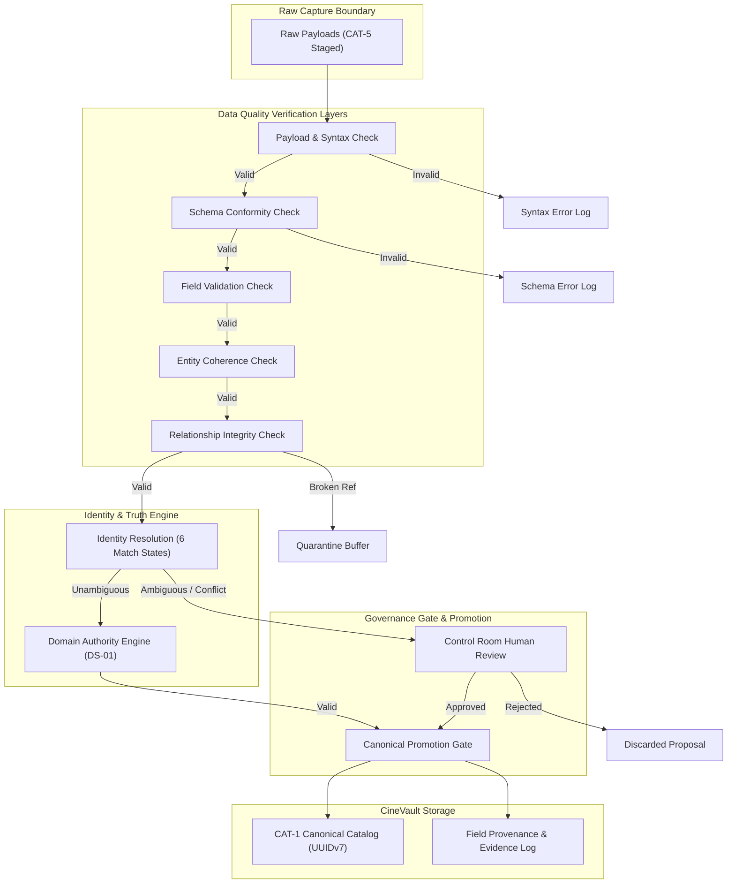
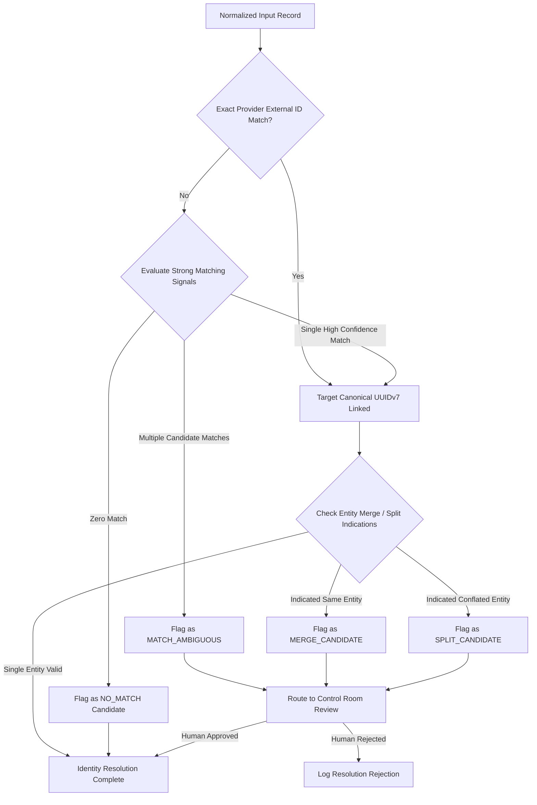
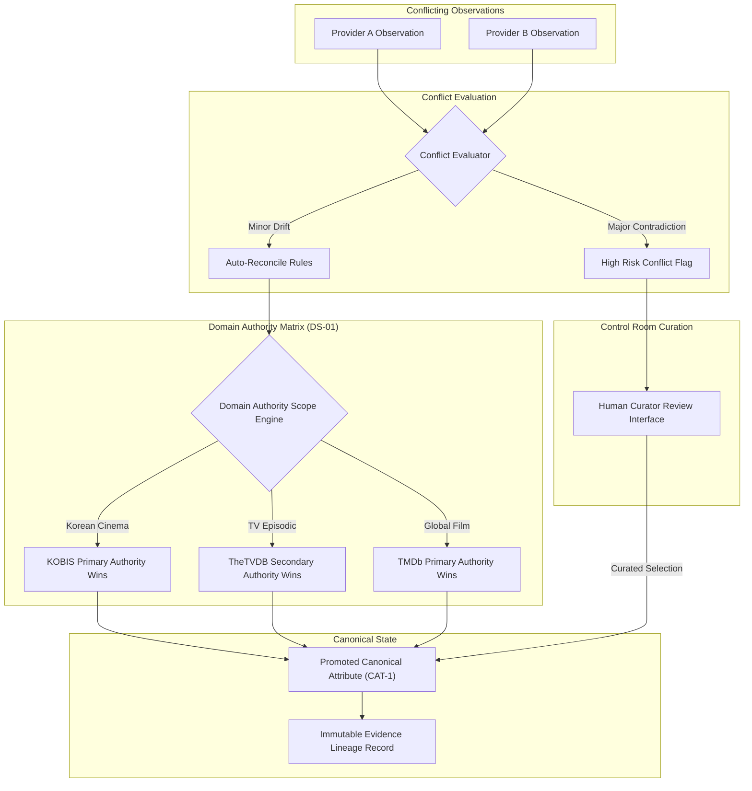
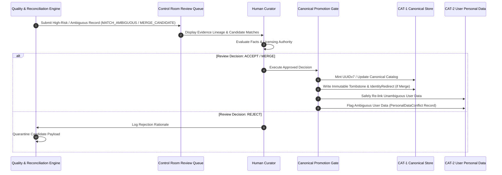

# CineVault OS — Data Quality & Reconciliation Architecture V1

**Document Type:** Master Data Quality & Reconciliation Architecture Specification  
**Status:** Architecture Baseline Specification (Post-Owner Approval Pass — Approved with Deferred Quality Decisions)  
**Date:** 2026-08-08  
**Scope:** Multi-Layered Quality Verification, Provider-Neutral Identity Resolution, Domain-Aware Truth Reconciliation, Evidence Provenance, False-Match Prevention, Merge/Split Governance, and Human Curation  

---

## 1. Purpose

The purpose of the **CineVault OS Data Quality & Reconciliation Architecture V1** is to establish an explainable, deterministic, and governance-first framework for evaluating external data quality, resolving entity identity, reconciling conflicting provider observations into canonical truth, and preventing raw or corrupt external metadata from contaminating CineVault's canonical domain model (`CAT-1`) or user-owned personal data (`CAT-2`).

This architecture defines the conceptual rules, quality dimensions, signal taxonomies, conflict handling models, and promotion gates that convert staged raw observations (`CAT-5`) and AI proposals (`CAT-6`) into validated canonical platform data (`CAT-1`).

---

## 2. Scope

### In-Scope
* Multi-layered data quality model (Source, Payload, Schema, Field, Entity, Relationship, Cross-Source, Canonical Quality).
* Conceptual quality dimensions (Completeness, Validity, Consistency, Uniqueness, Accuracy, Timeliness, Provenance, Rights Compliance, Referential Integrity, Domain Conformity).
* Multi-dimensional source quality profiling without single-score collapse.
* Attribute/field-level quality assessment rules and domain authority weighting.
* Identity resolution framework adhering to approved match taxonomy (`MATCH_EXACT`, `MATCH_AMBIGUOUS`, `NO_MATCH`, `MERGE_CANDIDATE`, `SPLIT_CANDIDATE`, `REQUIRES_REVIEW`).
* Taxonomy of matching signals (Strong, Supporting, Weak, Misleading).
* Rigorous false-match prevention rules protecting Title / Edition / Release boundaries (ADR-002) and distinguishing remakes, adaptations, cuts, and OVAs.
* Governance for entity merges and splits preserving provenance and protecting user-owned personal data (ADR-003, ADR-004).
* Domain-aware authority resolution implementing DS-01, KOBIS (`DEC-SRC-PRP-01`), and TheTVDB (`DEC-SRC-PRP-02`).
* Explainable decision evidence lineage model ("Why CineVault believes this fact").
* Mandatory human review triggers, workflow decisions, and curation routing.
* Conceptual confidence bands (`High`, `Medium`, `Low`, `Unknown`) with exact numerical thresholds deferred per `DEC-ING-DEF-03`.
* Change detection, temporal reconciliation, episodic/season reconciliation, edition reconciliation, people/credits reconciliation, and awards/festivals reconciliation.
* Quality failure handling taxonomy, data drift detection concepts, reconciliation replay framework, and AI proposal governance (ADR-004).
* 4 comprehensive Mermaid architecture diagrams.

### Out-of-Scope (Prohibited in this Phase)
* Application code, provider adapters, API clients, scrapers, network code.
* Physical database schemas, PostgreSQL DDL, tables, indexes, ORM models.
* Matching algorithms, fuzzy-search code, machine learning models, scoring scripts.
* Background workers, queues, schedulers, production jobs, reconciliation microservices.
* Mutation or modification of approved canonical documents (ADRs, Data Model V1, ERD V1, Data Dictionary V1, Data Source Registry V1, Ingestion Architecture V1).

---

## 3. Architectural Principles

1. **Canonical Identity Independence (ADR-001):** Internal canonical identities are generated UUIDv7s. External provider IDs are mappings (`TitleExternalId`, `PersonExternalId`) and NEVER canonical primary keys.
2. **Domain-Specific Source Authority (DS-01):** No single provider is the universal primary authority. Authority is domain/entity/field-scoped (e.g., KOBIS for Korean cinema, TheTVDB for TV catalog structure).
3. **Absolute Personal Data Safety (ADR-003, ADR-004):** External quality assessment, reconciliation, provider changes, or entity merges/splits MUST NEVER alter, overwrite, re-parent, or destroy User-Owned Personal Data (`CAT-2`). Ambiguous personal data re-associations spawn `PersonalDataConflict` or `UserSplitResolution` records.
4. **No Silent Merges or Splits:** Entity merges and splits require auditable governance and cannot occur implicitly or silently.
5. **No Blind "Latest Source Wins":** Ingestion timestamps do not override domain authority. Latest observation does not imply true observation.
6. **Separation of Metadata and Media Rights:** Quality and reconciliation of structured metadata rights are governed independently from media/image usage rights.
7. **Explainable Decision Lineage:** Every promoted canonical value must be reconstructable back to raw observations, applied authority rules, and evaluation evidence.
8. **AI Proposal Isolation (ADR-004):** AI-generated suggestions are `CAT-6` proposals. They can assist in candidate generation or conflict summarization but CANNOT automatically establish canonical truth.
9. **Idempotent & Replayable Reconciliation:** Re-evaluating historical observations with updated authority rules must yield deterministic, reproducible outcomes.
10. **Layered Defense Against Corruption:** Data passes through sequential quality layers; failure at any layer halts canonical promotion and routes to quarantine or review.

---

## 4. Terminology

* **Source Profile:** A multi-dimensional assessment of a metadata provider's domain expertise, historical reliability, coverage, and licensing status.
* **Match Signal:** A specific attribute observation (e.g., external ID, original title, release year, credit overlap) used to evaluate identity equivalence.
* **Match State:** One of six approved taxonomy states (`MATCH_EXACT`, `MATCH_AMBIGUOUS`, `NO_MATCH`, `MERGE_CANDIDATE`, `SPLIT_CANDIDATE`, `REQUIRES_REVIEW`).
* **Conflict Category:** Classification of discrepancy across data sources (e.g., `TITLE_CONFLICT`, `DATE_CONFLICT`, `RUNTIME_CONFLICT`, `CLASSIFICATION_CONFLICT`).
* **Authority Matrix:** The rule table mapping domain, entity, and attribute types to primary and secondary authoritative providers.
* **Evidence Lineage:** The immutable audit record recording the raw observations, confidence evaluation, authority rule, and review decision that produced a canonical fact.
* **Quarantine:** A staging state where invalid, suspicious, or conflicting external records are held pending evidence or curation review.
* **Personal Data Conflict:** A record created during canonical entity merges/splits when user personal data (watch history, ratings, notes) cannot be unambiguously re-associated automatically.

---

## 5. Data Quality Layers

The CineVault Data Quality Architecture establishes an 8-layer progressive quality verification model. A payload or record must satisfy all applicable layers before canonical promotion is permitted:

```text
1. Source Quality Layer
         ↓
2. Payload Quality Layer
         ↓
3. Schema Quality Layer
         ↓
4. Field Quality Layer
         ↓
5. Entity Quality Layer
         ↓
6. Relationship Quality Layer
         ↓
7. Cross-Source Consistency Layer
         ↓
8. Canonical Quality Gate
```

### Layer Responsibilities

| Quality Layer | Verification Scope | Primary Checks | Rejection Action |
|---|---|---|---|
| **1. Source Quality** | Provider licensing & reliability boundary | Licensing Gate status, contract authorization, commercial rights. | `REJECT_LICENSE` |
| **2. Payload Quality** | Raw transport & capture integrity | Checksum match, payload completeness, non-empty response, well-formed syntax. | `REJECT_SYNTAX` |
| **3. Schema Quality** | Intermediate model conformity | Structural model alignment (`NormalizedTitle`, etc.), data type validity, mandatory attribute presence. | `REJECT_SCHEMA` |
| **4. Field Quality** | Individual attribute value validity | Character encoding, date format ISO-8601, numeric range bounds (e.g., runtime > 0), script validity. | `QUARANTINE_FIELD` |
| **5. Entity Quality** | Single-entity logical coherence | Internal consistency (e.g., release date >= production year, death date >= birth date). | `QUARANTINE_ENTITY` |
| **6. Relationship Quality** | Graph & hierarchy integrity | Parent-child boundaries (`Title` ──▶ `Edition`, `Title` ──▶ `Season` ──▶ `Episode`), FK validity. | `QUARANTINE_GRAPH` |
| **7. Cross-Source Consistency** | Multi-provider observation alignment | Comparison against existing canonical state and secondary provider facts; authority conflict check. | `FLAG_CONFLICT` |
| **8. Canonical Quality** | Pre-promotion governance gate | Primary Edition invariant (`is_primary = true`), display ID prefix validity, CAT-2 isolation check. | `ROUTE_TO_REVIEW` |

---

## 6. Conceptual Quality Dimensions

Data quality in CineVault is measured across 10 distinct conceptual dimensions:

1. **Completeness:** Extent to which required and optional metadata attributes are populated (e.g., non-null canonical title, production year, runtime).
2. **Validity:** Adherence to defined syntax, format, and domain constraints (e.g., valid ISO 3166-1 alpha-2 country codes, ISO 639-1 language codes).
3. **Consistency:** Absence of logical contradictions across attributes within a single record or across related entities (e.g., episode air date falling within season broadcast window).
4. **Uniqueness:** Freedom from duplicate entity representations in canonical storage (`CAT-1`).
5. **Accuracy:** Degree of agreement between ingested metadata attributes and real-world entertainment facts as determined by domain authorities.
6. **Timeliness:** Freshness and currency of external observations relative to real-world changes (e.g., streaming availability window changes).
7. **Provenance:** Presence of complete observation lineage metadata (`source_provider`, `observation_timestamp`, `external_id`).
8. **Rights Compliance:** Legal eligibility of metadata and media for storage, caching, and display under verified contractual terms.
9. **Referential Integrity:** Coherence of entity references across titles, editions, releases, seasons, episodes, people, and taxonomies.
10. **Domain Conformity:** Adherence to CineVault entertainment domain rules (e.g., Title vs Edition distinction per ADR-002).

---

## 7. Source-Level Quality Profiling

To prevent reducing complex metadata providers to a single naive score, CineVault evaluates providers using a **Multi-Dimensional Source Quality Profile**. A provider may possess high authority in one domain while remaining weak or unverified in another.

```text
                    ┌───────────────────────────────────┐
                    │   Multi-Dimensional Source Profile│
                    └─────────────────┬─────────────────┘
                                      │
     ┌──────────────┬─────────────────┼─────────────────┬──────────────┐
     ▼              ▼                 ▼                 ▼              ▼
[ Domain Scope ][ Coverage Depth ][ Freshness Rank ][ Historical Acc ][ License Status ]
```

### Source Quality Profile Dimensions

* **Domain Authority Scope:** Specific domains where provider is recognized as authoritative (e.g., KOBIS for Korean theatrical releases, TheTVDB for TV episodic structures, Wikidata for cross-database Q-ID identity linking).
* **Catalog Coverage Depth:** Extent of deep catalog metadata versus top-tier blockbuster coverage.
* **Freshness & Update Velocity:** Frequency and speed of provider updates (real-time API vs daily dumps vs manual updates).
* **Historical Data Stability:** Rate of retroactive external ID changes or deletion of provider entities.
* **Licensing & Usage Legal Certainty:** Contractual verification status (`CONFIRMED_CC0`, `COMMERCIAL_CONTRACT_VERIFIED`, `CONDITIONAL_TIER`, `RESTRICTED_API`).

> [!IMPORTANT]
> A source quality profile MUST NOT collapse into a single global numerical score. Provider rankings are strictly domain-scoped, entity-scoped, and field-scoped.

---

## 8. Field-Level Quality Evaluation

Individual attributes within an ingested payload are evaluated independently based on field-specific quality rules and authority assignments.

### Field Evaluation Rules

```text
┌─────────────────────┬───────────────────────────────┬───────────────────────────────────────────┐
│ Field / Fact Type   │ Validation Constraint         │ Primary Authority Scope                   │
├─────────────────────┼───────────────────────────────┼───────────────────────────────────────────┤
│ `canonical_title`   │ Non-empty, normalized text    │ Localized domain authority / TMDb         │
│ `original_title`    │ Native script preserved       │ Origin-country national authority / KOBIS │
│ `production_year`   │ Integer (1888 – current+5)    │ Origin-country national authority         │
│ `release_date`      │ ISO-8601 YYYY-MM-DD           │ Country-specific release authority        │
│ `runtime_minutes`   │ Integer > 0 (Edition-scoped)  │ Primary Edition metadata source           │
│ `content_type`      │ Valid ContentType Enum        │ Governance reclassification rules         │
│ `season_number`     │ Non-negative integer          │ TheTVDB (Secondary TV Authority)          │
│ `episode_number`    │ Non-negative integer          │ TheTVDB (Secondary TV Authority)          │
│ `person_name`       │ Non-empty text                │ Primary domain credit source              │
│ `credit_role`       │ Valid CreditRole Enum         │ Production credit source                  │
│ `image_url`         │ Valid URI, HTTPS              │ Independent Media Rights Gate             │
└─────────────────────┴───────────────────────────────┴───────────────────────────────────────────┘
```

---

## 9. Identity Resolution Framework

Identity Resolution evaluates normalized external entities against existing canonical CineVault entities (`CAT-1`) using the 6 approved match taxonomy states (`DEC-ING-PRP-04`):

```text
MATCH_EXACT
MATCH_AMBIGUOUS
NO_MATCH
MERGE_CANDIDATE
SPLIT_CANDIDATE
REQUIRES_REVIEW
```

```text
                       [ Normalized Input Entity ]
                                    │
                                    ▼
                     ┌─────────────────────────────┐
                     │ Check Known External ID Map │
                     └──────────────┬──────────────┘
                                    │
               ┌────────────────────┴────────────────────┐
               ▼                                         ▼
      [ External ID Match ]                     [ No External ID Match ]
               │                                         │
               ▼                                         ▼
       [ MATCH_EXACT ]                          ┌────────────────────────┐
                                                │ Analyze Match Signals  │
                                                └───────────┬────────────┘
                                                            │
                       ┌────────────────────────────────────┼────────────────────────────────────┐
                       ▼                                    ▼                                    ▼
            [ High Confidence Match ]             [ Ambiguous / Multiple ]                [ Zero Match ]
                       │                                    │                                    │
                       ▼                                    ▼                                    ▼
                 [ MATCH_EXACT ]                     [ MATCH_AMBIGUOUS ]                   [ NO_MATCH ]
                       │                                    │                                    │
                       ▼                                    ▼                                    ▼
             (Target UUIDv7 Linked)                 (Route to Review Queue)               (Create New Candidate)
```

### Match State Behaviors
1. **`MATCH_EXACT`:** Unambiguous match to an existing canonical UUIDv7 via verified external provider ID mapping (`TitleExternalId`) or deterministic composite signal match.
2. **`MATCH_AMBIGUOUS`:** Incoming record matches multiple distinct canonical entities with comparable confidence. System halts automatic resolution and sets state to `REQUIRES_REVIEW`.
3. **`NO_MATCH`:** Incoming record matches zero existing canonical entities. System flags entity as a candidate for new canonical UUIDv7 creation.
4. **`MERGE_CANDIDATE`:** Evidence indicates two existing canonical entities in CineVault represent the same real-world creative work. Requires human curation.
5. **`SPLIT_CANDIDATE`:** Evidence indicates an existing canonical entity combines two distinct real-world creative works (e.g. a movie and its TV adaptation conflated). Requires human curation.
6. **`REQUIRES_REVIEW`:** General governance review state for ambiguous matches, structural reclassifications, or rights conflicts.

---

## 10. Matching Signals Taxonomy

Matching signals evaluate identity equivalence across external observations and canonical records. Signals are classified into four conceptual categories:

```text
┌────────────────────────────────────────────────────────────────────────────────┐
│                           MATCHING SIGNALS TAXONOMY                            │
├───────────────────┬───────────────────┬───────────────────┬────────────────────┤
│ STRONG SIGNALS    │ SUPPORTING SIGNALS│ WEAK SIGNALS      │ MISLEADING SIGNALS │
├───────────────────┼───────────────────┼───────────────────┼────────────────────┤
│ • External ID Match│ • Production Year │ • Single Cast Name│ • English Title    │
│   (TMDb, TVDB,    │   Match (±0 years)│   Match           │   Only Match       │
│    KOBIS, Q-ID)   │ • Country of      │ • Generic Genre   │ • Common Name      │
│ • Original Title  │   Origin Match    │   Match           │   Match Without    │
│   + Exact Year    │ • Director Credit │ • Short Synopsis  │   Birth Date       │
│   + Country Match │   Match           │   Text Overlap    │ • Shared Franchise │
│ • Primary Edition │ • Episode Count & │                   │   Name Only        │
│   Runtime Match   │   Season Structure│                   │                    │
└───────────────────┴───────────────────┴───────────────────┴────────────────────┘
```

### Signal Classification & Risk Rules
* **Strong Signals:** High-discriminatory evidence. A verified external ID mapping or exact original title + production year + origin country provides strong identity confirmation.
* **Supporting Signals:** Secondary evidence that reinforces strong signals (e.g., director credit match, exact runtime match).
* **Weak Signals:** Low-discriminatory evidence (e.g., matching a single generic genre like "Drama", or sharing a common cast member). Weak signals NEVER justify automatic matching on their own.
* **Misleading Signals:** Signals that frequently cause false matches (e.g., identical English localized titles for different movies, or sharing a franchise name like "Batman").

---

## 11. False-Match Prevention Architecture

To prevent distinct creative works from being incorrectly merged into a single canonical entity, the architecture enforces strict **False-Match Prevention Rules**.

### Critical Distinction Categories
1. **Remakes vs. Originals:** E.g., *Ocean's Eleven* (1960) vs. *Ocean's Eleven* (2001). Identical title, different production year, different core cast. Must remain distinct canonical Titles (`UUIDv7`).
2. **Feature Film vs. TV Adaptation:** E.g., *Fargo* (1996 Film) vs. *Fargo* (2014 Series). Differing `content_type`. Reclassification or matching across content types is strictly prohibited without explicit governance review (`ADR-001`).
3. **Title vs. Edition Boundaries (ADR-002):** E.g., *Theatrical Cut* vs. *Director's Cut* of *Blade Runner*. Material content differences MUST be modeled as distinct `Edition` records under the SAME `Title` (`UUIDv7`), NEVER as two separate Titles.
4. **Edition vs. Release Boundaries (ADR-002):** E.g., 4K UHD release vs. Streaming release of the same cut. Pure distribution differences MUST be modeled as `Release` events under the same `Edition`, NEVER creating new Editions or Titles.
5. **Anime Specials, OVAs, & Movies:** E.g., standalone anime movies versus TV special episodes. Must be distinguished using episodic hierarchy (`Title` ──▶ `Season` ──▶ `Episode`) or distinct `Title` records based on domain authority rules.

---

## 12. Merge & Split Governance (ADR-003, ADR-004)

Entity merges and splits represent high-impact canonical changes. They are subject to strict governance to protect **User-Owned Personal Data (CAT-2)**.

```text
                             [ MERGE / SPLIT TRIGGER ]
                                         │
                                         ▼
                       ┌───────────────────────────────────┐
                       │  Canonical Platform Data (CAT-1)  │
                       │   Execute Merge / Split Operation │
                       └─────────────────┬─────────────────┘
                                         │
                                         ▼
                       ┌───────────────────────────────────┐
                       │   Personal Data Safety Evaluator  │
                       └─────────────────┬─────────────────┘
                                         │
                 ┌───────────────────────┴───────────────────────┐
                 ▼                                               ▼
     [ Unambiguous Re-association ]                    [ Ambiguous Re-association ]
                 │                                               │
                 ▼                                               ▼
     [ Re-link CAT-2 Records ]                         [ Create PersonalDataConflict / ]
                                                       [ UserSplitResolution Record    ]
                                                                 │
                                                                 ▼
                                                       [ User Curation Interface ]
```

### Merge Governance Rules
* **Surviving Identity:** When two canonical Titles are merged, one `title_id` (UUIDv7) is designated as the surviving canonical identity.
* **Tombstone & Redirect:** The retired Title is soft-deleted via Tombstone, and an immutable `IdentityRedirect` record is created pointing to the surviving UUIDv7.
* **CAT-2 Isolation:** User watch history, ratings, notes, and reviews linked to the retired Title are safely re-linked to the surviving Title ONLY if no conflict exists.
* **Personal Data Conflict Handling:** If a user has separate ratings or watch events on BOTH merged titles (e.g. Title A rated 7/10, Title B rated 9/10), the system MUST NOT silently overwrite, average, or delete either rating (`ADR-003`). A `PersonalDataConflict` record is generated for user resolution.

### Split Governance Rules
* **New Identity Creation:** When a canonical Title is split, one or more new `Title` entities (`UUIDv7`) are created alongside new Display IDs.
* **CAT-2 Safety:** User watch history and ratings linked to the original pre-split entity are NOT automatically duplicated or guessed (`ADR-003`). Unambiguous records are assigned; ambiguous user data generates `UserSplitResolution` prompt events.

---

## 13. Conflict Taxonomy

When multiple data sources supply contradictory information for the same canonical entity, the discrepancy is classified into an explicit **Conflict Category**:

```text
┌───────────────────────────┬───────────────────────────────────────────────────────────────────┐
│ Conflict Category         │ Description / Example                                             │
├───────────────────────────┼───────────────────────────────────────────────────────────────────┤
│ `IDENTITY_CONFLICT`       │ External providers map the same record to different real-world    │
│                           │ entities or conflicting Wikidata Q-IDs.                           │
│ `TITLE_CONFLICT`          │ Primary or localized title spellings disagree across authorities. │
│ `DATE_CONFLICT`           │ Release dates or production years differ by > 1 year.            │
│ `RUNTIME_CONFLICT`        │ Stated runtimes for the primary edition differ by > 15 minutes.   │
│ `CLASSIFICATION_CONFLICT` │ Provider A lists title as "Movie", Provider B lists as "TV".      │
│ `EPISODE_ORDER_CONFLICT`  │ Broadcast episode numbering differs from DVD / Story arc ordering.│
│ `CREDIT_CONFLICT`         │ Disagreement on billing rank, cast role, or director credit.      │
│ `EDITION_CONFLICT`        │ Disagreement on whether a cut represents a distinct Edition.      │
│ `RELEASE_CONFLICT`        │ Disagreement on premiere type (Theatrical vs Festival vs Digital).│
│ `MEDIA_RIGHTS_CONFLICT`   │ Provider grants metadata rights but image license is restricted.   │
│ `PROVENANCE_CONFLICT`     │ Conflicting observation timestamps or source revisions.          │
└───────────────────────────┴───────────────────────────────────────────────────────────────────┘
```

---

## 14. Domain-Aware Authority Resolution Engine

CineVault rejects simplistic resolution heuristics such as "latest source wins" or "global highest-priority source wins". Truth resolution is strictly **Domain-Aware and Attribute-Scoped** (enforcing `DS-01`).

```text
[ Conflicting Field Observation ]
               │
               ▼
 ┌───────────────────────────┐
 │ Identify Fact Domain      │ ──▶ (Korean Cinema / TV Series / Global Film / Anime)
 └─────────────┬─────────────┘
               │
               ▼
 ┌───────────────────────────┐
 │ Lookup Domain Authority   │ ──▶ (KOBIS DEC-SRC-PRP-01 / TheTVDB DEC-SRC-PRP-02 / TMDb / ANN)
 └─────────────┬─────────────┘
               │
               ▼
 ┌───────────────────────────┐
 │ Evaluate Licensing Gate   │ ──▶ (Is provider active & legally verified?)
 └─────────────┬─────────────┘
               │
               ▼
 ┌───────────────────────────┐
 │ Execute Authority Decision│ ──▶ Promoted Value + Field Provenance Record
 └───────────────────────────┘
```

### Approved Domain Authority Hierarchy

```text
┌─────────────────────────┬───────────────────────────────────────────────┬───────────────────────────────┐
│ Domain / Entity Type    │ Approved Domain Authority Role / Provider     │ Secondary / Reference Source  │
├─────────────────────────┼───────────────────────────────────────────────┼───────────────────────────────┤
│ Korean Cinema Metadata  │ KOBIS / KOFIC (PRIMARY KOREAN AUTHORITY)      │ TMDb / Wikidata               │
│ Television & Episodic   │ TheTVDB (SECONDARY TV AUTHORITY DEC-SRC-PRP-02)│ TMDb (Candidate Primary)      │
│ General Cinema Metadata │ TMDb (Candidate Primary - Commercial License) │ Wikidata / KOBIS              │
│ Cross-Domain Identity   │ Wikidata (Reference / CC0 Graph)              │ TMDb / TheTVDB / KOBIS        │
│ Anime & Japanese Media  │ Anime News Network / AniList (Enrichment)     │ TMDb / Wikidata               │
└─────────────────────────┴───────────────────────────────────────────────┴───────────────────────────────┘
```

---

## 15. Decision Evidence & Lineage Model

Every canonical decision in CineVault must answer: **"Why does CineVault currently believe this value?"**

To satisfy Data Dictionary V1 requirements, the system constructs an immutable **Evidence Lineage Record** for every promoted canonical attribute:

```text
┌───────────────────────────────────────────────────────────────────┐
│                      CANONICAL EVIDENCE RECORD                    │
├──────────────────────────────┬────────────────────────────────────┤
│ Attribute Name               │ `canonical_title`                  │
│ Promoted Canonical Value     │ `"Parasite"`                       │
│ Selected Provider            │ `KOBIS` (Primary Korean Authority) │
│ Provider External ID         │ `"20192194"`                       │
│ Raw Capture Payload ID       │ `raw_payload_88f912...` (UUIDv7)   │
│ Observation Timestamp        │ `2026-08-08T12:00:00Z`             │
│ Normalization Rule Version   │ `norm_v1.4`                        │
│ Applied Authority Rule ID    │ `RULE-KOREAN-FILM-PRIMARY-KOBIS`   │
│ Identity Match State         │ `MATCH_EXACT`                      │
│ Evaluation Confidence Band   │ `HIGH_CONFIDENCE`                  │
│ Human Curation Override Flag │ `false`                            │
└──────────────────────────────┴────────────────────────────────────┘
```

---

## 16. Canonical Promotion Gate

Canonical Promotion is the governed phase where validated, reconciled metadata is committed into **CAT-1 Canonical Platform Data**.

```text
[ Candidate Fact ] ──▶ [ Quality Check ] ──▶ [ Authority Engine ] ──▶ [ Conflict Check ]
                                                                             │
                                              ┌──────────────────────────────┴──────────────────────────────┐
                                              ▼                                                             ▼
                                      [ Review Required ]                                         [ Unambiguous & Valid ]
                                              │                                                             │
                                              ▼                                                             ▼
                                  [ Control Room Curation ]                                    [ Canonical Promotion Gate ]
                                              │                                                             │
                                              └──────────────────────────────┬──────────────────────────────┘
                                                                             │
                                                                             ▼
                                                                  [ Promote to CAT-1 Catalog ]
                                                                  [ Mint UUIDv7 / Display ID ]
                                                                  [ Write Provenance Record  ]
```

### Promotion Checklist & Invariants
1. **Canonical Identity Assignment:** If a new entity, mint permanent internal **UUIDv7** (`title_id`, `person_id`).
2. **Display ID Generation:** Assign display ID (`MOV-000001`, `SER-000001`, `ANI-000001`) with immutable prefix based on initial classification (`ADR-001`).
3. **Primary Edition Invariant:** Every promoted Title MUST receive a Primary Edition (`is_primary = true`) per `ADR-002`.
4. **CAT-2 Isolation:** Promotion MUST NEVER mutate or rewrite user personal data.

---

## 17. Human Review & Control Room Curation

Human review is mandatory for high-risk, ambiguous, or structural metadata decisions.

### Mandatory Human Review Triggers
* Identity Match State is `MATCH_AMBIGUOUS`, `MERGE_CANDIDATE`, or `SPLIT_CANDIDATE`.
* Reclassification of `content_type` (e.g. Movie ──▶ TV Series) per `ADR-001`.
* Primary Edition runtime discrepancy > 15 minutes across authoritative providers.
* Conflicting authoritative data sources (e.g. KOBIS vs TMDb on Korean release year).
* Media/image usage rights ambiguity or takedown notice.
* AI-generated metadata proposal (`CAT-6`) flagged for canonical consideration.

### Review Workflow Decision Outcomes
* **`ACCEPT`:** Promote candidate fact to canonical platform data (`CAT-1`).
* **`REJECT`:** Reject candidate fact; log rejection rationale in provenance audit.
* **`DEFER`:** Postpone decision pending additional external provider evidence.
* **`REQUEST_MORE_EVIDENCE`:** Flag pipeline to fetch secondary provider datasets.
* **`CREATE_NEW_ENTITY`:** Confirm record represents a new distinct creative work; mint UUIDv7.
* **`MERGE`:** Approve entity merge; create Tombstone, `IdentityRedirect`, and `PersonalDataConflict` records.
* **`SPLIT`:** Approve entity split; create new Title entities and `UserSplitResolution` records.

---

## 18. Confidence Modeling

In accordance with `DEC-ING-DEF-03` (which intentionally defers numerical fuzzy threshold tuning), confidence in identity matching and reconciliation is modeled using **Conceptual Confidence Bands**.

### Conceptual Confidence Bands
* **`HIGH_CONFIDENCE`:** Unambiguous match via verified external ID or exact composite key match across primary domain authorities. Safe for automated canonical promotion.
* **`MEDIUM_CONFIDENCE`:** Strong supporting signals exist, but secondary provider discrepancy or minor attribute drift detected. Eligible for auto-promotion with `ACCEPT_WITH_WARNING` status.
* **`LOW_CONFIDENCE`:** Weak matching signals or minor ambiguity. Auto-promotion blocked; routed to Control Room Curation Queue.
* **`UNKNOWN`:** Incomplete observation data; requires secondary evidence acquisition.

> [!NOTE]
> Exact numerical scoring formulas (e.g. 0.85 Jaro-Winkler threshold) remain explicitly `DEFERRED` per `DEC-ING-DEF-03`.

---

## 19. Change Detection & Delta Ingestion

The reconciliation engine handles provider data evolution across 6 operational scenarios:

1. **Same Value Observed:** No change. Update `last_observed_at` timestamp in provenance.
2. **Attribute Value Changed:** Provider updates metadata (e.g. synopsis updated). Re-evaluate authority rules; update canonical attribute if source is authorized authority.
3. **New Provider Attribute Added:** Previously null attribute populated. Promote to canonical state.
4. **Attribute Omitted / Removed by Provider:** Missing attribute in a payload DOES NOT automatically erase canonical data in CineVault.
5. **Provider Record Deletion:** Provider revokes an entity. Mark provider mapping as `DISCONTINUED` in `TitleExternalId`. Canonical catalog entity (`CAT-1`) and user personal data (`CAT-2`) remain ACTIVE.
6. **Rights Withdrawal:** Provider revokes distribution permissions. Trigger media CDN purge or metadata quarantine per legal terms.

---

## 20. Temporal Reconciliation

Temporal facts must be reconciled while distinguishing release events from streaming availability:

```text
┌─────────────────────────┬─────────────────────────────────┬───────────────────────────────────┐
│ Temporal Concept        │ Entity Assignment               │ Reconciliation Rule               │
├─────────────────────────┼─────────────────────────────────┼───────────────────────────────────┤
│ Production Year         │ `Title.production_year`         │ Origin-country national authority │
│ Premiere / Festival Date│ `Release.release_date`          │ Earliest verified festival event  │
│ Country Premiere Date   │ `Release.release_date`          │ Country-specific national authority│
│ Edition Digital Master  │ `Edition.mastering_date`        │ Technical release authority       │
│ Platform Availability   │ `PlatformOffer.valid_from/to`   │ Real-time streaming API feed      │
└─────────────────────────┴─────────────────────────────────┴───────────────────────────────────┘
```

---

## 21. Episode & Season Reconciliation

Providers frequently disagree on TV episodic structures (e.g. Broadcast order vs DVD order vs Story arc order).

### Episodic Reconciliation Rules
* **Canonical Hierarchy:** `Title` ──▶ `Season` ──▶ `Episode`. Episode identity is permanent and independent of display numbers (`ADR-002`).
* **TV Domain Authority:** TheTVDB (`DEC-SRC-PRP-02`, Secondary TV Authority) provides an authority reference for broadcast season and episode numbering sequences.
* **Alternate Episode Numbering:** Non-broadcast orderings (DVD order, Story Arc order, Regional Japanese numbering) are preserved in alternate ordering structures (`RegionalEpisodeOrder`), NEVER overwriting canonical episode sequences.

---

## 22. Edition Reconciliation (ADR-002)

The reconciliation engine enforces strict compliance with **ADR-002**:

```text
Title (Abstract Creative Work)
  ↓
Edition (Material Content Difference: Theatrical vs Director's Cut)
  ↓
Release (Distribution Event: 4K UHD, Digital Stream, Festival)
```

### Edition Reconciliation Rules
* **Material Difference Invariant:** Additional `Edition` records are created ONLY when content is materially different (e.g., deleted scenes added, unrated cut, different ending).
* **Distribution Isolation:** Re-mastering, 4K restoration, or digital distribution differences MUST NOT create a new `Edition`. They are recorded as `Release` events under the existing `Edition`.
* **Primary Edition Requirement:** Every Title MUST maintain exactly one Primary Edition (`is_primary = true`).

---

## 23. People & Credits Reconciliation

Reconciling cast and crew observations involves resolving person identities and role mappings:

* **Person Identity Resolution:** Matched via `PersonExternalId` (TMDb Person ID, Wikidata Q-ID). Transliterated name variations (e.g. Hangul vs Romanized Korean names) are stored in `PersonName` alias tables.
* **Credit Role Mappings:** Cast billing rank and crew roles (Director, Writer, Producer) are reconciled per `Edition` or `Title`.
* **Duplicate Person Merges:** Handled via Person merge workflows; preserves credit history without corrupting user watch logs.

---

## 24. Awards & Festivals Reconciliation

Awards and festival participation are reconciled against approved domain entities:

```text
Award ──▶ AwardCategory ──▶ AwardEvent ──▶ AwardResult (Nominee / Winner)
Festival ──▶ FestivalEdition ──▶ FestivalParticipation
```

### Reconciliation Rules
* **Award Identity:** Standardized by official organization title (e.g., Academy Awards, BAFTA, Cannes Film Festival).
* **Year / Edition Alignment:** Award events are aligned to specific calendar years and event iteration numbers (`AwardEvent.year`).
* **Nominee / Winner Integrity:** Conflicting winner declarations require primary festival archive verification.

---

## 25. Quality Failure & Quarantine Taxonomy

Records failing quality validation are assigned an explicit failure state:

```text
┌─────────────────────────┬───────────────────────────────────────────────────────────────────┐
│ Quality Failure State   │ Definition & Handling Action                                      │
├─────────────────────────┼───────────────────────────────────────────────────────────────────┤
│ `REJECT_LICENSE`        │ Failed pre-acquisition Licensing Gate. Payload discarded.         │
│ `REJECT_SYNTAX`         │ Malformed JSON/XML payload. Logged as parser error.               │
│ `REJECT_SCHEMA`         │ Missing mandatory fields. Held in Raw Capture (`CAT-5`).          │
│ `QUARANTINE_INVALID`    │ Logical contradiction (e.g. runtime < 0). Quarantined.            │
│ `QUARANTINE_GRAPH`      │ Broken parent-child reference. Quarantined.                       │
│ `FLAG_CONFLICT`         │ Authoritative provider contradiction. Flagged for review.         │
│ `ACCEPT_WITH_WARNING`   │ Non-critical attribute drift. Promoted with audit warning.        │
└─────────────────────────┴───────────────────────────────────────────────────────────────────┘
```

---

## 26. Data Drift & Schema Evolution

Data drift detection monitors long-term changes in external data feeds:

* **Schema Drift:** Detection of new, deprecated, or renamed fields in provider JSON/XML payloads.
* **Semantic Drift:** Shifts in provider value meanings (e.g. provider changing runtime from minutes to seconds).
* **Classification Drift:** Shifts in how a provider categorizes titles (e.g., mini-series reclassified as TV series).

---

## 27. Reconciliation Replay Framework

CineVault supports re-running reconciliation rules over historical raw payloads stored in the **Raw Capture Boundary (`CAT-5`)**:

```text
┌───────────────────────────────────┐
│ Stored Raw Payloads (CAT-5)       │
└─────────────────┬─────────────────┘
                  │
                  ▼ Replay Trigger (Updated Authority Rules or Improved Matching)
┌───────────────────────────────────┐
│ Re-Run Normalization & Matching   │
└─────────────────┬─────────────────┘
                  │
                  ▼
┌───────────────────────────────────┐
│ Re-Evaluate Authority Engine      │
└─────────────────┬─────────────────┘
                  │
                  ▼
┌───────────────────────────────────┐
│ Apply Reconciled Canonical Updates│
└───────────────────────────────────┘
```

Replay is fully deterministic, audit-logged, and executed without re-fetching external API network payloads.

---

## 28. End-to-End Auditability & Lineage

The architecture guarantees that every canonical fact in CineVault can produce a complete audit trail:

```text
Raw Payload ID (CAT-5) ──▶ Normalized Model ──▶ Match Decision ──▶ Authority Rule ──▶ Canonical Record (CAT-1)
```

Opaque or non-reconstructable decision logic is strictly prohibited.

---

## 29. AI Assistance Governance (ADR-004)

In strict compliance with **ADR-004**, AI components operate exclusively as suggestion generators.

### AI Governance Constraints
* **`CAT-6` Classification:** All AI outputs are categorized as `CAT-6` (AI-Generated Proposals).
* **Direct Promotion Prohibited:** AI components CANNOT directly write to `CAT-1` Canonical Platform Data.
* **Permitted AI Roles:** Candidate match generation assistance, anomaly detection, semantic title comparison, conflict summarization for human curators.

---

## 30. Quality Scoring Framework

Quality scoring evaluates external sources and entity records across distinct conceptual dimensions without collapsing into a single naive number:

```text
┌─────────────────────────┬───────────────────────────────────────────────────────────────────┐
│ Quality Score Component │ Evaluation Scope                                                  │
├─────────────────────────┼───────────────────────────────────────────────────────────────────┤
│ `source_reliability`    │ Provider domain track record, stability, and license certainty.   │
│ `record_completeness`   │ Percentage of populated required/optional attributes.             │
│ `evidence_strength`     │ Number and rank of independent authorities confirming the fact.    │
│ `match_confidence_band` │ Identity resolution match state (`HIGH`, `MEDIUM`, `LOW`).        │
└─────────────────────────┴───────────────────────────────────────────────────────────────────┘
```

> [!NOTE]
> Exact scoring formulas (e.g., `0.4 * completeness + 0.6 * authority`) are marked `PROPOSED` and `DEFERRED` for algorithmic validation.

---

## 31. Architecture Diagrams

### Diagram 1: Data Quality Pipeline Architecture



---

### Diagram 2: Identity Resolution Flow



---

### Diagram 3: Domain Authority Conflict & Reconciliation Flow



---

### Diagram 4: Human Review & Canonical Promotion Flow



---

## 31. Deferred Decisions

| Decision ID | Deferred Topic | Reason for Deferral | Target Phase |
|---|---|---|---|
| `DEC-QUAL-DEF-01` | Physical Quality Staging & Quarantine DDL | Physical DB design prohibited in this phase. | Physical Database Design Phase |
| `DEC-QUAL-DEF-02` | Exact Fuzzy Matching Algorithms & ML Models | Algorithmic code creation prohibited in this phase. | Reconciliation Implementation Phase |
| `DEC-QUAL-DEF-03` | Numerical Confidence Threshold Formulas | Postponed to algorithmic testing pass per `DEC-ING-DEF-03`. | Algorithmic Tuning Phase |
| `DEC-QUAL-DEF-04` | Control Room Curation UI Dashboard | Frontend application code deferred. | Control Room UI Phase |

---

## 32. Key Architectural Risks

1. **False Merges of Similar Titles:** High risk of incorrectly merging remakes or adaptations if title matching is overly permissive; mitigated by strict False-Match Prevention rules.
2. **Provider Discrepancies in TV Ordering:** Conflicting season/episode numbering may occur across providers. Mitigated by TheTVDB's approved role as SECONDARY TV AUTHORITY (`DEC-SRC-PRP-02`), providing an authority reference within the TV domain, while reconciliation remains domain-specific and evidence/provenance-driven.
3. **User Personal Data Re-association Conflict:** Risk of accidental user data loss during entity merges; mitigated by mandatory `PersonalDataConflict` generation (`ADR-003`).

---

## 33. Open Questions

1. **Threshold Calibration Dataset:** What benchmark catalog dataset will be used to calibrate fuzzy matching confidence bands during the algorithmic tuning phase?
2. **Quarantine Retention Period:** How long should quarantined invalid/ambiguous payloads be retained before automated purging?

---

## 34. Governance Gate & Sign-Off

The **Data Quality & Reconciliation Architecture V1** has received formal Project Owner approval for all conceptual proposal decisions (`DEC-QUAL-PRP-01` through `DEC-QUAL-PRP-06`).

* **Current Governance Status:** `APPROVED WITH DEFERRED QUALITY DECISIONS`
* **Next Phase:** API Specification / Physical Database Design (Awaiting Control Room Audit Trigger)

---
