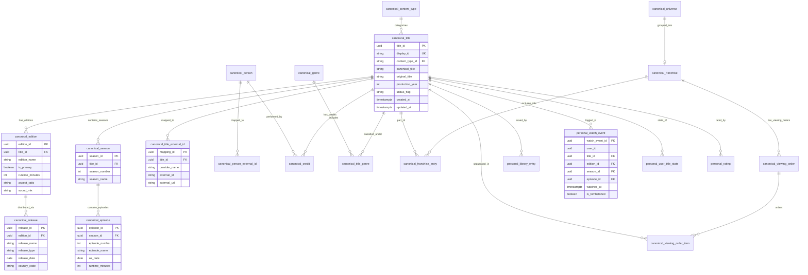

# CineVault OS — Day 3 Data Model & ERD Specification

**Document Version:** V1.0  
**Phase:** Day 3 — Data Model / ERD Foundation  
**Status:** Accepted & Verified  
**Scope:** Canonical domain metadata, title/edition/release hierarchy, episodic structure, external provider mappings, user data isolation, indexing & scaling strategy.

---

## 1. Domain Architecture & Principles

CineVault OS data model is engineered to scale seamlessly from **10 titles** to **1,000,000+ titles** without structural redesign.

### Core Architectural Guarantees
1. **Canonical Identity (ADR-001)**:
   - Permanent canonical identity is **UUIDv7**.
   - Secondary immutable display IDs (e.g. `MOV-000001`, `SER-000001`, `ANI-000001`) are assigned at creation.
   - `content_type` is the authoritative classification. Changing `content_type` never mutates UUID or display ID.
2. **Entertainment Hierarchy (ADR-002)**:
   - `Title` (Abstract creative work) -> `Edition` (Material content cut/version) -> `Release` (Distribution event).
   - Core Rule: *Material content difference -> Edition*; *Distribution difference -> Release*.
3. **Episodic Model (ADR-003)**:
   - `Title` -> `Season` -> `Episode`.
   - Episode canonical identity is an independent UUID, not tied solely to display numbering.
4. **External Identifiers**:
   - Provider mappings (`TMDb`, `IMDb`, `AniList`, `TVDB`, `JustWatch`) are stored in decoupled mapping tables (`canonical.title_external_id`, `canonical.person_external_id`).
   - Third-party IDs never become CineVault's primary keys.
5. **Personal Data Isolation (ADR-003 & ADR-004)**:
   - `canonical.title` contains ZERO personal fields.
   - User personal state (`library_entry`, `watch_event`, `user_title_state`, `rating`, `note`, `review`) resides strictly in the `personal` schema.

---

## 2. Logical Entity-Relationship Diagram (ERD)

---

## 3. High-Scale Indexing Strategy

To maintain sub-millisecond query performance as catalog scales from **10 to 1,000,000+** titles, the database relies on structured PostgreSQL indexes:

| Index Name | Target Table | Columns / Expressions | Type | Query Benefit |
| :--- | :--- | :--- | :--- | :--- |
| `unique_primary_edition` | `canonical.edition` | `(title_id) WHERE (is_primary = true)` | Partial Unique | Guarantees exactly 1 primary cut per title; ultra-fast primary edition lookups. |
| `idx_title_canonical_trgm` | `canonical.title` | `canonical_title gin_trgm_ops` | GIN Trigram | Case-insensitive fuzzy search & partial title matching. |
| `idx_title_original_trgm` | `canonical.title` | `original_title gin_trgm_ops` | GIN Trigram | Case-insensitive fuzzy search on original language titles. |
| `idx_title_content_type` | `canonical.title` | `(content_type_id)` | B-Tree | High-selectivity filtering by MOVIE, TV_SERIES, ANIME, DOCUMENTARY. |
| `idx_title_production_year` | `canonical.title` | `(production_year)` | B-Tree | Fast range and exact-year filtering for catalog browsing. |
| `idx_title_ext_lookup` | `canonical.title_external_id` | `(provider_name, external_id)` | B-Tree | Instant TMDb, IMDb, AniList external ID resolution. |
| `idx_season_title` | `canonical.season` | `(title_id)` | B-Tree | Rapid retrieval of all seasons for series. |
| `idx_episode_season` | `canonical.episode` | `(season_id)` | B-Tree | Rapid retrieval of all episodes within a season. |
| `idx_release_edition` | `canonical.release` | `(edition_id)` | B-Tree | Fast lookup of distribution releases for an edition. |
| `idx_user_watch_events` | `personal.watch_event` | `(user_id, watched_at DESC)` | B-Tree | Efficient chronological personal watch history timeline queries. |

---

## 4. Verification & Catalog Protection Baseline

* **Movies**: 9
* **TV/Web Series**: 1
* **Total Baseline Titles**: 10
* **Backend Tests**: 161 passed
* **TypeScript Check**: 0 errors
