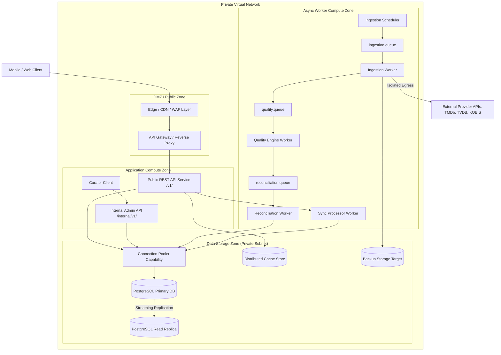
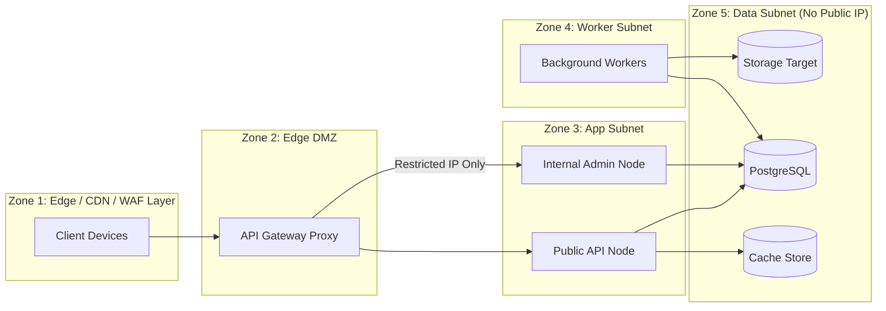
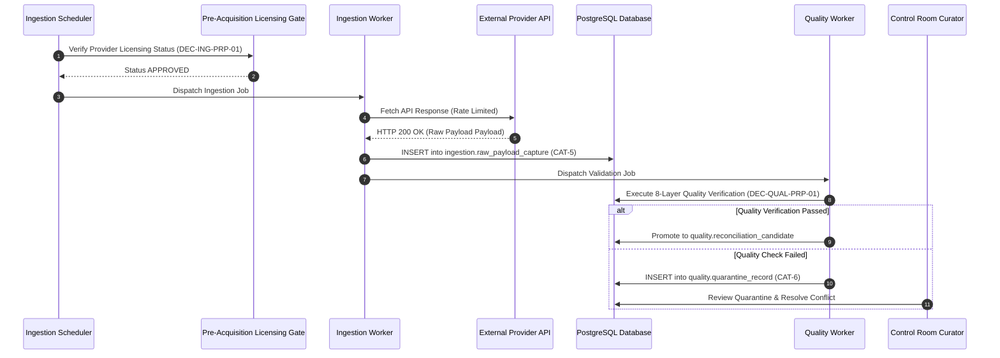
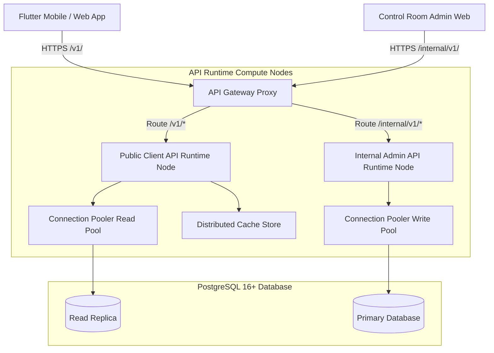
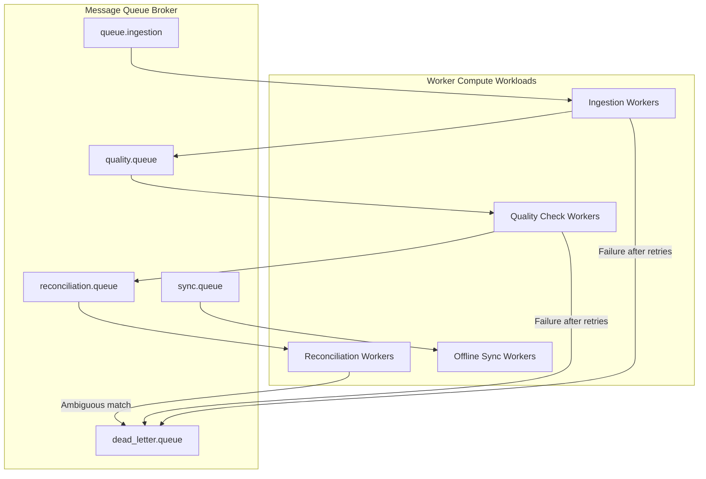
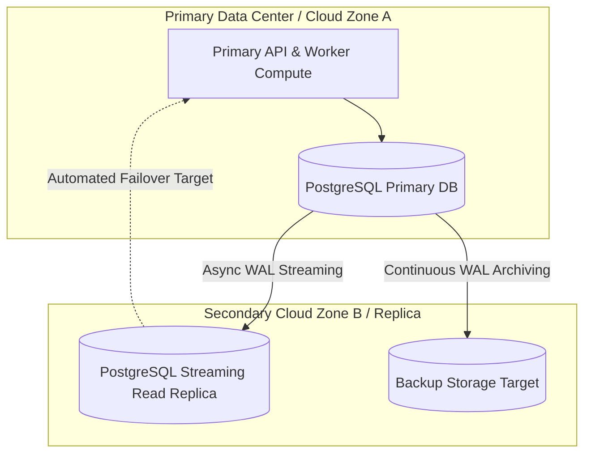

# CineVault OS — Infrastructure Architecture V1

**Document Type:** Master Infrastructure Architecture & Runtime Topology Specification  
**Status:** Architecture Baseline Specification (Post-Owner Approval Pass — Approved with Deferred Infrastructure Decisions)  
**Date:** 2026-08-08  
**Scope:** Complete Runtime Topology, Compute Architecture, Environment Model, Network & Security Zones, Database Runtime, Caching Strategy, Message Queues, Object Storage, Ingestion Runtime, Observability, Failure Recovery, and CI/CD Pipeline Design  

---

## 1. Purpose

The purpose of the **CineVault OS Infrastructure Architecture V1** is to define a production-grade, resilient, secure, and scalable cloud-native runtime architecture for CineVault OS.

This specification translates all previously approved governance baselines (`ADR-001` through `ADR-004`, `Data Model V1`, `ERD V1`, `Data Dictionary V1`, `Data Source Registry V1`, `Ingestion Architecture V1`, `Data Quality & Reconciliation Architecture V1`, `API Specification V1`, and `Physical Database Design V1`) into a physical runtime environment model. It establishes compute topologies, network security perimeters, database runtime topologies, caching boundaries, queue processing models, secret management policies, and observability systems without provisioning infrastructure, creating cloud resources, or writing deployment code.

---

## 2. Scope

### In-Scope
* Definition of the 4-tier Environment Model (`local`, `development`, `staging`, `production`) and isolation boundaries.
* Compute Topology specification for REST API services, ingestion schedulers, background workers, quality engines, reconciliation pipelines, sync processors, and Control Room management tools.
* PostgreSQL Database Runtime Architecture (Primary/Replica topology, connection pooling concept, failover concepts, backup & point-in-time recovery).
* Caching Architecture (Distributed Cache / Rate-Limit State Store conceptual boundaries, canonical vs. personal data caching rules, TTL policies, invalidation strategies).
* Object Storage Architecture (S3-compatible API target concept for licensed artwork proxy caches, raw payload archives, and exports).
* Asynchronous Message Queue Topology (Task distribution, dead-letter queues, idempotency, exponential backoff, rate limiting).
* Ingestion Runtime Implementation (Mapping the 12-state ingestion lifecycle, provider authorization gates, circuit breakers, and rate limiters).
* API Gateway & Runtime Boundaries (3-tier logical isolation: Public Client API `/v1/`, Internal Operational API `/internal/v1/`, Provider Integration Boundary).
* Security Architecture & Network Zones (Edge/CDN/WAF Layer, DMZ Zone, Application Zone, Worker Zone, Data Zone, TLS 1.3, secrets management).
* Observability & Monitoring Framework (Prometheus metrics, JSON structured logging, OpenTelemetry tracing, alert rules, health check probes).
* Failure Handling & Disaster Recovery (RPO/RTO targets, failure modes, failover protocols, circuit breaker patterns).
* Conceptual CI/CD Pipeline & Development Infrastructure.
* 6 comprehensive Mermaid architecture diagrams.

### Out-of-Scope (Prohibited in this Phase)
* Deploying any infrastructure, provisioning cloud resources (AWS, GCP, Azure, DigitalOcean).
* Creating Docker Compose files, Kubernetes manifests, Helm charts, Terraform/OpenTofu scripts.
* Provisioning PostgreSQL instances, Redis clusters, RabbitMQ/Kafka brokers, S3 buckets.
* Creating CI/CD YAML pipeline files, application source code, API controllers, worker scripts, SQL files, database migrations.

---

## 3. Architectural Principles & Invariants

1. **Strict Implementation Neutrality:** This document specifies runtime contracts, topologies, network boundaries, and queue contracts. Zero infrastructure is provisioned; zero code is written. Vendor selections (cloud providers, CDN vendors, specific connection poolers, exact caching software) remain DEFERRED.
2. **Canonical Governance Locks:** The conceptual data model (`CAT-1` through `CAT-6`), UUIDv7 identity strategy (**ADR-001**), content hierarchy (**ADR-002**), personal data isolation (**ADR-003**, **ADR-004**), 3-tier API boundaries, and 5-schema PostgreSQL database design are immutable constraints. Infrastructure implements these baselines without altering them.
3. **No Direct Provider Access to Canonical Storage:** External data ingestion pipelines MUST pass through provider adapters, raw capture staging (`ingestion.raw_payload_capture`), syntax/schema quality gates (`quality.quarantine_record`), and reconciliation curation engines before canonical promotion (`canonical` schema).
4. **AI Proposal Isolation (ADR-004):** AI processing services operate strictly within `CAT-6` proposal storage (`quality.ai_proposal_staging`). Direct AI write paths into `canonical` schema tables are structurally blocked.
5. **Personal Data Non-Destruction:** Infrastructure maintenance routines, database merges, or provider deletions NEVER delete or mutate `CAT-2` User Personal Data (`personal.watch_event`, `personal.rating`). Merges generate `personal_data_conflict` records for user-driven resolution.
6. **No Unlicensed Scraping or Rights Bypass:** Provider adapters execute strictly through approved Pre-Acquisition Licensing Gates (**DEC-ING-PRP-01**). Media proxy caches enforce metadata vs. media rights separation (**DEC-ING-PRP-05**).
7. **Zero-Trust Network Zoning:** Compute components operate within isolated security zones. Public edge proxies cannot directly query PostgreSQL; workers cannot access user personal endpoints.

---

## 4. Terminology

* **Ingestion Worker:** Asynchronous process executing provider API fetching, rate limiting, and raw payload capture (`CAT-5`).
* **Reconciliation Engine:** Asynchronous service evaluating candidate observations against canonical records using fuzzy matching, evidence lineage, and authority rules.
* **Control Room:** Internal administrative dashboard and API service for human curation, conflict review, and candidate promotion.
* **Circuit Breaker:** Resilience pattern preventing cascading failures by stopping requests to an external provider when failure thresholds are exceeded.
* **Dead-Letter Queue (DLQ):** Secondary queue holding messages that failed processing after maximum retry attempts for human investigation.
* **Point-In-Time Recovery (PITR):** Continuous WAL archiving allowing database state restoration to any exact timestamp.

---

## 5. Environment Model & Isolation

CineVault OS specifies 4 distinct execution environments with strict data and network isolation:

```text
┌─────────────────────────────────────────────────────────────────────────────────┐
│                           ENVIRONMENT MODEL & ISOLATION                         │
├──────────────┬──────────────────┬──────────────────┬────────────────────────────┤
│ Environment  │ Compute Runtime  │ Database Target  │ Isolation Rules            │
├──────────────┼──────────────────┼──────────────────┼────────────────────────────┤
│ `local`      │ Local Container  │ Local PostgreSQL │ Isolated developer stack;  │
│              │ Stack            │ Containers       │ mock external provider APIs│
├──────────────┼──────────────────┼──────────────────┼────────────────────────────┤
│ `development`│ Staged Cloud     │ Dev PostgreSQL   │ Shared dev testing;        │
│              │ Container Group  │ (Anonymized)     │ synthetic test data        │
├──────────────┼──────────────────┼──────────────────┼────────────────────────────┤
│ `staging`    │ Production-Ident │ Staging DB       │ Pre-production validation; │
│              │ Topology         │ (Replication Copy│ sandbox provider API keys  │
├──────────────┼──────────────────┼──────────────────┼────────────────────────────┤
│ `production` │ High-Availability│ Multi-AZ Primary │ Zero test access; strict   │
│              │ Multi-AZ Cluster │ & Read Replicas  │ secrets & audit controls   │
└──────────────┴──────────────────┴──────────────────┴────────────────────────────┘
```

---

## 6. Compute Topology & Micro-Services

Compute workloads are divided into discrete, independently scalable runtime services:

```text
┌─────────────────────────┬───────────────────────────────┬──────────────────────┬──────────────────────────────┐
│ Service Name            │ Primary Function              │ Inbound Trigger      │ Outbound Access              │
├─────────────────────────┼───────────────────────────────┼──────────────────────┼──────────────────────────────┤
│ `api_gateway`           │ Edge Proxy, TLS, Auth, Limits │ Client HTTPS (`/v1`) │ `public_api_service`         │
│ `public_api_service`    │ Serves Client REST API        │ Gateway Requests     │ PostgreSQL (Read/Write Pool) │
│                         │ (`/v1/titles`, `/v1/me`)      │                      │ Distributed Cache Store      │
│ `internal_admin_service`│ Control Room Curation API     │ Curator HTTPS        │ PostgreSQL (Full Access Pool)│
│                         │ (`/internal/v1/...`)          │ (Internal Zone)      │ Queue Broker                 │
│ `ingestion_scheduler`   │ Cron/Periodic Source Trigger  │ Timer / Cron         │ Ingestion Queue              │
│ `ingestion_worker`      │ Provider API Fetch & Capture  │ Ingestion Queue      │ External Provider API        │
│                         │                               │                      │ `ingestion` DB Schema        │
│ `quality_worker`        │ Syntax/Schema Verification    │ Quality Queue        │ `ingestion` & `quality` DB   │
│ `reconciliation_worker` │ Matching & Candidate Lineage  │ Reconciliation Queue │ `quality` & `canonical` DB   │
│ `sync_processor_worker` │ Offline Outbox Sync Engine    │ Sync Queue           │ `personal` DB Schema         │
│ `media_proxy_worker`    │ Licensed Artwork Cache Proxy  │ Media Queue          │ Object Storage Target / CDN  │
└─────────────────────────┴───────────────────────────────┴──────────────────────┴──────────────────────────────┘
```

---

## 7. Database Runtime Architecture (PostgreSQL 16+)

The database runtime architecture leverages the approved **Physical Database Design V1** (PostgreSQL 16+) with a Primary/Replica topology:

```text
┌─────────────────────────────────────────────────────────────────────────────────┐
│                      POSTGRESQL DATABASE RUNTIME TOPOLOGY                       │
├────────────────────────────────────────┬────────────────────────────────────────┤
│ Primary Database Instance (Multi-AZ)   │ Read Replica Instances (Scalable Pool) │
├────────────────────────────────────────┼────────────────────────────────────────┤
│ • Handles all WRITE operations         │ • Handles read-heavy client queries    │
│ • Hosts schemas: `canonical`, `personal│ • Streaming WAL replication from PK    │
│   ingestion`, `quality`, `audit`       │ • Connection pooling capability        │
│ • Continuous WAL archiving for PITR    │ • Isolated read role (`cinevault_read`)│
└────────────────────────────────────────┴────────────────────────────────────────┘
```

### Connection Management & Pooling Concept (`DEC-PHYS-DEF-03` DEFERRED)
* **Connection Pooling Capability:** REQUIRED / PROPOSED architectural capability to pool connections between stateless compute services and PostgreSQL instances.
* **Candidate Technology:** **PgBouncer** is identified as a candidate example. Specific technology selection and topology configuration remain DEFERRED (`DEC-PHYS-DEF-03`).
* **Replication & Failover:** Asynchronous Multi-AZ streaming replication with automated health checks and failover management.
* **Backup & PITR (`DEC-PHYS-DEF-04` DEFERRED):** Daily full base backups combined with continuous Write-Ahead Log (WAL) archiving to a Backup Storage Target (e.g., S3-compatible API target), enabling Point-In-Time Recovery to any second within 30 days. Cloud backup infrastructure remains DEFERRED (`DEC-PHYS-DEF-04`).

---

## 8. Caching Architecture (Distributed Cache / Rate-Limit Store)

Caching is specified using a **Distributed Cache / Rate-Limit State Store** conceptual boundary (`DEC-API-DEF-04` DEFERRED):

> [!NOTE]
> **Candidate Technology:** **Redis** is identified as a candidate technology for cache implementation. Physical cache storage technology, cluster topology, and exact key schemas remain DEFERRED (`DEC-API-DEF-04`).

```text
┌────────────────────────────────────────────────────────────────────────┐
│             DISTRIBUTED CACHE & STATE STORE BOUNDARIES                 │
├───────────────────────────────────┬────────────────────────────────────┤
│ Permitted Cache Targets           │ STRICTLY PROHIBITED Cache Targets  │
├───────────────────────────────────┼────────────────────────────────────┤
│ • Canonical Title Metadata (`CAT-1`)│ • Raw User Auth Tokens in Plaintext│
│ • Genre / Taxonomy Lookup Tables  │ • Personal Watch Events (`CAT-2`)  │
│ • Public API Response Payloads    │ • Un-reconciled Raw Payloads (`CAT-5`)│
│ • Rate-Limiting Counter Keys      │ • AI Proposal Drafts (`CAT-6`)     │
│ • Client Session Token Metadata   │ • Sensitive External Provider Keys │
└───────────────────────────────────┴────────────────────────────────────┘
```

### TTL & Invalidation Concept
* **Read-Through Caching:** Public API fetches from Cache Store first; on cache miss, reads from PostgreSQL Read Replica and populates Cache Store with a 3600-second (1 hour) TTL.
* **Invalidation Strategy:** Canonical catalog updates publish an invalidation event to Cache Pub/Sub, evicting stale title keys immediately.

---

## 9. Asynchronous Message Queue Topology

Asynchronous task processing uses a message broker queue architecture (e.g. RabbitMQ, Redis Streams, or NATS as candidate options under `DEC-INFRA-OPN-01`):

```text
┌───────────────────────┬───────────────────────────────────┬───────────────────────────────┐
│ Queue Name            │ Workload / Payload Description    │ Failure & Retry Policy        │
├───────────────────────┼───────────────────────────────────┼───────────────────────────────┤
│ `queue.ingestion`     │ Provider API fetch job triggers   │ 3 retries; exponential backoff│
│ `queue.quality`       │ Raw payload validation jobs       │ 5 retries; route to DLQ on err│
│ `queue.reconciliation`│ Entity matching candidate tasks   │ 3 retries; DLQ for curation   │
│ `queue.sync`          │ Outbox offline mutation processing│ Infinite retry with backoff   │
│                       │                                   │ until user conflict flagged   │
│ `queue.media`         │ Artwork proxy & thumbnail generation│ 3 retries; fallback to null   │
│ `queue.dead_letter`   │ Permanent processing failures     │ Retained for manual review    │
└───────────────────────┴───────────────────────────────────┴───────────────────────────────┘
```

---

## 10. Ingestion Runtime Implementation

The ingestion runtime executes the approved 12-state ingestion lifecycle across dedicated compute units:

```text
┌─────────────────────────────────────────────────────────────────────────────────┐
│                        INGESTION RUNTIME EXECUTION PIPELINE                     │
├─────────────────────────────────────────────────────────────────────────────────┤
│ 1. `ingestion_scheduler` triggers periodic ingest job                           │
│ 2. Pre-Acquisition Licensing Gate verifies provider status (DEC-ING-PRP-01)    │
│ 3. Ingestion Worker checks Rate Limiter counter                                 │
│ 4. Worker invokes Provider Adapter over Provider Integration Boundary           │
│ 5. Raw HTTP response captured immutably in `ingestion.raw_payload_capture`       │
│ 6. Normalized candidate generated in `quality.normalized_title_staging`         │
│ 7. `quality_worker` executes 8-layer quality checks (DEC-QUAL-PRP-01)           │
│ 8. Valid payloads forwarded to `reconciliation_worker`                          │
│ 9. Candidate matched; evidence recorded in `audit.attribute_evidence_lineage`   │
│ 10. Unambiguous match promoted to `canonical` schema; conflicts queued          │
└─────────────────────────────────────────────────────────────────────────────────┘
```

---

## 11. API Runtime & Boundary Enforcement

Runtime compute nodes enforce the approved 3-tier API boundary architecture (**DEC-API-PRP-02**):

```text
┌────────────────────────────────────────────────────────────────────────┐
│                     THREE-TIER RUNTIME API BOUNDARIES                  │
├───────────────────┬───────────────────────────┬────────────────────────┤
│ Public Client API │ Internal Operational API  │ Provider Boundary      │
│ (`/v1/`)          │ (`/internal/v1/`)         │ (Egress Ingestion Only)│
├───────────────────┼───────────────────────────┼────────────────────────┤
│ • Mobile/Web client│ • Control Room Curation  │ • Isolated outbound    │
│   traffic only    │ • Candidate promotion     │   HTTP/HTTPS calls to  │
│ • Read-heavy,     │ • Personal conflict UI    │   TMDb, TVDB, KOBIS    │
│   rate-limited    │ • Admin authentication    │ • Blocked from inbound │
│ • CORS restricted │ • Internal network zone   │   client access        │
└───────────────────┴───────────────────────────┴────────────────────────┘
```

---

## 12. Security Architecture & Network Boundaries

The network architecture is divided into 5 isolated security zones:

```text
┌─────────────────────────────────────────────────────────────────────────────────┐
│                            NETWORK SECURITY ZONES                               │
├──────────────┬──────────────────────┬───────────────────────────────────────────┤
│ Zone Name    │ Components           │ Access Policy                             │
├──────────────┼──────────────────────┼───────────────────────────────────────────┤
│ Zone 1: Edge │ Edge / CDN / WAF     │ Public HTTPS (Ports 80/443). DDoS filter. │
│              │ Layer (DEC-INFRA-DEF-01) (Vendor neutral).                       │
│ Zone 2: DMZ  │ API Gateway Proxy    │ Inbound from Edge; routes to Public API.  │
│ Zone 3: App  │ `public_api_service` │ Inbound from DMZ; access to DB Read Pool. │
│              │ `internal_admin_api` │ Internal IP restriction for Admin API.    │
│ Zone 4: Work │ Workers, Schedulers  │ Isolated subnet; egress to Provider APIs. │
│ Zone 5: Data │ PostgreSQL, Cache,   │ Strict private subnet; zero public IP.    │
│              │ Storage Target       │ Access restricted to App/Worker nodes.    │
└──────────────┴──────────────────────┴───────────────────────────────────────────┘
```

---

## 13. Secrets & Key Management Policy

* **Zero Plaintext Secrets:** Secrets (DB passwords, provider API keys, OAuth client secrets, JWT signing keys) MUST NOT be committed to Git or hardcoded in container images.
* **Secrets Manager:** Runtime environment variables are injected at container startup from an encrypted Secrets Manager (e.g., Vault or cloud provider secrets service).
* **Least Privilege:** Each runtime compute service receives ONLY the exact secret keys required for its specific role.

---

## 14. Observability & Monitoring Framework

```text
┌───────────────────────┬───────────────────────────────┬───────────────────────────────────────────┐
│ Observability Dimension│ Technology Standard          │ Target Health Metric / Alert              │
├───────────────────────┼───────────────────────────────┼───────────────────────────────────────────┤
│ System Metrics        │ Prometheus + Grafana          │ CPU/RAM > 85%; DB Conn Pool Exhaustion    │
│ Application Logs      │ Structured JSON (Zap/Winston) │ ERROR/CRITICAL logs; HTTP 5xx Spike       │
│ Distributed Tracing   │ OpenTelemetry                 │ End-to-end latency; DB query span > 200ms │
│ Health Check Probes   │ `/health/liveness`            │ HTTP 200 OK process alive probe           │
│                       │ `/health/readiness`           │ HTTP 200 OK DB & Cache connection probe   │
│ Audit Lineage         │ `audit.canonical_audit_log`   │ Administrative promotion & merge tracking │
└───────────────────────┴───────────────────────────────┴───────────────────────────────────────────┘
```

---

## 15. Failure & Disaster Recovery

```text
┌───────────────────────┬───────────────────────────────┬───────────────────────────────────────────┐
│ Component Failure     │ Automated Detection           │ Mitigation & Recovery Protocol            │
├───────────────────────┼───────────────────────────────┼───────────────────────────────────────────┤
│ Primary DB Crash      │ Health check probe failure    │ Automated Multi-AZ failover to Replica    │
│ Provider API Outage   │ HTTP 5xx / Timeout counter    │ Circuit Breaker trips; queue retries job  │
│ Cache Store Outage    │ Connection timeout            │ Fail-open to PostgreSQL Read Replicas     │
│ API Node Crash        │ Container / Load Balancer     │ Traffic rerouted to healthy nodes; autoscale│
│ Queue Broker Outage   │ Compute disconnect alert      │ Workers buffer mutations in local outbox  │
└───────────────────────┴───────────────────────────────┴───────────────────────────────────────────┘
```

### RPO & RTO Targets (PROPOSED)
* **Recovery Point Objective (RPO):** < 5 minutes for personal watch data and canonical catalog.
* **Recovery Time Objective (RTO):** < 1 hour for full infrastructure failover.

---

## 16. Architecture Diagrams

### Diagram 1: Complete Infrastructure Topology



---

### Diagram 2: Production Network & Security Boundaries



---

### Diagram 3: Data Ingestion Runtime Flow



---

### Diagram 4: API Runtime & Boundary Topology



---

### Diagram 5: Async Worker & Queue Topology



---

### Diagram 6: Disaster Recovery & Replication Topology



---

## 17. Deferred Infrastructure Decisions

| Decision ID | Deferred Topic | Target Phase |
|---|---|---|
| `DEC-INFRA-DEF-01` | Cloud Infrastructure Provider & CDN Selection (AWS vs GCP vs Azure vs Self-Hosted) | Cloud Procurement Phase |
| `DEC-INFRA-DEF-02` | Kubernetes Manifests & Terraform Script Creation | Infrastructure Implementation Phase |
| `DEC-INFRA-DEF-03` | CI/CD Pipeline Automation Scripting (GitHub Actions / GitLab CI) | DevOps Implementation Phase |
| `DEC-API-DEF-02` | Authentication Provider & OAuth Server Technology | Security Implementation Phase |
| `DEC-API-DEF-03` | API Gateway Technology Selection (Kong vs Envoy vs NGINX) | Edge Infrastructure Phase |
| `DEC-API-DEF-04` | Physical Cache Storage Technology & Key Schemas (Redis vs Memcached) | Cache Implementation Phase |
| `DEC-PHYS-DEF-02` | Database Migration Tool Selection | Database Infrastructure Phase |
| `DEC-PHYS-DEF-03` | Connection Pool Technology & Topology (PgBouncer settings) | Deployment Phase |
| `DEC-PHYS-DEF-04` | Backup / DR Cloud Storage Infrastructure Target | Operations Phase |

---

## 18. Key Architectural Risks

1. **Provider Egress Rate-Limit Starvation:** High risk of provider IP blocks if rate limiters fail; mitigated by centralized rate-limiting keys and circuit breaker patterns.
2. **Reconciliation Queue Backlog:** Risk of slow curation processing under heavy ingestion spikes; mitigated by asynchronous queue partitioning and horizontal worker scaling.
3. **Cache Invalidation Desynchronization:** Risk of serving stale title metadata from Cache Store; mitigated by event-driven pub/sub cache eviction upon canonical update.

---

## 19. Open Questions

1. **Queue Technology Standard (`DEC-INFRA-OPN-01`):** Evaluation between RabbitMQ (AMQP) vs Redis Streams vs NATS for asynchronous queue broker workload.
2. **Multi-Region Read Scale (`DEC-INFRA-OPN-02`):** Should read replicas be deployed across multiple geographical regions for global client latency optimization?

---

## 20. Governance Gate & Sign-Off

The **Infrastructure Architecture V1** has received formal Project Owner approval for all conceptual proposal decisions (`DEC-INFRA-PRP-01` through `DEC-INFRA-PRP-08`).

* **Current Governance Status:** `APPROVED WITH DEFERRED INFRASTRUCTURE DECISIONS`
* **Next Phase:** Production Infrastructure Procurement / Implementation (Awaiting Control Room Trigger)

---
