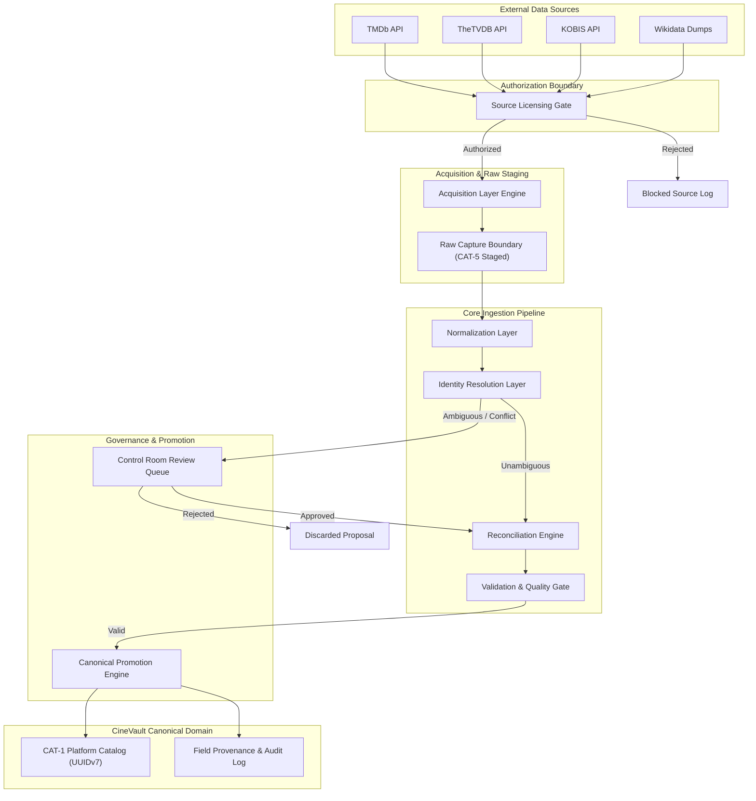
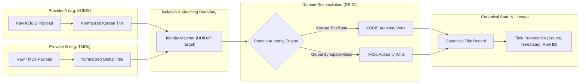
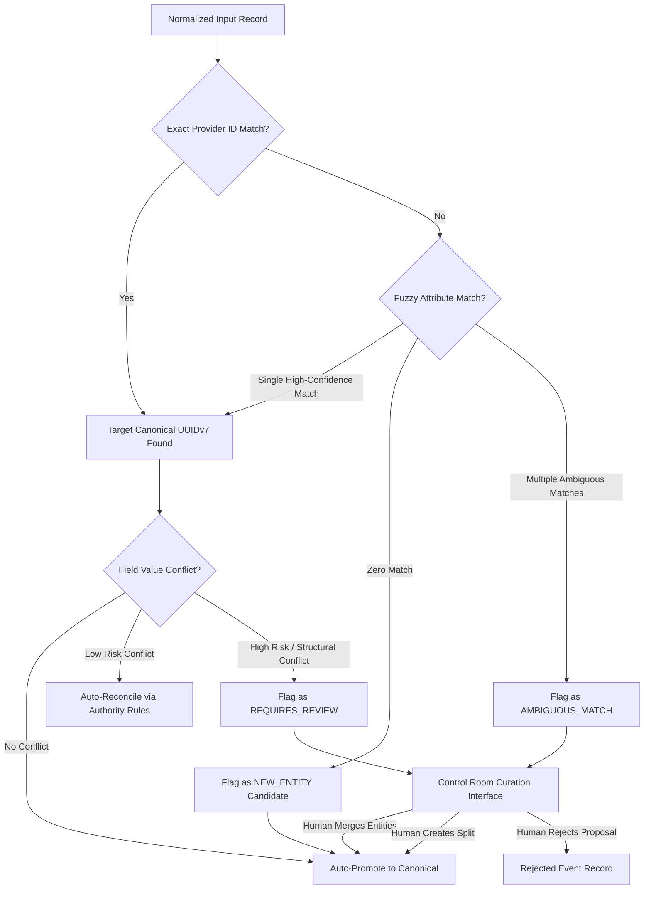

# CineVault OS — Data Ingestion Architecture V1

**Document Type:** Master Ingestion Architecture Specification  
**Status:** Architecture Baseline Specification (Post-Owner Approval Pass — Approved with Deferred Items)  
**Date:** 2026-08-08  
**Scope:** Provider-Neutral Data Acquisition, Licensing Gate, Raw Capture Boundary, Normalization, Identity Resolution, Reconciliation, Canonical Promotion, Provenance, and Governance  

---

## 1. Purpose

The purpose of the **CineVault OS Data Ingestion Architecture V1** is to establish a provider-neutral, governance-first architectural blueprint for acquiring, transforming, resolving, reconciling, and promoting external entertainment metadata into CineVault's canonical domain model.

This architecture ensures that external source data—regardless of technical protocol (REST, GraphQL, bulk datasets, licensed feeds) or origin (TMDb, TheTVDB, KOBIS, Wikidata, etc.)—is ingested safely, legally, deterministically, and with complete provenance.

---

## 2. Scope

### In-Scope
* Provider-neutral acquisition abstractions, connectors, rate-limiting, and retry concepts.
* Pre-ingestion licensing and access authorization gate.
* Immutable raw data capture boundary (CAT-5 External-Source Data).
* Schema normalization and structural mapping to CineVault representations.
* Identity resolution framework adhering to ADR-001 (UUIDv7 internal canonical identity).
* Domain-aware metadata reconciliation framework enforcing DS-01 and approved source authority roles (DEC-SRC-PRP-01, DEC-SRC-PRP-02).
* Conceptual conflict handling, human curation routing, and review workflows.
* Field-level provenance tracking and end-to-end operational auditability.
* Isolation of media/image rights from structured metadata rights.
* Governance for AI-generated metadata proposals (CAT-6) per ADR-004.
* Idempotency, replayability, failure isolation, security boundaries, and observability.

### Out-of-Scope (Prohibited in this Phase)
* Application code, provider API clients, scraper scripts, network code.
* Physical database schemas, PostgreSQL DDL, tables, indexes, ORM models.
* Queue workers, background processing implementations, ETL job scripts.
* Modification of approved canonical documents (ADRs, Data Model V1, ERD V1, Data Dictionary V1).
* Mutation or management of User-Owned Personal Data (CAT-2).

---

## 3. Architectural Principles

1. **Licensing Before Ingestion:** Technical accessibility of an API or dataset NEVER implies legal authorization for ingestion, storage, or commercial use. All sources must clear the Licensing Gate prior to acquisition.
2. **Provider-Neutral Architecture:** The core ingestion pipeline must remain decoupled from specific external API schemas, transfer formats, and transport protocols.
3. **Immutable Raw Capture Boundary:** External payloads are captured immutably as CAT-5 External-Source Data before transformation. Raw payload data NEVER directly overwrites canonical entities.
4. **Canonical Identity Independence (ADR-001):** Internal canonical identities are generated UUIDv7s. External provider IDs are mappings (`TitleExternalId`, etc.) and NEVER canonical keys.
5. **Domain-Specific Authority (DS-01):** No single provider is the universal primary authority. Authority is domain-scoped and rule-driven (e.g., KOBIS for Korean cinema, TheTVDB for TV structure).
6. **Non-Destructive Personal Data Protection (ADR-003, ADR-004):** External ingestion, updates, or provider deletions MUST NEVER alter, overwrite, or destroy user-owned watch history, ratings, notes, or reviews (CAT-2).
7. **Metadata vs. Media Licensing Isolation:** Metadata rights and image/media rights are governed independently. Metadata ingestion authorization does not grant media storage or redistribution rights.
8. **AI Proposal Isolation (ADR-004):** AI-generated data is classified as CAT-6 proposals and must pass validation gates before canonical promotion.
9. **Deterministic Replayability:** Ingestion must support re-running normalization and reconciliation logic over historical raw payloads when business rules or authority mappings evolve.
10. **Explainable Provenance & Auditability:** Every canonical attribute must maintain full lineage back to the raw source observation, ingestion operation, and reconciliation rule that created or modified it.

---

## 4. Terminology

* **Acquisition Boundary:** The boundary responsible for fetching payload data from external provider endpoints or feeds.
* **Provider Connector:** An abstract provider adapter that encapsulates provider-specific transport, auth, rate limiting, and raw response extraction.
* **Licensing Gate:** A mandatory pre-acquisition checkpoint evaluating provider contractual rights, usage terms, and media permissions.
* **Raw Payload Boundary:** The immutable staging zone where un-transformed external payloads are recorded alongside metadata (timestamp, source revision, provider ID).
* **Normalized Representation:** Intermediate, provider-neutral structured objects conforming to CineVault domain interfaces prior to canonical identity matching.
* **Identity Resolution:** The process of matching normalized external entities against existing canonical CineVault entities or declaring a new entity candidate.
* **Reconciliation Engine:** The domain logic that resolves attribute conflicts across multiple authorized providers using domain authority rules.
* **Canonical Promotion:** The governed operation that writes or updates reconciled metadata into CAT-1 Canonical Platform Data.
* **Field Provenance:** Metadata recording the provider, source record ID, timestamp, and rule ID for an ingested attribute value.

---

## 5. High-Level Ingestion Pipeline Architecture

The CineVault ingestion pipeline follows a strict, progressive 10-stage flow:

```text
1. External Data Source
         ↓
2. Source Authorization & Licensing Gate
         ↓
3. Acquisition Layer (Fetch / Stream / Import)
         ↓
4. Immutable Raw Capture Boundary (CAT-5 Staged)
         ↓
5. Normalization Layer (Provider Schema -> CineVault Intermediate)
         ↓
6. Identity Resolution Layer (Provider Mappings & Entity Matching)
         ↓
7. Domain Reconciliation Layer (Authority Weighting & Conflict Engine)
         ↓
8. Validation & Governance Gate (Data Integrity & Structural Checks)
         ↓
9. Canonical Promotion Layer (CAT-1 Catalog Write & Display ID Generation)
         ↓
10. Provenance & Audit Logging (Lineage & Operational Observability)
```

---

## 6. Layer Responsibilities & Prohibitions

| Layer | Primary Responsibilities | Prohibited Actions |
|---|---|---|
| **1. Source Authorization Gate** | Verify API keys, active contracts, commercial terms, attribution rules, media rights, and storage permissions. | MUST NOT allow unverified or restricted sources (e.g. IMDb public datasets, scraped JustWatch) to pass. |
| **2. Acquisition Layer** | Transport handling, rate-limit throttling, exponential backoff, pagination, bulk dump unpacking, checkpointing. | MUST NOT parse business domain entities or execute identity matching. |
| **3. Raw Capture Layer** | Store immutable raw payloads, capture source HTTP/file headers, record retrieval timestamp, assign raw payload identity. | MUST NOT alter payload content or write into CAT-1 canonical tables. |
| **4. Normalization Layer** | Map provider-specific JSON/XML/RDF schemas into standard CineVault intermediate types (`NormalizedTitle`, etc.). | MUST NOT assign UUIDv7 canonical keys or resolve cross-provider conflicts. |
| **5. Identity Resolution Layer** | Resolve external IDs to internal `TitleExternalId` mappings, perform fuzzy candidate matching, flag duplicate/split/merge candidates. | MUST NOT merge or split canonical entities without governance review. MUST NOT use external IDs as UUIDv7. |
| **6. Reconciliation Layer** | Apply domain-specific authority matrix (DS-01, KOBIS, TheTVDB), resolve conflicting field values across providers. | MUST NOT use blind "latest source wins" or global "highest priority source wins" logic. |
| **7. Validation & Governance** | Structural check (ADR-001/002 rules), primary edition invariant verification, required field enforcement, confidence scoring. | MUST NOT promote invalid or structurally incomplete records. |
| **8. Canonical Promotion** | Mint new UUIDv7, assign secondary Display ID (`MOV-000001`), update CAT-1 canonical platform data, tombstone merged entities. | MUST NOT alter or mutate CAT-2 User-Owned Personal Data under any circumstances. |
| **9. Provenance & Audit** | Record attribute lineage, provider attribution, ingestion run metadata, audit logs in `CanonicalAuditLog`. | MUST NOT discard source attribution or raw execution telemetry. |

---

## 7. Source Authorization & Licensing Gate

Before any external data pipeline executes, the payload request or dataset must clear the **Licensing Gate**.

```text
                     [ External Provider Request ]
                                   │
                                   ▼
                   ┌───────────────────────────────┐
                   │   Source Authorization Gate   │
                   └───────────────┬───────────────┘
                                   │
                ┌──────────────────┴──────────────────┐
                ▼                                     ▼
     [ Valid License & Terms ]            [ Unverified / Prohibited ]
                │                                     │
                ▼                                     ▼
    ┌───────────────────────┐             ┌───────────────────────┐
    │  Ingestion Permitted  │             │   REJECT & BLOCK LOG  │
    └───────────────────────┘             └───────────────────────┘
```

### Verification Criteria
1. **Contract & Terms Verification:** Confirm explicit authorization for local storage, warehousing, redistribution, and commercial usage.
2. **Access Role Check:** Verify whether provider is `CANDIDATE`, `CONDITIONAL`, `RESTRICTED`, `EXCLUDED`, or `VERIFICATION-ONLY`.
3. **Specific Provider Gates:**
   * **TMDb:** Require active commercial license verification flag per `DS-02`.
   * **IMDb Public Datasets:** Permanently BLOCKED from catalog ingestion per `DS-04`.
   * **AniList:** Block bulk ingestion; allow only permitted enrichment queries per `DS-03`.
   * **JustWatch:** Block any web-scraping attempts per `DS-05`; permit only official partner feeds.
   * **KOBIS / KOFIC:** Require licensing terms verification per `DEC-SRC-PRP-01` before production activation.
   * **TheTVDB:** Verify commercial subscription tier ($0–$10k+/yr) per `DEC-SRC-PRP-02`.
4. **Media / Image Permissions:** Independent check validating image proxying, caching, or CDN hosting rights.

---

## 8. Acquisition Architecture

The Acquisition Layer handles external network transport and data ingestion protocols while remaining fully implementation-neutral.

### Connector Abstractions
* **REST API Connector:** Manages HTTP requests, bearer tokens, query parameters, rate limits, page offsets, and cursor navigation (e.g., TMDb, TheTVDB, KOBIS).
* **GraphQL Connector:** Handles document queries, variable pagination, rate cost metrics, and error payload parsing (e.g., AniList enrichment).
* **Bulk Dataset Connector:** Downloads, verifies checksums, decompresses, and iterates over compressed dump files (e.g., Wikidata JSON dumps).
* **Manual / Curated Import Connector:** Ingests structured JSON/CSV files generated by internal editorial review or authorized partner hand-offs.

### Operational Protocols
* **Rate-Limit Throttling:** Respects HTTP 429 response headers and provider rate limits (e.g. TMDb 40 req/sec limit, Wikidata SPARQL 60s timeout).
* **Retry Policy:** Implements exponential backoff with jitter for transient 5xx errors and network timeouts. Circuit breakers isolate failing endpoints.
* **Full vs. Incremental Acquisition:**
  * *Full Acquisition:* Periodic bulk sync from snapshot dumps (e.g. Wikidata).
  * *Incremental Acquisition:* Change-log feeds, delta endpoints, or timestamp-filtered updates (e.g. TMDb `changes` endpoint).
* **Checkpointing & Watermarking:** Saves progress tokens, page offsets, and last-retrieved timestamps to enable resuming interrupted ingestion runs seamlessly.

---

## 9. Immutable Raw Capture Boundary

All data fetched by the Acquisition Layer must be stored immutably in the **Raw Capture Boundary** (CAT-5 External-Source Data) prior to normalization.

### Capture Requirements
* **Payload Immutability:** Raw JSON, XML, or RDF payloads are stored exactly as received without modification or cleanup.
* **Metadata Attachment:** Every raw payload record is wrapped with operational metadata:
  * `raw_payload_id` (UUIDv7)
  * `provider_name` (Enum: `TMDB`, `TVDB`, `KOBIS`, `WIKIDATA`, etc.)
  * `external_entity_type` (String, e.g. "movie", "tv_series", "person")
  * `external_entity_id` (String, e.g. "550", "Q1375", "20212345")
  * `ingestion_run_id` (UUIDv7)
  * `acquired_at` (UTC ISO-8601 Timestamp)
  * `payload_checksum` (SHA-256)
  * `source_revision_version` (String, optional)
* **Decoupling Guarantee:** Raw capture stores external data safely. Even if downstream normalization or reconciliation algorithms change, historical raw payloads remain intact for replay.

---

## 10. Normalization Architecture

The Normalization Layer translates raw provider payloads into standard intermediate CineVault data structures.

```text
[ Provider Payload ] ──▶ [ Normalizer Adapter ] ──▶ [ Normalized Intermediate Model ]
```

### Intermediate Canonical Models
Normalization produces provider-agnostic representations:
* `NormalizedTitle` (canonical_title, original_title, production_year, synopsis, content_type)
* `NormalizedEdition` (edition_name, runtime_minutes, aspect_ratio, color_format)
* `NormalizedRelease` (release_date, release_type, country_code, platform_name)
* `NormalizedSeason` (season_number, season_name, overview)
* `NormalizedEpisode` (episode_number, episode_name, air_date, runtime_minutes)
* `NormalizedPerson` (full_name, original_name, birth_date, death_date, gender)
* `NormalizedCredit` (person_external_id, role_type, character_name, job_title, billing_order)
* `NormalizedExternalId` (provider_name, provider_entity_id, provider_url)
* `NormalizedImage` (image_type, source_url, width, height, license_type)

### Crucial Distinction
**Normalization is NOT Canonicalization.**  
Normalization merely standardizes field names and data types (e.g. converting TMDb `"runtime": 120` and KOBIS `"showTm": "120"` into integer `runtime_minutes = 120`). Identity matching and truth reconciliation occur downstream.

---

## 11. Identity Resolution Framework

Identity Resolution matches normalized external records against existing CineVault canonical entities while respecting **ADR-001** (UUIDv7 canonical identity).

```text
[ Normalized Entity ]
          │
          ▼
┌───────────────────────────────────┐
│ Check Known External ID Mappings  │ ──▶ [ Match Found ] ──▶ Existing UUIDv7
└─────────────────┬─────────────────┘
                  │ No Match
                  ▼
┌───────────────────────────────────┐
│  Fuzzy & Attribute Matching Rules │ ──▶ [ High Confidence ] ──▶ Link to UUIDv7
└─────────────────┬─────────────────┘
                  │ Ambiguous / Multiple Matches
                  ▼
┌───────────────────────────────────┐
│  Candidate Classification Engine  │
└─────────────────┬─────────────────┘
                  │
     ┌────────────┼────────────┐
     ▼            ▼            ▼
[ NEW_ENTITY ] [ MERGE_CAND ] [ SPLIT_CAND ]
```

### Match State Taxonomy
1. `MATCH_EXACT_EXTERNAL_ID`: Direct match via existing provider ID mapping (e.g. `TitleExternalId` where provider = `TMDB` and external_id = `550`).
2. `MATCH_HIGH_CONFIDENCE_ATTRIBUTE`: Match based on deterministic combination (e.g. Exact `original_title` + `production_year` + `country_code`).
3. `MATCH_AMBIGUOUS`: Multiple potential canonical targets match the record. Requires Human Review.
4. `NO_MATCH_NEW_CANDIDATE`: No existing matching entity. Flagged as a candidate for new canonical entity creation.
5. `MERGE_CANDIDATE`: Indicates two canonical entities in CineVault likely represent the same real-world Title/Person.
6. `SPLIT_CANDIDATE`: Indicates one external provider record conflates two distinct creative works or people.

---

## 12. Domain-Aware Reconciliation Framework

Reconciliation resolves attribute conflicts when multiple authorized data sources supply conflicting information for the same canonical entity.

### Strict Governance Constraints
* **No Universal Primary Source (DS-01):** No single provider wins all attribute conflicts.
* **No Simple "Latest Source Wins":** Ingestion timestamps do not override domain authority.
* **No Blind Merging:** Conflicting core attributes are reconciled based on explicit domain authority roles.

### Domain Authority Hierarchy (Approved Baseline)

```text
┌─────────────────────────┬───────────────────────────────┬───────────────────────────────┐
│ Domain / Entity Type    │ Primary Domain Authority      │ Secondary / Reference Source  │
├─────────────────────────┼───────────────────────────────┼───────────────────────────────┤
│ Korean Cinema           │ KOBIS / KOFIC (DEC-SRC-PRP-01)│ TMDb / Wikidata               │
│ Television & Episodic   │ TheTVDB (DEC-SRC-PRP-02)      │ TMDb                          │
│ General Cinema Metadata │ TMDb (Commercial License)     │ Wikidata / KOBIS              │
│ Cross-Domain Identity   │ Wikidata (CC0 Graph)          │ TMDb / TheTVDB / KOBIS        │
└─────────────────────────┴───────────────────────────────┴───────────────────────────────┘
```

### Attribute Reconciliation Rules
1. **Title Names:** Preserve `canonical_title` (localized) and `original_title` (native script) independently.
2. **Release Dates:** Regional release dates take precedence from national authorities (e.g. KOBIS for Korean release date); global premiere date derived from earliest verified release.
3. **Runtime:** Captured at the `Edition` level (`Edition.runtime_minutes`). Different cut lengths MUST NOT overwrite primary edition runtime.
4. **Episodic Structure:** TheTVDB rules for broadcast season/episode numbers; alternate ordering stored in `RegionalEpisodeOrder`.

---

## 13. Conflict Handling Architecture

Conflicts encountered during identity resolution or reconciliation are managed through a formalized state machine:

```text
                       [ Raw Normalized Event ]
                                  │
                                  ▼
                     ┌─────────────────────────┐
                     │   Conflict Evaluator    │
                     └────────────┬────────────┘
                                  │
               ┌──────────────────┴──────────────────┐
               ▼                                     ▼
    [ Deterministic Conflict ]            [ High-Impact / Ambiguous ]
               │                                     │
               ▼                                     ▼
    ┌─────────────────────┐               ┌─────────────────────┐
    │ Auto-Reconcile via  │               │   REQUIRES_REVIEW   │
    │ Domain Authority    │               │  (Control Room Queue)│
    └──────────┬──────────┘               └──────────┬──────────┘
               │                                     │
               ▼                                     ▼
       [ ACCEPTED_AUTO ]                     [ HUMAN_DECISION ]
               │                                     │
               └──────────────────┬──────────────────┘
                                  │
                                  ▼
                      [ CANONICAL PROMOTION ]
```

### Conflict Classification
* `MATCH`: Unambiguous match, zero attribute conflict.
* `CONFLICT_LOW_RISK`: Minor attribute discrepancy (e.g. synopsis formatting). Auto-reconciled using primary domain authority.
* `CONFLICT_HIGH_RISK`: Core metadata discrepancy (e.g., conflicting release year, differing `content_type`, runtime variance > 15 mins). Flagged as `REQUIRES_REVIEW`.
* `AMBIGUOUS_IDENTITY`: Multiple candidate matches. Flagged as `REQUIRES_REVIEW`.
* `REJECTED`: Validation failure or prohibited license state. Pipeline halts for payload.

---

## 14. Canonical Promotion Layer

Canonical Promotion is the governed phase where validated, reconciled metadata is committed into **CAT-1 Canonical Platform Data**.

### Promotion Checklist & Invariants
1. **Canonical Identity Assignment:** If a new entity, mint a permanent **UUIDv7** primary key (`title_id`, `person_id`, etc.).
2. **Display ID Assignment:** Assign secondary display ID (`MOV-000001`, `SER-000001`, `ANI-000001`) with immutable prefix based on initial classification.
3. **Primary Edition Invariant:** Every newly promoted Title MUST automatically receive a Primary Edition (`is_primary = true`).
4. **External ID Linkage:** Insert or update `TitleExternalId` / `PersonExternalId` mapping records.
5. **Zero Mutation of User Personal Data (ADR-003, ADR-004):** Promotion MUST NEVER update, re-parent, or delete records in `CAT-2` (Watch Events, Ratings, Notes, Reviews). Re-parenting or conflict resolution of personal data occurs strictly in domain user services through explicit user-approved workflows.

---

## 15. Field-Level Provenance Architecture

To comply with Data Dictionary V1 requirements, every promoted canonical attribute must maintain field-level provenance tracking.

### Provenance Attributes (Conceptual Model)
For any ingested attribute value, the system captures:
* `source_provider`: Name of the provider supplying the value (e.g. `"KOBIS"`, `"TMDB"`, `"WIKIDATA"`).
* `source_external_id`: Provider entity ID supplying the value (e.g. `"20212345"`).
* `observation_timestamp`: UTC timestamp when payload was acquired.
* `ingestion_run_id`: UUIDv7 identifying the batch/stream execution.
* `reconciliation_rule_id`: Identifier of the authority rule applied during reconciliation.
* `confidence_score`: Floating point score (0.00 – 1.00) representing source authority weight.
* `is_manually_overridden`: Boolean flag indicating if a human editor forced the value.

---

## 16. End-to-End Auditability

The architecture guarantees complete auditability and lineage reconstruction across all 10 pipeline stages.

```text
External Payload ──▶ Raw Capture ID ──▶ Normalized Model ──▶ Resolution Decision ──▶ Reconciliation Log ──▶ Canonical Audit Record
```

### Audit Traceability
* **Reconstruction Capability:** Given any canonical field value, system operators can trace back to the exact raw payload, acquisition timestamp, provider connector run, and reconciliation rule.
* **Canonical Audit Logging:** All entity creations, metadata promotions, reclassifications, and merge/split events produce immutable records in `CanonicalAuditLog`.

---

## 17. Update & Change Detection Architecture

Data sources continuously evolve. The ingestion architecture distinguishes between routine updates, provider corrections, and provider deletions.

### Update Workflow
1. **Incremental Delta Processing:** Ingestion compares incoming raw payload checksums against previously captured checksums for `(provider_name, external_entity_id)`. Unchanged payloads skip processing.
2. **Attribute Drift Detection:** Changed payloads are normalized and evaluated for attribute drift against current canonical state.
3. **Provider Deletions:** If a provider deletes or removes a record from its feed:
   * The external mapping state in `TitleExternalId` is marked `DISCONTINUED`.
   * The canonical entity in CineVault remains ACTIVE (external deletion NEVER deletes canonical catalog data).

---

## 18. Rights & Deletion Events Handling

External legal demands, rights expirations, or takedown notices require graceful handling without disrupting system stability.

### Policy Rules
* **Metadata Takedown:** If a provider revokes metadata distribution rights, data derived *exclusively* from that provider without secondary authority backing is flagged for review or soft-deleted via platform Tombstone.
* **Isolation from User Data:** External takedowns or provider removals MUST NEVER purge or delete user watch history or personal logs (CAT-2). User library entries retain historical text or user-entered metadata.

---

## 19. Media & Image Rights Architecture

Media and image ingestion is strictly segregated from structured metadata ingestion.

```text
┌───────────────────────────────────────────────────────────────────┐
│                      MEDIA INGESTION PIPELINE                      │
├─────────────────────────────────┬─────────────────────────────────┤
│ Metadata Licensing Check        │ Independent Image Rights Check  │
│ (Permits Title / Person Info)   │ (Evaluates Image Usage Rights)  │
└────────────────┬────────────────┴────────────────┬────────────────┘
                 │                                 │
                 ▼                                 ▼
      [ Metadata Promoted ]             [ Image Rights Decision ]
                                                   │
                                ┌──────────────────┴──────────────────┐
                                ▼                                     ▼
                     [ Permitted / CC / Paid ]             [ Restricted / Unlicensed ]
                                │                                     │
                                ▼                                     ▼
                     [ Cache / Host CDN ]                  [ External URL Reference / Block ]
```

### Media Governance Policies
1. **No Automatic Rights Inheritance:** Having metadata API rights does NOT grant image download, caching, or redistribution rights.
2. **Licensing Classification per Image:** Images are tagged with license categories (`PUBLIC_DOMAIN`, `CREATIVE_COMMONS`, `COMMERCIAL_LICENSED`, `PROPRIETARY_RESTRICTED`).
3. **Fallback & Placeholder Handling:** Unlicensed images are never stored or proxied; system falls back to generated or permissioned default artwork.

---

## 20. AI-Generated Data Handling

In strict compliance with **ADR-004**, AI-generated proposals are handled as untrusted external candidate inputs.

### AI Governance Pipeline
```text
[ AI Generator Output ]
          │
          ▼
┌───────────────────────────────────┐
│  Classify as CAT-6 (AI Proposal)  │
└─────────────────┬─────────────────┘
                  │
                  ▼
┌───────────────────────────────────┐
│    Status: UNVERIFIED_PROPOSAL    │
└─────────────────┬─────────────────┘
                  │
                  ▼
┌───────────────────────────────────┐
│  Validation & Curation Review Gate │
└─────────────────┬─────────────────┘
                  │
       ┌──────────┴──────────┐
       ▼                     ▼
 [ Approved by Human ]   [ Rejected ]
       │                     │
       ▼                     ▼
 [ Promote to CAT-1 ]   [ Discard ]
```

* **No Direct Canonical Writing:** AI components can NEVER directly insert or update CAT-1 Canonical Platform Data.
* **Mandatory Flagging:** All AI proposals must record `provenance_type = "AI_GENERATED"`, model identifier, and prompt version.

---

## 21. Failure Isolation Architecture

To prevent a single provider failure or malformed API payload from destabilizing the pipeline or corrupting canonical catalog data, failure isolation boundaries are established:

```text
[ Provider A (Fails / Times Out) ] ──▶ [ Isolated Connector Error Log ] ──▶ (Canonical Unaffected)
[ Provider B (Sends Malformed Payload) ] ──▶ [ Rejected at Normalization ] ──▶ (Canonical Unaffected)
[ Provider C (Valid Payload) ] ──▶ [ Normalization ──▶ Promotion ] ──▶ (Canonical Updated)
```

1. **Connector Isolation:** Errors in Provider A's network connection do not block Provider B's acquisition run.
2. **Payload Sandboxing:** Parsing failures during raw capture or normalization halt processing for *that specific record* only, logging a `PayloadParsingError`.
3. **Transaction Boundaries:** Canonical promotion occurs in isolated domain transaction blocks per entity.

---

## 22. Security Boundaries

1. **Credential Isolation:** API keys, OAuth tokens, and secrets must be injected strictly into the Acquisition Layer via secure runtime environment variables. Secrets are NEVER logged or written to raw payload dumps.
2. **Network Perimeter Security:** Acquisition connectors communicate outbound using TLS 1.3. Direct inbound network connections from providers are prohibited unless explicitly configured as signed webhooks.
3. **Raw Data Access Control:** Raw payloads (CAT-5) may contain unredacted third-party raw metadata and are accessible only to administrative background ingestion workers and security audit roles.

---

## 23. Observability & Telemetry Requirements

Every ingestion run must produce structured execution telemetry to ensure operational transparency.

### Ingestion Run Metrics
* `run_id` (UUIDv7)
* `provider_id` (Enum)
* `acquisition_mode` (`FULL` | `INCREMENTAL`)
* `started_at` / `completed_at`
* `records_acquired_count`
* `records_normalized_count`
* `records_promoted_count`
* `records_rejected_count`
* `conflicts_flagged_count`
* `rate_limit_events_count`
* `licensing_gate_blocks_count`

---

## 24. Idempotency Architecture

The ingestion pipeline must be strictly idempotent. Re-ingesting the exact same raw payload multiple times must produce zero unintended side-effects or duplicate entities.

### Idempotency Mechanics
* **Payload Checksum Matching:** If SHA-256 payload checksum matches the latest processed raw capture for `(provider, external_id)`, reprocessing is bypassed.
* **Deterministic Matching:** Identity resolution rules yield identical candidate matches for unchanged normalized inputs.
* **Upsert Semantics:** Canonical promotion uses deterministic upsert operations based on internal `UUIDv7` keys or unique `(provider, external_id)` mapping keys.

---

## 25. Replay & Reprocessing Framework

When normalization code, identity matching heuristics, or reconciliation authority rules evolve, CineVault must support replay processing.

### Replay Execution Model
```text
┌───────────────────────────────────┐
│ Immutable Raw Payloads (CAT-5)    │
└─────────────────┬─────────────────┘
                  │
                  ▼ Replay Trigger (New Rules Version)
┌───────────────────────────────────┐
│ Re-Run Normalization & Matching   │
└─────────────────┬─────────────────┘
                  │
                  ▼
┌───────────────────────────────────┐
│ Re-Evaluate Reconciliation & Diff │
└─────────────────┬─────────────────┘
                  │
                  ▼
┌───────────────────────────────────┐
│ Audit & Apply Reconciled Updates  │
└───────────────────────────────────┘
```

* Replay reads directly from stored raw payloads in the Raw Capture Boundary (CAT-5).
* Replay does NOT re-fetch payloads from external network APIs, eliminating rate limit costs and external API dependency during rule upgrades.

---

## 26. Ingestion State Machine

The lifetime of an external data record is governed by an explicit 12-state state machine:

```text
[ DISCOVERED ]
      │
      ▼
[ LICENSE_CHECK ] ─────────────┐ (Failed)
      │                        ▼
      ▼ (Passed)        [ REJECTED_LICENSE ]
[ AUTHORIZED ]
      │
      ▼
[ ACQUIRED ]
      │
      ▼
[ RAW_CAPTURED ]
      │
      ▼
[ NORMALIZED ]
      │
      ▼
[ IDENTITY_RESOLVED ] ─────────┐ (Ambiguous)
      │                        ▼
      │                 [ REQUIRES_HUMAN_REVIEW ]
      │                        │
      ▼ (Unambiguous)          ▼ (Approved)
[ RECONCILED ] ────────────────┘
      │
      ▼
[ VALIDATED ] ─────────────────┐ (Invalid)
      │                        ▼
      ▼ (Valid)         [ REJECTED_VALIDATION ]
[ PROMOTED_CANONICAL ]
```

---

## 27. Domain-Specific Authority Matrix

Domain authority governs reconciliation per entertainment domain based on provider specialization:

```text
┌─────────────────────────┬───────────────────────────────┬───────────────────────────────┐
│ Domain                  │ Primary Authority             │ Secondary Authority           │
├─────────────────────────┼───────────────────────────────┼───────────────────────────────┤
│ Korean Feature Films    │ KOBIS / KOFIC (DEC-SRC-PRP-01)│ TMDb                          │
│ Global Feature Films    │ TMDb (Commercial)             │ Wikidata                      │
│ Television Series       │ TheTVDB (DEC-SRC-PRP-02)      │ TMDb                          │
│ Episodic Structure      │ TheTVDB (DEC-SRC-PRP-02)      │ TMDb                          │
│ Japanese Animation      │ Anime News Network / AniList  │ TMDb / Wikidata               │
│ Structured Entities     │ Wikidata (CC0)                │ Library of Congress           │
│ Streaming Availability  │ JustWatch (Partner Contract)  │ TMDb                          │
└─────────────────────────┴───────────────────────────────┴───────────────────────────────┘
```

---

## 28. Architecture Diagrams

### Diagram 1: High-Level Ingestion Architecture



---

### Diagram 2: Provider Isolation & Provenance Flow



---

### Diagram 3: Conflict, Identity Resolution & Human Review Flow



---

## 29. Deferred Decisions

| Decision ID | Deferred Topic | Reason for Deferral | Target Phase |
|---|---|---|---|
| `DEC-ING-DEF-01` | Physical Raw Staging Table DDL | Physical DB design prohibited in this phase. | Physical Database Design Phase |
| `DEC-ING-DEF-02` | API Rate Limiter Implementation | Network client code prohibited in this phase. | Ingestion Pipeline Phase |
| `DEC-ING-DEF-03` | Exact Fuzzy Matching Threshold Weights | ML / Algorithmic tuning deferred. | Data Quality Phase |
| `DEC-ING-DEF-04` | Control Room UI Workflow Engine | Frontend application code deferred. | Control Room UI Phase |

---

## 30. Key Architectural Risks

1. **Provider Licensing Changes:** A candidate source (e.g., TMDb) may alter API usage terms, requiring fallback to alternative commercial feeds.
2. **Identity Misattribution:** Aggressive fuzzy matching could incorrectly merge distinct creative titles; mitigated by conservative confidence thresholds and mandatory human review for ambiguous states.
3. **Provider Rate Limiting / Downtime:** Third-party API outages could delay incremental updates; mitigated by exponential backoff, circuit breaking, and asynchronous acquisition queues.

---

## 31. Open Questions

1. **Commercial Licensing Execution:** What is the formal target timeline for executing the TMDb commercial agreement (`DS-02`) and TheTVDB subscription (`DEC-SRC-PRP-02`)?
2. **Raw Capture Retention Window:** Should raw CAT-5 payloads be retained indefinitely for historical replay, or archived to cold blob storage after a designated period (e.g., 365 days)?

---

## 32. Governance Gate & Sign-Off

The **Data Ingestion Architecture V1** has received formal Project Owner approval for all conceptual proposal decisions (`DEC-ING-PRP-01` through `DEC-ING-PRP-06`).

* **Current Governance Status:** `APPROVED WITH DEFERRED ITEMS`
* **Next Phase:** Data Quality & Reconciliation Architecture V1 (Awaiting Control Room Audit Trigger)

---
