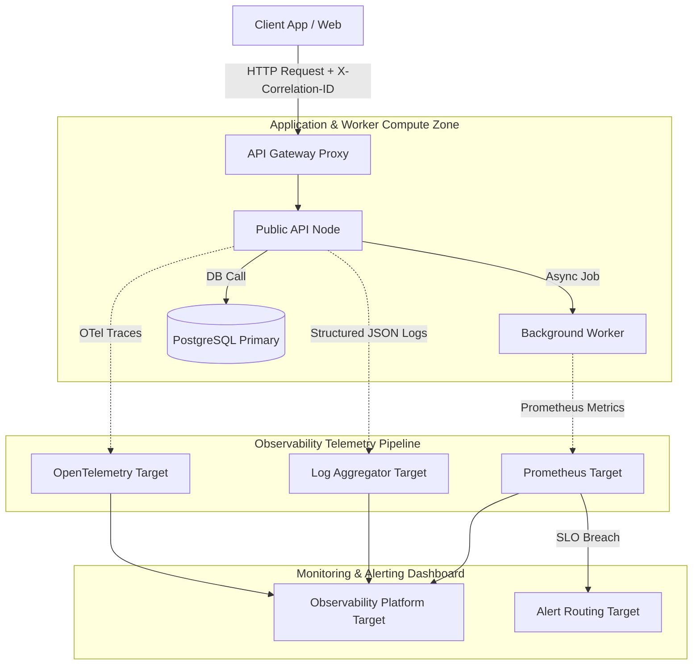
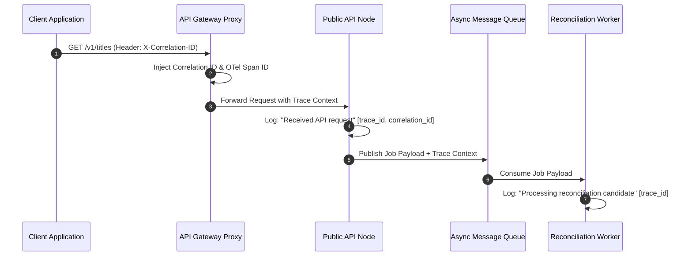
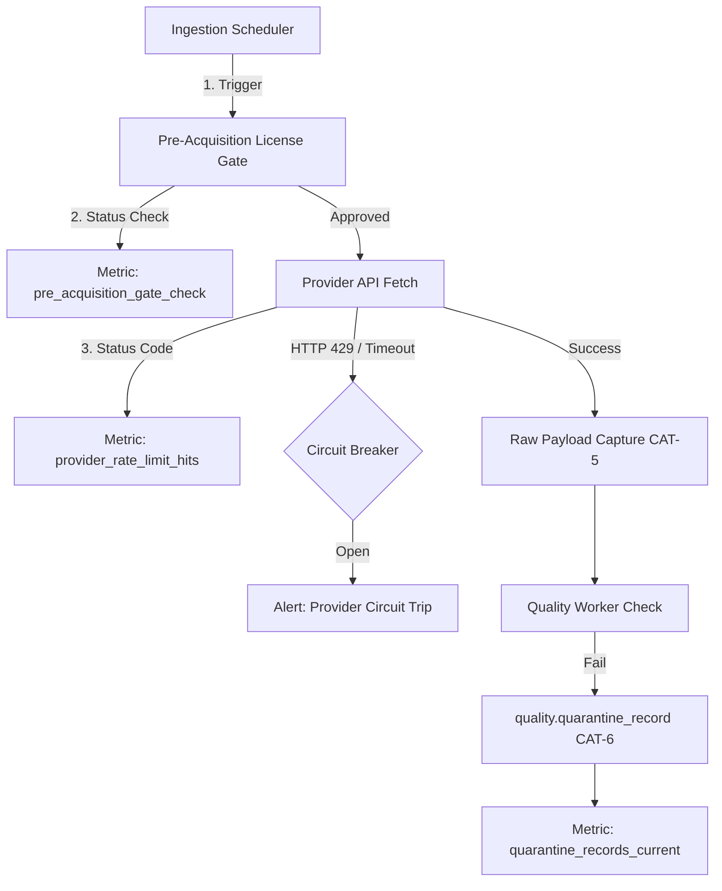
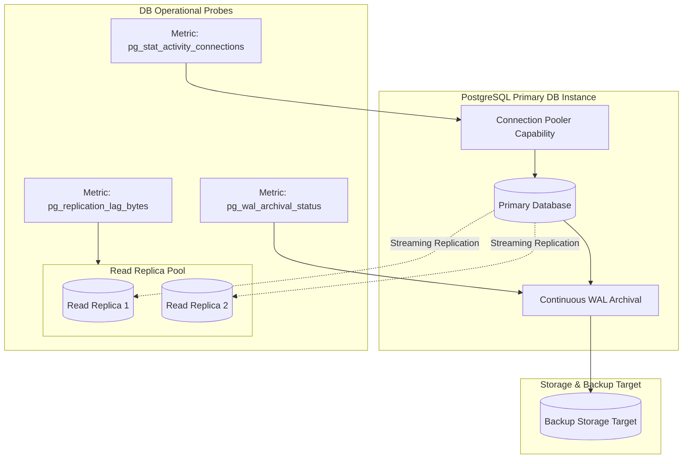
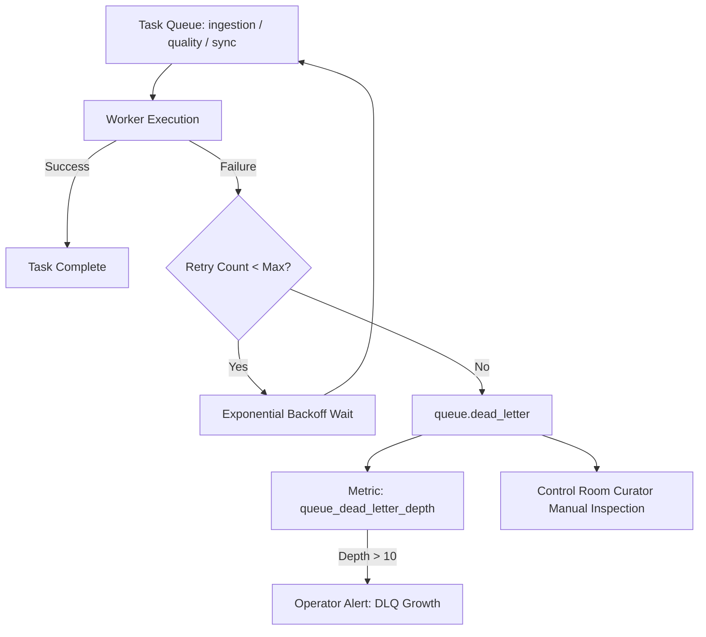
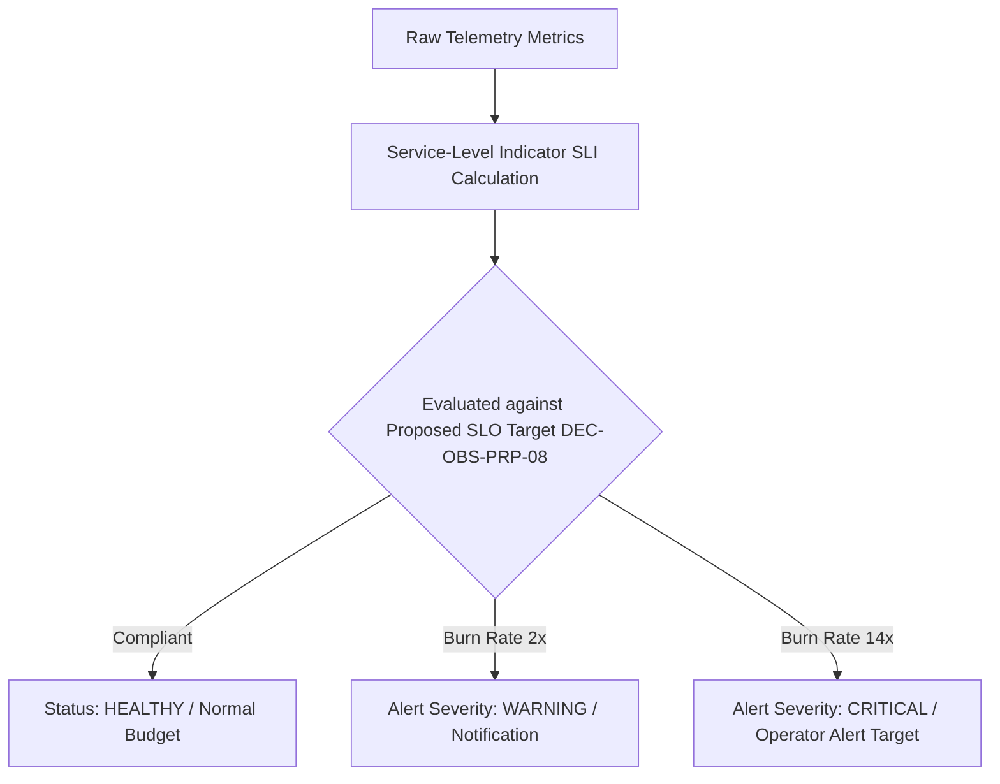

# CineVault OS — Observability & Operations Architecture V1

**Document Type:** Master Observability & Operations Architecture Specification  
**Status:** Approved & Baseline Locked (Project Owner Approval Pass — 2026-08-08)  
**Date:** 2026-08-08  
**Scope:** Observability Pillars (Metrics, Structured Logs, Distributed Tracing, Health Probes), Ingestion Pipeline Operations, Quality & Curation Monitoring, Database & Storage Operations, API & Sync SLA Tracking, Incident Runbooks, Capacity Planning, and Alerting Hierarchy  

---

## 1. Purpose

The purpose of the **CineVault OS Observability & Operations Architecture V1** is to establish a comprehensive, vendor-neutral operational framework that guarantees total visibility, rapid incident triage, explainable data lineage, and continuous system resilience across all CineVault OS runtime components.

This specification translates all approved governance baselines (`ADR-001` through `ADR-004`, `Data Model V1`, `ERD V1`, `Data Dictionary V1`, `Data Source Registry V1`, `Ingestion Architecture V1`, `Data Quality & Reconciliation Architecture V1`, `API Specification V1`, `Physical Database Design V1`, `Infrastructure Architecture V1`, and `Security Architecture V1`) into an operational baseline. It establishes telemetry standards, health probes, incident runbooks, and alerting thresholds without selecting SaaS vendors, creating alerting scripts, deploying dashboards, or provisioning cloud monitoring infrastructure.

---

## 2. Scope

### In-Scope
* 4 Observability Pillars (Metrics, Structured JSON Logs, OpenTelemetry Traces, Health Probes).
* Ingestion & Provider Operations Monitoring (12-state lifecycle, rate limits, quota tracking, Pre-Acquisition Gate **DEC-ING-PRP-01**).
* Quality & Reconciliation Operational Monitoring (Quarantine rates `CAT-6`, AI proposal review queues `quality.ai_proposal_staging`, match confidence distribution).
* Database & Storage Operational Monitoring (PostgreSQL pool utilization, read replica streaming lag, continuous WAL archival, disk space alerts).
* API & Offline Sync Operations (Proposed SLA tracking p95/p99 latency, HTTP 4xx/5xx rates, `POST /v1/sync/push` mutation queue backlog).
* Incident Management Runbooks (Primary DB failover, Circuit Breaker trips, Dead-Letter Queue DLQ remediation, provider API degradation).
* Operational Security Cross-Check Alignment (TLS 1.3 / AES-256 proposed `DEC-SEC-PRP-09`; 15-minute curator timeout proposed `DEC-SEC-PRP-10`; AI direct write prohibition; audit tamper-resistance requirement; human vs service identity separation).
* 6 comprehensive Mermaid operational architecture diagrams.

### Out-of-Scope (Prohibited in this Phase)
* Provisioning observability SaaS platforms, alert routing vendors, or log aggregation backends.
* Deploying monitoring software, alerting rules, or dashboard UIs.
* Provisioning cloud infrastructure, Terraform scripts, Kubernetes manifests, Docker containers.
* Writing application monitoring code, custom metrics exporters, or automated alerting scripts.

---

## 3. Architectural Principles & Invariants

1. **Vendor-Neutral Operational Contracts:** Observability is specified via standard open formats (Prometheus metrics exposition, W3C Trace Context, structured JSON logging). Vendor selection for alert routing platforms, observability backends, and log aggregators remains DEFERRED.
2. **Canonical Governance Locks:** All core data ownership baselines (`CAT-1` through `CAT-6`), UUIDv7 identity rules (**ADR-001**), content hierarchy (**ADR-002**), personal data safety (**ADR-003**, **ADR-004**), 3-tier API boundaries, and 5-schema PostgreSQL partitions remain locked invariants.
3. **Strict Personal Data Privacy in Telemetry:** Telemetry payloads (logs, traces, metrics) MUST NOT log plaintext user personal data (`CAT-2`), watch history events, user authentication tokens, or sensitive external provider keys.
4. **AI Proposal Operational Boundary:** AI proposals (`quality.ai_proposal_staging`, `CAT-6`) are monitored as untrusted proposal queues. Direct AI write paths into `canonical` schema tables are architecturally prohibited and isolated. Physical enforcement remains an implementation/security-control requirement.
5. **Security Cross-Check Alignment:**
   * Cryptographic standards (TLS 1.3, AES-256) are proposed choices (**DEC-SEC-PRP-09**); encryption requirement itself is inherited (**DEC-SEC-INH-11**).
   * Curator 15-minute session timeout is a proposed choice (**DEC-SEC-PRP-10**); privileged session protection is inherited (**DEC-SEC-INH-12**).
   * Audit records require integrity protection and must resist unauthorized modification (**DEC-SEC-PRP-11**); specific cryptographic audit signing systems remain deferred.
   * RBAC explicitly separates Human Roles (`Anonymous`, `Authenticated User`, `Curator`, `Administrator`) from Machine Service Identities (`Ingestion`, `Quality`, `Reconciliation`, `Sync Processor`, `AI Engine`, `Analytics`).
6. **Inherited Disaster Recovery Targets:** RPO < 5 minutes and RTO < 1 hour targets are inherited from Infrastructure Architecture V1 (**DEC-INFRA-PRP-08**).
7. **Actionable Alerting & Low-Noise Thresholds:** Alerts trigger ONLY on actionable operational degradation (SLO breaches, resource exhaustion, dead-letter queue growth). Benign transient retries do not trigger pageable alerts.

---

## 4. Observability Pillars Framework

```text
┌───────────────────────────┬───────────────────────────────┬───────────────────────────────────────────┐
│ Observability Pillar      │ Technology Standard           │ Operational Function                      │
├───────────────────────────┼───────────────────────────────┼───────────────────────────────────────────┤
│ 1. Metrics                │ Prometheus Exposition Format  │ System health, queue depth, throughput,   │
│                           │ (DEC-INFRA-PRP-07)            │ error rates, latency histograms           │
│ 2. Structured Logs        │ Structured JSON (Zap/Winston) │ Event context, error stack traces,        │
│                           │ with Correlation ID           │ audit event snapshots, request metadata   │
│ 3. Distributed Tracing    │ OpenTelemetry / W3C Trace     │ Cross-service request flows, DB spans,    │
│                           │ Context (DEC-INFRA-PRP-07)    │ worker pipeline execution duration        │
│ 4. Health Probes          │ HTTP `/health/liveness` &     │ Container orchestrator restarts,          │
│                           │ `/health/readiness`           │ load balancer target group routing        │
└───────────────────────────┴───────────────────────────────┴───────────────────────────────────────────┘
```

---

## 5. Telemetry & Context Propagation Strategy (DEC-OBS-PRP-01, DEC-OBS-PRP-02)

### 5.1 Correlation ID & Trace Context
Every inbound HTTP request at the `api_gateway` or scheduled job at the `ingestion_scheduler` is assigned an immutable **UUIDv7 Correlation ID** (`X-Correlation-ID`) and a W3C compliant **Trace Context** (`traceparent`).

```text
┌─────────────────────────────────────────────────────────────────────────────────┐
│                       CONTEXT PROPAGATION FLOW                                  │
├─────────────────────────────────────────────────────────────────────────────────┤
│ Client / Gate ──▶ API Gateway ──▶ Public API Node ──▶ Message Queue ──▶ Worker  │
│ [Generates X-Correlation-ID: 018f3a5e-7b12-7000-8000-000000000001]              │
│ [Logs & Traces propagate X-Correlation-ID across all downstream micro-services]  │
└─────────────────────────────────────────────────────────────────────────────────┘
```

---

## 6. Ingestion & Provider Operations Monitoring (DEC-OBS-PRP-04)

Operational telemetry tracks the approved 12-state ingestion lifecycle:

```text
┌───────────────────────────────┬───────────────────────────────────┬───────────────────────────────────────────┐
│ Ingestion Telemetry Metric    │ Metric Type & Label               │ Operational Threshold / Alert Trigger     │
├───────────────────────────────┼───────────────────────────────────┼───────────────────────────────────────────┤
│ `ingestion_jobs_total`        │ Counter (provider, status)        │ Rate drop > 50% vs baseline               │
│ `ingestion_duration_seconds`  │ Histogram (provider, phase)       │ p95 duration > 30 seconds                 │
│ `provider_rate_limit_hits`    │ Counter (provider, status_code)   │ > 5 HTTP 429 hits / 5 min                 │
│ `provider_circuit_breaker`    │ Gauge (provider, state)           │ State == OPEN (Alert Severity: HIGH)      │
│ `raw_payload_bytes`           │ Histogram (provider)              │ Payload size > 10MB (Alert: WARNING)      │
│ `pre_acquisition_gate_check`  │ Counter (provider, license_status)│ Status == REJECTED (Alert: INFO)          │
└───────────────────────────────┴───────────────────────────────────┴───────────────────────────────────────────┘
```

---

## 7. Quality, Quarantine & AI Proposal Monitoring (DEC-OBS-PRP-05)

```text
┌───────────────────────────────┬───────────────────────────────────┬───────────────────────────────────────────┐
│ Quality Telemetry Metric      │ Metric Type & Label               │ Operational Threshold / Alert Trigger     │
├───────────────────────────────┼───────────────────────────────────┼───────────────────────────────────────────┤
│ `quality_verifications_total` │ Counter (layer, result)           │ Verification failure rate > 10%           │
│ `quarantine_records_current`  │ Gauge (failure_category)          │ Quarantine growth > 100 records / hour    │
│ `reconciliation_matches_total`│ Counter (match_type, confidence)  │ Unambiguous auto-match rate < 70%         │
│ `ai_proposals_pending`        │ Gauge (confidence_band)           │ Pending proposals in CAT-6 > 500          │
│ `ai_proposal_curation_rate`   │ Counter (action: approve/reject)  │ Rejection rate > 40% (AI tuning needed)   │
└───────────────────────────────┴───────────────────────────────────┴───────────────────────────────────────────┘
```

---

## 8. Database & Storage Operational Monitoring (DEC-OBS-PRP-06)

```text
┌───────────────────────────────┬───────────────────────────────────┬───────────────────────────────────────────┐
│ Database Telemetry Metric     │ Metric Type & Label               │ Operational Threshold / Alert Trigger     │
├───────────────────────────────┼───────────────────────────────────┼───────────────────────────────────────────┤
│ `pg_stat_activity_connections`│ Gauge (pool_role, state)          │ Pool utilization > 85% (Alert: WARNING)   │
│ `pg_replication_lag_bytes`    │ Gauge (replica_id)                │ Replication lag > 10MB (Alert: CRITICAL)  │
│ `pg_wal_archival_status`      │ Gauge (status: success/fail)      │ Archival failure > 5 min (Alert: CRITICAL)│
│ `db_disk_usage_percent`       │ Gauge (volume_id)                 │ Usage > 80% (WARN) / > 90% (CRITICAL)     │
│ `deadlocks_total`             │ Counter (schema)                  │ > 0 deadlocks (Alert: CRITICAL)           │
└───────────────────────────────┴───────────────────────────────────┴───────────────────────────────────────────┘
```

### 8.1 Phase 4 Cache & Queue Operational Telemetry Metrics (Phase 4 Baseline)

```text
┌───────────────────────────────┬───────────────────────────────────┬───────────────────────────────────────────┐
│ Cache / Queue Telemetry Metric│ Metric Type & Label               │ Operational Threshold / Alert Trigger     │
├───────────────────────────────┼───────────────────────────────────┼───────────────────────────────────────────┤
│ `valkey_health_status`        │ Gauge (target, status)            │ Status == UNHEALTHY (Alert: CRITICAL)     │
│ `valkey_rate_limit_hits_total`│ Counter (route_id, policy)        │ HTTP 429 rate > 5% of total requests      │
│ `rabbitmq_health_status`      │ Gauge (target, status)            │ Status == UNHEALTHY (Alert: CRITICAL)     │
│ `rabbitmq_queue_depth`        │ Gauge (queue_name, type)          │ Depth > 1000 messages (Alert: WARNING)    │
│ `rabbitmq_dead_letter_total`  │ Counter (dlx_routing_key)         │ DLQ depth > 10 messages (Alert: HIGH)     │
│ `rabbitmq_retry_events_total` │ Counter (queue_name)              │ Retry rate > 15% of processed jobs        │
│ `pgbouncer_health_status`     │ Gauge (target, status)            │ Status == UNHEALTHY (Alert: CRITICAL)     │
│ `kong_rate_limit_redis_latency`│ Histogram (plugin: rate-limiting) │ p99 latency > 10ms (Alert: WARNING)       │
└───────────────────────────────┴───────────────────────────────────┴───────────────────────────────────────────┘
```

---

## 9. API & Offline Sync SLA Monitoring (DEC-OBS-PRP-08 Proposed Framework)

> [!NOTE]
> **PROPOSED SLO THRESHOLDS (`DEC-OBS-PRP-08`):** Numerical availability (99.9%) and latency thresholds (p95 < 200ms API, < 2000ms sync) are proposed architectural targets awaiting Project Owner review. They are not silently promoted to inherited constraints.

```text
┌───────────────────────────────┬───────────────────────────────────┬───────────────────────────────────────────┐
│ Service-Level Indicator (SLI) │ Proposed Target SLO (DEC-OBS-PRP-08)│ Alerting Condition                        │
├───────────────────────────────┼───────────────────────────────────┼───────────────────────────────────────────┤
│ Public API Read Availability  │ 99.9% HTTP 2xx/4xx over 30 days   │ Error budget burn rate > 2x over 1 hour   │
│ Public API p95 Latency        │ < 200ms for `GET /v1/titles/*`    │ p95 latency > 500ms over 5 minutes        │
│ Sync Push Processing Latency  │ < 2000ms for `POST /v1/sync/push` │ p95 latency > 5000ms over 5 minutes       │
│ Sync Outbox Backlog           │ < 100 pending mutations in queue  │ Queue depth > 500 mutations               │
└───────────────────────────────┴───────────────────────────────────┴───────────────────────────────────────────┘
```

---

## 10. Operational Incident Runbooks (DEC-OBS-PRP-07)

```text
┌───────────────────────────────┬───────────────────────────────────┬───────────────────────────────────────────┐
│ Incident Scenario             │ Automated Detection               │ Operational Runbook Protocol              │
├───────────────────────────────┼───────────────────────────────────┼───────────────────────────────────────────┤
│ 1. Primary DB Failover        │ DB readiness probe failure        │ Auto failover to Read Replica; promote PK;│
│                               │                                   │ verify WAL archival continuity.           │
│ 2. Provider Circuit Trip      │ Circuit breaker state == OPEN     │ Pause ingestion queue; switch to stale    │
│                               │                                   │ cache fallback; notify operator.          │
│ 3. DLQ Message Accumulation   │ `queue.dead_letter` depth > 10    │ Inspect payload checksums; route to       │
│                               │                                   │ Control Room quarantine curation.         │
│ 4. Outbox Sync Backlog        │ `queue.sync` depth > 500          │ Autoscale sync processor workers; check   │
│                               │                                   │ `personal_data_conflict` dispute count.   │
└───────────────────────────────┴───────────────────────────────────┴───────────────────────────────────────────┘
```

---

## 11. Architecture Diagrams

### Diagram 1: End-to-End Observability Telemetry Flow



---

### Diagram 2: Logging & Tracing Context Propagation Flow



---

### Diagram 3: Ingestion & Quality Operational Monitoring Flow



---

### Diagram 4: Database & Storage Operational Resilience Topology



---

### Diagram 5: Dead-Letter Queue (DLQ) & Incident Runbook Protocol



---

### Diagram 6: Service-Level Indicator (SLI) / Service-Level Objective (SLO) Alerting Hierarchy



---

## 12. Deferred Observability Decisions

| Decision ID | Deferred Topic | Target Phase |
|---|---|---|
| `DEC-OBS-DEF-01` | Alert Routing Platform Selection — DEFERRED | Operations Infrastructure Phase |
| `DEC-OBS-DEF-02` | Observability Platform / Backend Selection — DEFERRED | Cloud Procurement Phase |
| `DEC-OBS-DEF-03` | Log Aggregation Backend Selection — DEFERRED | Operations Infrastructure Phase |
| `DEC-INFRA-DEF-01` | Cloud Infrastructure Provider & WAF Selection — DEFERRED | Cloud Procurement Phase |
| `DEC-API-DEF-02` | Authentication Provider & OAuth Server Selection — DEFERRED | Security Implementation Phase |

---

## 13. Key Operational Risks

1. **Alert Fatigue:** High risk of operator burnout from un-actionable warning noise; mitigated by alerting strictly on SLO error budget burn rates.
2. **Telemetry Personal Data Leakage:** Risk of logging sensitive user logs; mitigated by automated log sanitization filters excluding `CAT-2` fields.
3. **Queue DLQ Starvation:** Risk of silent message drop; mitigated by mandatory DLQ depth metrics and operator triage runbooks.

---

## 14. Open Questions

1. **Telemetry Data Retention Policy (`DEC-OBS-OPN-01`):** Evaluation between 30-day vs 90-day retention windows for metric and trace telemetry data.
2. **Adaptive Anomaly Detection (`DEC-OBS-OPN-02`):** Evaluation of machine-learning dynamic baseline thresholds versus static alerting thresholds.

---

## 15. Governance Gate & Sign-Off

The **Observability & Operations Architecture V1** proposals (`DEC-OBS-PRP-01` through `DEC-OBS-PRP-08`) have received explicit Project Owner approval via the Control Room workflow on **2026-08-08**.

* **Current Governance Status:** `APPROVED AND BASELINE LOCKED`
* **Owner Approval Date:** 2026-08-08
* **Next Phase:** Implementation Readiness Gate & Technology Evaluation

---
