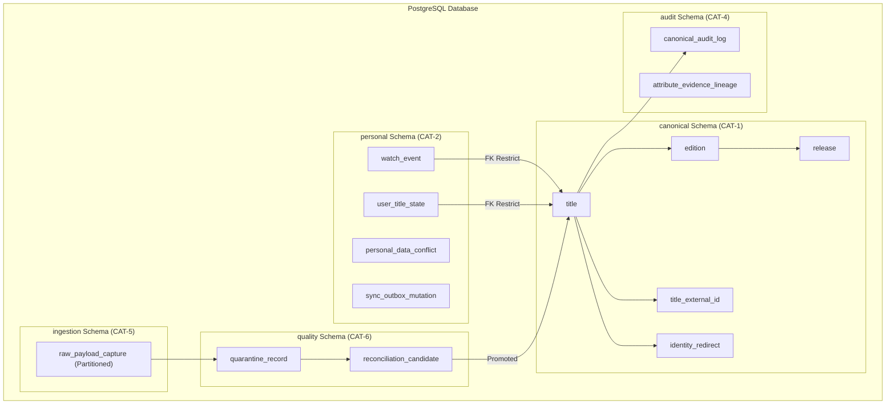
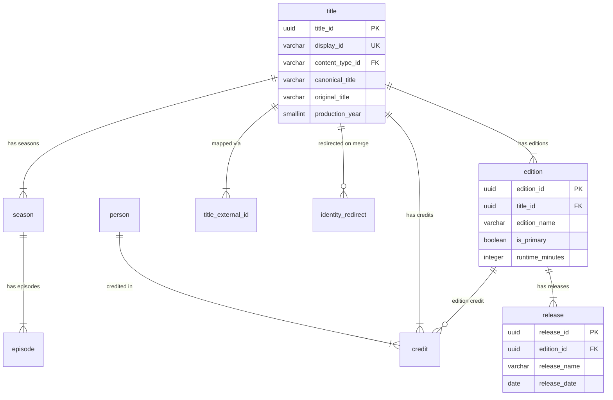
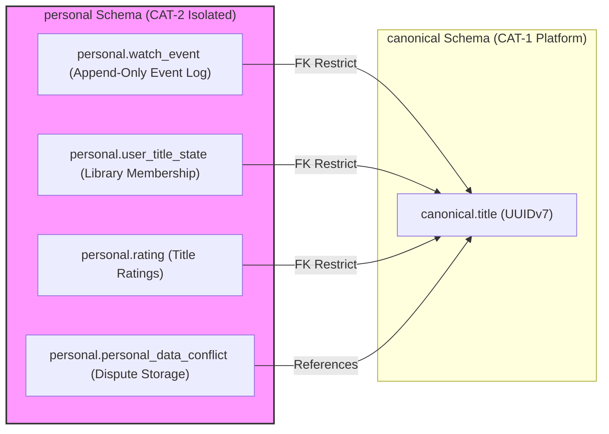
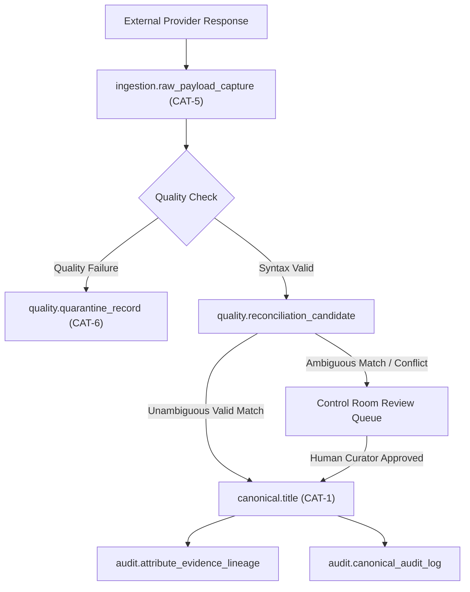

# CineVault OS — Physical Database Design V1

**Document Type:** Master Physical Database Architecture & Schema Specification  
**Status:** Architecture Baseline Specification (Post-Owner Approval Pass — Approved with Deferred Physical Decisions)  
**Date:** 2026-08-08  
**Scope:** PostgreSQL Physical Database Schema, Table Specifications, Data Types, Constraints, Indexing Strategy, Partitioning, Storage Categories, Personal Data Isolation, Auditability, and Security  

---

## 1. Purpose

The purpose of the **CineVault OS Physical Database Design V1** is to establish a rigorous, PostgreSQL-oriented physical database architecture that translates the approved conceptual domain model (`Data Model V1`, `ERD V1`, `Data Dictionary V1`) into a production-grade, highly performant, and secure relational database specification.

This specification defines physical table structures, PostgreSQL data types, primary and foreign key constraints, unique indexes, declarative partitioning rules, raw payload staging (`DEC-ING-DEF-01`), quarantine staging (`DEC-QUAL-DEF-01`), evidence lineage storage, personal data isolation boundaries (`CAT-2`), and offline sync outbox structures without executing DDL or creating physical database artifacts.

---

## 2. Scope

### In-Scope
* Target database platform specification (**PostgreSQL 16+**).
* Physical identity strategy implementing **ADR-001** (UUIDv7 primary keys, provider mapping tables).
* PostgreSQL logical schema partitioning (`canonical`, `personal`, `ingestion`, `quality`, `audit`).
* Complete physical table specifications for all domain entities defined in `Data Model V1` and `Data Dictionary V1`.
* Physical table specifications for `Title`, `Edition`, `Release` (**ADR-002** content hierarchy).
* Physical table specifications for `Season`, `Episode`, `RegionalEpisodeOrder` episodic hierarchy.
* Physical table specifications for `Franchise`, `Universe`, `ViewingOrder`, `ViewingOrderItem`.
* Physical table specifications for `Person`, `PersonName`, `Credit`, `CreditRole`, `ProductionCompany`, `TitleCompany`.
* Physical table specifications for `Award`, `AwardCategory`, `AwardEvent`, `AwardResult`, `Festival`, `FestivalEdition`, `FestivalParticipation`.
* Physical table specifications for `Platform`, `PlatformOffer`.
* Physical table specifications for `IdentityRedirect` (approved conceptual entity per `DEC-DER-06`).
* External identity mapping tables (`title_external_id`, `edition_external_id`, `person_external_id`, `company_external_id`).
* Physical design of Raw Payload Staging (`ingestion.raw_payload_capture` - designing `DEC-ING-DEF-01`, SHA-256 checksums).
* Physical design of Quality Quarantine Staging (`quality.quarantine_record` - designing `DEC-QUAL-DEF-01`, 7 failure outcomes).
* Physical design of Reconciliation Candidate & Decision Evidence storage (`reconciliation_candidate`, `attribute_evidence_lineage`).
* Physical design of Personal Data isolation tables (`personal.library_entry`, `personal.watch_event`, `personal.user_title_state`, `personal.rating`, `personal.note`, `personal.review`).
* Physical design of Personal Data Conflict tables (`personal.personal_data_conflict`, `personal.user_split_resolution`).
* Physical design of Offline Sync Outbox & Mutation tables (`personal.sync_outbox_mutation`, `personal.sync_cursor_state`).
* Physical design of Audit & Lineage storage (`audit.canonical_audit_log`).
* Indexing strategy (B-Tree, GIN, GiST, Partial, Composite indexes).
* Declarative partitioning rules for append-heavy tables (`watch_event`, `raw_payload_capture`, `canonical_audit_log`).
* PostgreSQL roles, least-privilege security model, encryption, and backup requirements.
* Complete 39-table traceability matrix against baseline documents.
* 4 comprehensive Mermaid database architecture diagrams.

### Out-of-Scope (Prohibited in this Phase)
* Creating SQL files, DDL execution, database migrations, PostgreSQL database provisioning.
* Creating ORM models, Python code, database repositories, API client code.
* Executing database queries, creating indexes in a live database, running Docker containers.
* Modifying approved canonical baseline documents (ADRs, Data Model V1, ERD V1, Data Dictionary V1, Data Source Registry V1, Ingestion V1, Quality V1, API Spec V1).

---

## 3. Architectural Principles & Invariants

1. **UUIDv7 Canonical Primary Keys (ADR-001):** Primary keys across all canonical tables (`CAT-1`) use PostgreSQL native `uuid` columns populated with internally generated **UUIDv7** values. External provider IDs (TMDb, TVDB, KOBIS, Wikidata Q-ID) are stored in dedicated mapping tables (`title_external_id`, etc.) and NEVER serve as primary keys.
2. **Content Hierarchy Enforcement (ADR-002):** Physical Foreign Key constraints enforce `Title -> Edition -> Release` and `Title -> Season -> Episode`. Every `Title` MUST reference at least one `Edition` where `is_primary = true`.
3. **Personal Data Isolation & Non-Destruction (ADR-003, ADR-004):** `CAT-2` User Personal Data tables reside in a separate PostgreSQL schema (`personal`) with zero foreign keys referencing external raw staging tables. Merges/splits of canonical titles NEVER alter or delete user watch events or ratings; conflicts spawn records in `personal_data_conflict` or `user_split_resolution`.
4. **Append-Only Watch Event Semantics:** The `personal.watch_event` table is an append-only event log. In-place updates are prohibited by rule; corrections use tombstone references.
5. **Durable Sync Outbox (ADR-004):** Offline mutations are staged in `personal.sync_outbox_mutation` using client-generated `mutation_id` (UUIDv7) keys for idempotent processing.
6. **Domain-Specific Authority Provenance (DS-01):** Provenance fields (`source_provider`, `observation_timestamp`, `applied_rule_id`) are persisted alongside canonical attributes to credit approved authorities (KOBIS Primary Korean, TheTVDB Secondary TV).
7. **Metadata vs. Media Rights Separation:** Structured metadata tables do not store binary media assets. Image references are stored as HTTPS URL strings or proxy keys in `image_asset` with explicit license category tags.
8. **AI Proposal Isolation (ADR-004):** AI proposals (`CAT-6`) are staged in `quality.ai_proposal_staging` and cannot be written directly into `canonical` schema tables without human review.
9. **Explainable Audit Lineage:** System state changes generate immutable audit rows in `audit.canonical_audit_log`.
10. **Declarative Partitioning:** High-volume event and raw staging tables use PostgreSQL range partitioning by time to maintain query performance and simplify storage lifecycle management.

---

## 4. Terminology

* **Schema Partitioning:** Logical grouping of PostgreSQL tables into distinct namespaces (`canonical`, `personal`, `ingestion`, `quality`, `audit`) to enforce access boundaries.
* **UUIDv7:** Time-ordered 128-bit Universally Unique Identifier providing sequential insertion properties for B-Tree indexes while maintaining global uniqueness.
* **Tombstone:** A soft-deletion marker or redirect record (`IdentityRedirect`) pointing a retired entity key to a surviving entity key.
* **Composite Index:** An index created on multiple columns to optimize specific multi-column query filter combinations.
* **Declarative Partitioning:** PostgreSQL feature dividing a single logical table into physical partition tables based on range or list keys.
* **Evidence Lineage:** Immutable physical record linking a canonical attribute value to its raw observation ID, provider name, observation timestamp, and authority rule.

---

## 5. Target Database Platform & Version

The physical database architecture is designed specifically for **PostgreSQL 16+**.

### Target Features & Capabilities
* **Native UUID Support:** Native `uuid` data type for 128-bit primary keys.
* **JSONB Storage & Indexing:** `jsonb` data type for semi-structured metadata payloads, with GIN (`jsonb_path_ops`) indexing.
* **Declarative Table Partitioning:** Native RANGE partitioning for time-series tables (`watch_event`, `raw_payload_capture`, `canonical_audit_log`).
* **Generated Columns:** Stored generated columns for derived search keys.
* **Collation & Case Insensitivity:** `citext` extension or non-deterministic ICU collations for case-insensitive title lookups.

---

## 6. Canonical Identity & UUIDv7 Strategy

In strict adherence to **ADR-001**, all internal entity primary keys use native PostgreSQL `uuid` data types.

```text
┌────────────────────────────────────────────────────────────────────────┐
│                        PHYSICAL IDENTITY MODEL                         │
├───────────────────────────────────┬────────────────────────────────────┤
│ Canonical Primary Key (`title_id`)│ External Provider ID (`title_ext`) │
├───────────────────────────────────┼────────────────────────────────────┤
│ Type: `uuid` (128-bit)            │ Type: `varchar(128)`               │
│ Generation: Internal UUIDv7       │ Storage: `canonical.title_ext_id`  │
│ Properties: Time-ordered, Global  │ Namespace: `provider_name` Enum    │
│ Immutability: Permanent           │ Mapping: FK ──▶ `title.title_id`   │
└───────────────────────────────────┴────────────────────────────────────┘
```

### UUIDv7 Generation Strategy
* **Internal Generation:** UUIDv7 values are generated internally by CineVault application services or database default functions (`uuid_generate_v7()`) prior to insertion (`DEC-PHYS-PRP-02`).
* **Index Friendly:** Time-ordered 48-bit timestamp prefix ensures sequential B-Tree index page allocation, preventing index fragmentation inherent in random UUIDv4.
* **Zero External Primary Keys:** Provider IDs (e.g. TMDb `550`, KOBIS `20192194`, Wikidata `Q1375`) are stored as string values in `title_external_id` mapping tables.

---

## 7. PostgreSQL Logical Schema Architecture

CineVault's physical database is partitioned into 5 logical PostgreSQL schemas (`DEC-PHYS-PRP-01`) to enforce role-based security, access isolation, and maintenance boundaries:

```text
┌─────────────────────────────────────────────────────────────────────────────────┐
│                      POSTGRESQL LOGICAL SCHEMAS                                 │
├──────────────┬──────────────┬──────────────┬──────────────┬─────────────────────┤
│ `canonical`  │ `personal`   │ `ingestion`  │ `quality`    │ `audit`             │
├──────────────┼──────────────┼──────────────┼──────────────┼─────────────────────┤
│ Master Platform│ User Personal│ Raw Payload  │ Quarantine   │ System Lineage &    │
│ Catalog Data │ Logs & Sync  │ Staging      │ & Candidate  │ Operational Audit   │
│ (`CAT-1`)    │ (`CAT-2`)    │ (`CAT-5`)    │ (`CAT-6`)    │ (`CAT-4`)           │
└──────────────┴──────────────┴──────────────┴──────────────┴─────────────────────┘
```

1. **`canonical` Schema:** Contains core platform catalog tables (`title`, `edition`, `release`, `season`, `episode`, `person`, `credit`, `award`, `festival`, `platform_offer`, `identity_redirect`).
2. **`personal` Schema:** Contains user-owned data (`library_entry`, `watch_event`, `user_title_state`, `rating`, `note`, `review`, `sync_outbox_mutation`, `personal_data_conflict`).
3. **`ingestion` Schema:** Stages raw provider responses (`raw_payload_capture`, `provider_checkpoint`).
4. **`quality` Schema:** Contains quality failure quarantine logs (`quarantine_record`), intermediate staging (`normalized_title_staging`), AI proposals (`ai_proposal_staging`), and candidate review queues (`reconciliation_candidate`).
5. **`audit` Schema:** Contains immutable operational audit logs (`canonical_audit_log`, `attribute_evidence_lineage`).

---

## 8. Physical Table Catalog & 39-Table Traceability Matrix

Every physical PostgreSQL table is classified into its conceptual domain category and mapped back to the approved canonical baseline:

```text
┌───────────────────────────┬────────────────────────────────┬──────────────┬───────────────────────────────┬───────────────────────────────┐
│ Conceptual Entity / Role  │ Physical Table Name            │ Schema       │ Approved Baseline Reference   │ Classification / Purpose      │
├───────────────────────────┼────────────────────────────────┼──────────────┼───────────────────────────────┼───────────────────────────────┤
│ Title                     │ `title`                        │ `canonical`  │ Data Model V1, Data Dict V1   │ Approved Canonical Entity     │
│ ContentType               │ `content_type`                 │ `canonical`  │ Data Model V1, Data Dict V1   │ Approved Taxonomy Entity      │
│ Edition                   │ `edition`                      │ `canonical`  │ ADR-002, Data Dict V1         │ Approved Canonical Entity     │
│ Release                   │ `release`                      │ `canonical`  │ ADR-002, Data Dict V1         │ Approved Canonical Entity     │
│ Season                    │ `season`                       │ `canonical`  │ ADR-002, Data Dict V1         │ Approved Canonical Entity     │
│ Episode                   │ `episode`                      │ `canonical`  │ ADR-002, Data Dict V1         │ Approved Canonical Entity     │
│ RegionalEpisodeOrder      │ `regional_episode_order`       │ `canonical`  │ ADR-002, Data Dict V1         │ Approved Canonical Entity     │
│ Universe                  │ `universe`                     │ `canonical`  │ ADR-002, Data Dict V1         │ Approved Canonical Entity     │
│ Franchise                 │ `franchise`                    │ `canonical`  │ ADR-002, Data Dict V1         │ Approved Canonical Entity     │
│ FranchiseEntry            │ `franchise_entry`              │ `canonical`  │ ADR-002, Data Dict V1         │ Approved Canonical Entity     │
│ ViewingOrder              │ `viewing_order`                │ `canonical`  │ ADR-002, Data Dict V1         │ Approved Canonical Entity     │
│ ViewingOrderItem          │ `viewing_order_item`           │ `canonical`  │ ADR-002, Data Dict V1         │ Approved Canonical Entity     │
│ Person                    │ `person`                       │ `canonical`  │ Data Model V1, Data Dict V1   │ Approved Canonical Entity     │
│ PersonName                │ `person_name`                  │ `canonical`  │ Data Model V1, Data Dict V1   │ Approved Canonical Entity     │
│ Credit                    │ `credit`                       │ `canonical`  │ Data Model V1, Data Dict V1   │ Approved Canonical Entity     │
│ CreditRole                │ `credit_role`                  │ `canonical`  │ Data Model V1, Data Dict V1   │ Approved Taxonomy Entity      │
│ ProductionCompany         │ `production_company`           │ `canonical`  │ Data Model V1, Data Dict V1   │ Approved Canonical Entity     │
│ TitleCompany              │ `title_company`                │ `canonical`  │ Data Model V1, Data Dict V1   │ Approved Canonical Entity     │
│ Genre / Theme / Keyword   │ `genre`, `theme`, `keyword`    │ `canonical`  │ Data Model V1, Data Dict V1   │ Approved Taxonomy Entity      │
│ TitleCountry / Language   │ `title_country`, `title_lang`  │ `canonical`  │ Data Model V1, Data Dict V1   │ Approved Canonical Entity     │
│ Award / AwardCategory     │ `award`, `award_category`      │ `canonical`  │ Data Model V1, Data Dict V1   │ Approved Canonical Entity     │
│ AwardEvent / AwardResult  │ `award_event`, `award_result`  │ `canonical`  │ Data Model V1, Data Dict V1   │ Approved Canonical Entity     │
│ Festival / FestivalEdition│ `festival`, `festival_edition` │ `canonical`  │ Data Model V1, Data Dict V1   │ Approved Canonical Entity     │
│ FestivalParticipation     │ `festival_participation`       │ `canonical`  │ Data Model V1, Data Dict V1   │ Approved Canonical Entity     │
│ Platform / PlatformOffer  │ `platform`, `platform_offer`   │ `canonical`  │ Data Model V1, Data Dict V1   │ Approved Canonical Entity     │
│ IdentityRedirect          │ `identity_redirect`            │ `canonical`  │ Data Model V1 (DEC-DER-06)    │ Approved Conceptual Entity     │
│ TitleExternalId           │ `title_external_id`            │ `canonical`  │ ADR-001, Data Dict V1         │ Approved Mapping Entity       │
│ PersonExternalId          │ `person_external_id`           │ `canonical`  │ ADR-001, Data Dict V1         │ Approved Mapping Entity       │
│ RawPayloadCapture         │ `raw_payload_capture`          │ `ingestion`  │ DEC-ING-PRP-02, DEC-ING-DEF-01│ Physical Ingestion Support    │
│ QuarantineRecord          │ `quarantine_record`            │ `quality`    │ DEC-QUAL-PRP-06, QUAL-DEF-01  │ Physical Quality Support      │
│ ReconciliationCandidate   │ `reconciliation_candidate`     │ `quality`    │ DEC-QUAL-PRP-04               │ Physical Curation Support     │
│ AIProposalStaging         │ `ai_proposal_staging`          │ `quality`    │ ADR-004 (CAT-6)               │ Physical AI Staging Support   │
│ AttributeEvidenceLineage  │ `attribute_evidence_lineage`   │ `audit`      │ DEC-QUAL-PRP-05               │ Physical Audit Support        │
│ LibraryEntry              │ `library_entry`                │ `personal`   │ ADR-003, Data Dict V1         │ Approved Personal Data Entity  │
│ WatchEvent                │ `watch_event`                  │ `personal`   │ ADR-003, Data Dict V1         │ Approved Personal Data Entity  │
│ UserTitleState            │ `user_title_state`             │ `personal`   │ ADR-003, Data Dict V1         │ Approved Personal Data Entity  │
│ Rating / Note / Review    │ `rating`, `note`, `review`     │ `personal`   │ ADR-003, Data Dict V1         │ Approved Personal Data Entity  │
│ PersonalDataConflict      │ `personal_data_conflict`       │ `personal`   │ ADR-003, Data Dict V1         │ Approved Conflict Entity      │
│ UserSplitResolution       │ `user_split_resolution`        │ `personal`   │ ADR-003, Data Dict V1         │ Approved Conflict Entity      │
│ SyncOutboxMutation        │ `sync_outbox_mutation`         │ `personal`   │ ADR-004, DEC-API-PRP-07       │ Physical Sync Support Table   │
│ CanonicalAuditLog         │ `canonical_audit_log`           │ `audit`      │ Data Model V1, Data Dict V1   │ Approved Audit Entity         │
└───────────────────────────┴────────────────────────────────┴──────────────┴───────────────────────────────┴───────────────────────────────┘
```

> [!NOTE]
> All physical support tables (`raw_payload_capture`, `quarantine_record`, `sync_outbox_mutation`, etc.) exist explicitly to satisfy approved architectural decisions (DEC-ING-PRP-02, DEC-QUAL-PRP-06, DEC-API-PRP-07) and do NOT introduce unapproved domain concepts.

---

## 9. Canonical Content Domain Tables

### A. Table: `canonical.title`
* **Purpose:** Stores abstract creative works (ADR-001, ADR-002).
* **Primary Key:** `title_id` (`uuid`, default internally generated UUIDv7).
* **Columns:**
  * `title_id` (`uuid`, NOT NULL, PK)
  * `display_id` (`varchar(32)`, NOT NULL, UNIQUE, e.g. `"MOV-000001"`)
  * `content_type_id` (`varchar(32)`, NOT NULL, FK ──▶ `canonical.content_type.content_type_id`)
  * `canonical_title` (`varchar(512)`, NOT NULL)
  * `original_title` (`varchar(512)`, NOT NULL)
  * `production_year` (`smallint`, NULL)
  * `tagline` (`varchar(512)`, NULL)
  * `synopsis` (`text`, NULL)
  * `status_flag` (`varchar(32)`, NOT NULL DEFAULT `'ACTIVE'`)
  * `created_at` (`timestamptz`, NOT NULL DEFAULT `clock_timestamp()`)
  * `updated_at` (`timestamptz`, NOT NULL DEFAULT `clock_timestamp()`)
* **Constraints:** `CONSTRAINT check_production_year CHECK (production_year >= 1888 AND production_year <= 2100)`

---

### B. Table: `canonical.edition`
* **Purpose:** Stores materially distinct versions of a Title (ADR-002).
* **Primary Key:** `edition_id` (`uuid`, NOT NULL, PK).
* **Columns:**
  * `edition_id` (`uuid`, NOT NULL, PK)
  * `title_id` (`uuid`, NOT NULL, FK ──▶ `canonical.title.title_id` ON DELETE RESTRICT)
  * `edition_name` (`varchar(256)`, NOT NULL, e.g. `"Theatrical Cut"`)
  * `is_primary` (`boolean`, NOT NULL DEFAULT `false`)
  * `runtime_minutes` (`integer`, NULL)
  * `aspect_ratio` (`varchar(32)`, NULL)
  * `color_format` (`varchar(32)`, NULL)
  * `sound_mix` (`varchar(64)`, NULL)
  * `created_at` (`timestamptz`, NOT NULL DEFAULT `clock_timestamp()`)
* **Partial Index Proposal (DEC-PHYS-PRP-09):** `CREATE UNIQUE INDEX unique_primary_edition ON canonical.edition (title_id) WHERE (is_primary = true);`

---

### C. Table: `canonical.release`
* **Purpose:** Stores real-world distribution events for an Edition (ADR-002).
* **Primary Key:** `release_id` (`uuid`, NOT NULL, PK).
* **Columns:**
  * `release_id` (`uuid`, NOT NULL, PK)
  * `edition_id` (`uuid`, NOT NULL, FK ──▶ `canonical.edition.edition_id` ON DELETE CASCADE)
  * `release_name` (`varchar(256)`, NOT NULL)
  * `release_type` (`varchar(64)`, NOT NULL, e.g. `"THEATRICAL"`, `"FESTIVAL"`, `"STREAMING"`)
  * `release_date` (`date`, NULL)
  * `country_code` (`char(2)`, NULL)
  * `created_at` (`timestamptz`, NOT NULL DEFAULT `clock_timestamp()`)

---

### D. Table: `canonical.identity_redirect`
* **Purpose:** Tombstone and redirect table for merged canonical entities (Data Model V1 `DEC-DER-06`, Data Dictionary V1).
* **Primary Key:** `redirect_id` (`uuid`, NOT NULL, PK).
* **Columns:**
  * `redirect_id` (`uuid`, NOT NULL, PK)
  * `from_id` (`uuid`, NOT NULL, INDEX)
  * `to_id` (`uuid`, NOT NULL, INDEX)
  * `entity_type` (`varchar(64)`, NOT NULL, e.g. `"Title"`, `"Person"`)
  * `merge_reason` (`varchar(256)`, NULL)
  * `merged_at` (`timestamptz`, NOT NULL DEFAULT `clock_timestamp()`)

---

## 10. Episodic Hierarchy Tables

### A. Table: `canonical.season`
* **Primary Key:** `season_id` (`uuid`, NOT NULL, PK).
* **Columns:** `season_id` (`uuid`), `title_id` (`uuid`, FK ──▶ `canonical.title`), `season_number` (`integer`, NOT NULL), `season_name` (`varchar(256)`), `overview` (`text`), `created_at` (`timestamptz`).
* **Constraints:** `UNIQUE (title_id, season_number)`

### B. Table: `canonical.episode`
* **Primary Key:** `episode_id` (`uuid`, NOT NULL, PK).
* **Columns:** `episode_id` (`uuid`), `season_id` (`uuid`, FK ──▶ `canonical.season`), `episode_number` (`integer`, NOT NULL), `episode_name` (`varchar(512)`), `air_date` (`date`), `runtime_minutes` (`integer`), `overview` (`text`), `created_at` (`timestamptz`).
* **Constraints:** `UNIQUE (season_id, episode_number)`

---

## 11. Franchise, Universe & Viewing Order Tables

* **`canonical.universe`:** `universe_id` (`uuid`, PK), `name` (`varchar(256)`), `overview` (`text`).
* **`canonical.franchise`:** `franchise_id` (`uuid`, PK), `universe_id` (`uuid`, FK optional), `name` (`varchar(256)`).
* **`canonical.franchise_entry`:** `franchise_entry_id` (`uuid`, PK), `franchise_id` (`uuid`, FK), `title_id` (`uuid`, FK), `entry_type` (`varchar(64)`).
* **`canonical.viewing_order`:** `viewing_order_id` (`uuid`, PK), `franchise_id` (`uuid`, FK), `order_name` (`varchar(256)`), `order_type` (`varchar(64)`).
* **`canonical.viewing_order_item`:** `item_id` (`uuid`, PK), `viewing_order_id` (`uuid`, FK), `title_id` (`uuid`, FK), `position` (`integer`, NOT NULL).

---

## 12. People, Credits & Companies Tables

* **`canonical.person`:** `person_id` (`uuid`, PK), `canonical_name` (`varchar(256)`, NOT NULL), `birth_date` (`date`), `death_date` (`date`), `gender` (`varchar(32)`), `created_at` (`timestamptz`).
* **`canonical.credit`:** `credit_id` (`uuid`, PK), `title_id` (`uuid`, FK), `edition_id` (`uuid`, FK optional), `person_id` (`uuid`, FK), `credit_role_id` (`varchar(64)`, FK), `character_name` (`varchar(256)`), `billing_order` (`integer`).

---

## 13. Awards & Festivals Tables

* **`canonical.award`:** `award_id` (`uuid`, PK), `award_name` (`varchar(256)`), `organization` (`varchar(256)`).
* **`canonical.award_event`:** `event_id` (`uuid`, PK), `award_id` (`uuid`, FK), `year` (`smallint`, NOT NULL), `edition_number` (`integer`).
* **`canonical.award_result`:** `result_id` (`uuid`, PK), `event_id` (`uuid`, FK), `category_id` (`uuid`, FK), `title_id` (`uuid`, FK optional), `person_id` (`uuid`, FK optional), `is_winner` (`boolean`, NOT NULL).

---

## 14. Platform Offers & Availability Tables

* **`canonical.platform`:** `platform_id` (`uuid`, PK), `name` (`varchar(256)`), `code` (`varchar(64)`, UNIQUE).
* **`canonical.platform_offer`:** `offer_id` (`uuid`, PK), `platform_id` (`uuid`, FK), `title_id` (`uuid`, FK), `country_code` (`char(2)`), `offer_type` (`varchar(32)`), `valid_from` (`timestamptz`), `valid_to` (`timestamptz`).

---

## 15. External Identifier Mapping Tables

### Table: `canonical.title_external_id`
* **Purpose:** Provider ID mapping table enforcing **ADR-001** and **DS-01**.
* **Primary Key:** `mapping_id` (`uuid`, PK).
* **Columns:**
  * `mapping_id` (`uuid`, NOT NULL, PK)
  * `title_id` (`uuid`, NOT NULL, FK ──▶ `canonical.title.title_id` ON DELETE CASCADE)
  * `provider_name` (`varchar(64)`, NOT NULL, e.g. `"TMDB"`, `"TVDB"`, `"KOBIS"`, `"WIKIDATA"`)
  * `external_id` (`varchar(128)`, NOT NULL)
  * `external_url` (`varchar(512)`, NULL)
  * `created_at` (`timestamptz`, NOT NULL DEFAULT `clock_timestamp()`)
* **Constraints:** `CONSTRAINT unique_provider_title_mapping UNIQUE (provider_name, external_id)`

---

## 16. Ingestion & Raw Payload Staging (DEC-ING-DEF-01 Physical Proposal)

Physically designs deferred requirement **`DEC-ING-DEF-01`** under approved concept **`DEC-ING-PRP-02`**.

### Table: `ingestion.raw_payload_capture`
* **Purpose:** Immutable raw observation staging for external provider responses (`CAT-5`).
* **Primary Key:** `raw_payload_id` (`uuid`, NOT NULL, PK).
* **Columns:**
  * `raw_payload_id` (`uuid`, NOT NULL, PK)
  * `provider_name` (`varchar(64)`, NOT NULL)
  * `external_entity_type` (`varchar(64)`, NOT NULL, e.g. `"movie"`, `"tv_series"`)
  * `external_entity_id` (`varchar(128)`, NOT NULL)
  * `payload_checksum` (`varchar(64)`, NOT NULL, SHA-256 hex string)
  * `raw_payload` (`jsonb`, NOT NULL)
  * `http_status_code` (`smallint`, NULL)
  * `acquired_at` (`timestamptz`, NOT NULL DEFAULT `clock_timestamp()`)
  * `ingestion_run_id` (`uuid`, NOT NULL)
* **Partitioning Proposal (DEC-PHYS-PRP-07):** Range partitioned by `acquired_at` (Monthly partitions).
* **Constraints:** `UNIQUE (provider_name, external_entity_id, payload_checksum, acquired_at)`

---

## 17. Quality & Quarantine Storage (DEC-QUAL-DEF-01 Physical Proposal)

Physically designs deferred requirement **`DEC-QUAL-DEF-01`** under approved concept **`DEC-QUAL-PRP-06`**.

### Table: `quality.quarantine_record`
* **Purpose:** Holds failed payloads and quality quarantine items (`CAT-6`).
* **Primary Key:** `quarantine_id` (`uuid`, NOT NULL, PK).
* **Columns:**
  * `quarantine_id` (`uuid`, NOT NULL, PK)
  * `raw_payload_id` (`uuid`, NULL, FK ──▶ `ingestion.raw_payload_capture`)
  * `provider_name` (`varchar(64)`, NOT NULL)
  * `failure_category` (`varchar(64)`, NOT NULL, e.g. `"REJECT_LICENSE"`, `"QUARANTINE_INVALID"`, `"FLAG_CONFLICT"`)
  * `diagnostic_details` (`jsonb`, NOT NULL)
  * `review_status` (`varchar(32)`, NOT NULL DEFAULT `'PENDING'`)
  * `detected_at` (`timestamptz`, NOT NULL DEFAULT `clock_timestamp()`)

---

## 18. Reconciliation Evidence Storage (DEC-QUAL-PRP-05 Physical Proposal)

### Table: `audit.attribute_evidence_lineage`
* **Purpose:** Stores decision evidence lineage for canonical attributes (DEC-QUAL-PRP-05).
* **Columns:** `lineage_id` (`uuid`, PK), `canonical_table` (`varchar(64)`), `canonical_id` (`uuid`), `attribute_name` (`varchar(64)`), `promoted_value` (`text`), `source_provider` (`varchar(64)`), `source_external_id` (`varchar(128)`), `raw_payload_id` (`uuid`), `applied_rule_id` (`varchar(128)`), `confidence_band` (`varchar(32)`), `promoted_at` (`timestamptz`).

---

## 19. Personal Data Isolation Tables (ADR-003, ADR-004)

All user personal data is isolated in the `personal` schema (`DEC-PHYS-PRP-01`).

### A. Table: `personal.watch_event`
* **Purpose:** Append-only historical log of user viewing activity (`CAT-2`).
* **Primary Key:** `watch_event_id` (`uuid`, NOT NULL, PK).
* **Columns:**
  * `watch_event_id` (`uuid`, NOT NULL, PK)
  * `user_id` (`uuid`, NOT NULL)
  * `title_id` (`uuid`, NOT NULL, FK ──▶ `canonical.title.title_id` ON DELETE RESTRICT)
  * `edition_id` (`uuid`, NULL, FK ──▶ `canonical.edition.edition_id` ON DELETE RESTRICT)
  * `season_id` (`uuid`, NULL)
  * `episode_id` (`uuid`, NULL)
  * `watched_at` (`timestamptz`, NOT NULL)
  * `device_type` (`varchar(64)`, NULL)
  * `notes` (`text`, NULL)
  * `is_tombstoned` (`boolean`, NOT NULL DEFAULT `false`)
  * `created_at` (`timestamptz`, NOT NULL DEFAULT `clock_timestamp()`)
* **Partitioning Proposal (DEC-PHYS-PRP-07):** Range partitioned by `watched_at` (Yearly partitions).

### B. Table: `personal.user_title_state`
* **Columns:** `user_id` (`uuid`), `title_id` (`uuid`, FK ──▶ `canonical.title`), `manual_status_override` (`varchar(32)`), `is_favorite` (`boolean`), `preferred_edition_id` (`uuid`), `updated_at` (`timestamptz`).
* **Constraints:** `PRIMARY KEY (user_id, title_id)`

---

## 20. Personal Data Conflict Tables

### Table: `personal.personal_data_conflict`
* **Purpose:** Surfaces personal data conflicts created during entity merges (`ADR-003`).
* **Columns:** `conflict_id` (`uuid`, PK), `user_id` (`uuid`, NOT NULL), `conflict_type` (`varchar(64)`), `surviving_title_id` (`uuid`), `retired_title_id` (`uuid`), `conflicting_data` (`jsonb`, NOT NULL), `resolution_status` (`varchar(32)`, DEFAULT `'UNRESOLVED'`), `created_at` (`timestamptz`).

---

## 21. Offline Sync Outbox & Mutation Tables (ADR-004, DEC-API-PRP-07)

### Table: `personal.sync_outbox_mutation`
* **Purpose:** Physical staging table for durable client offline sync mutations (`DEC-PHYS-PRP-10`).
* **Columns:**
  * `mutation_id` (`uuid`, NOT NULL, PK, client-generated UUIDv7)
  * `user_id` (`uuid`, NOT NULL)
  * `mutation_type` (`varchar(64)`, NOT NULL)
  * `client_timestamp` (`timestamptz`, NOT NULL)
  * `payload` (`jsonb`, NOT NULL)
  * `processing_state` (`varchar(32)`, NOT NULL DEFAULT `'PENDING'`)
  * `processed_at` (`timestamptz`, NULL)
* **Constraints:** `UNIQUE (user_id, mutation_id)`

---

## 22. Audit Logging & System Lineage

### Table: `audit.canonical_audit_log`
* **Purpose:** Operational audit log for all governance-sensitive catalog operations.
* **Columns:** `audit_id` (`uuid`, PK), `actor_id` (`uuid`), `action_type` (`varchar(64)`), `target_table` (`varchar(64)`), `target_id` (`uuid`), `previous_state` (`jsonb`), `resulting_state` (`jsonb`), `recorded_at` (`timestamptz`).
* **Partitioning Proposal (DEC-PHYS-PRP-07):** Range partitioned by `recorded_at`.

---

## 23. Data Types & Column Mapping Rules

```text
┌───────────────────────────┬───────────────────────────────┬───────────────────────────────────────────┐
│ Conceptual Data Type      │ Target PostgreSQL Data Type   │ Usage Rules                               │
├───────────────────────────┼───────────────────────────────┼───────────────────────────────────────────┤
│ Identity / Primary Key    │ `uuid`                        │ 128-bit native UUIDv7                     │
│ Short String / Display ID │ `varchar(32)` / `varchar(64)` │ Strict upper length bound                 │
│ Title / Entity Name       │ `varchar(256)` / `(512)`      │ Variable length text                      │
│ Unbounded Description     │ `text`                        │ Large synopses, reviews, raw notes        │
│ Integer (Year / Count)    │ `smallint` / `integer`        │ `smallint` for year; `integer` for count  │
│ Timestamp (UTC)           │ `timestamptz`                 │ Always timezone-aware (`UTC`)             │
│ Calendar Date             │ `date`                        │ Year-Month-Day without time               │
│ Boolean Flag              │ `boolean`                     │ Native boolean (`true`/`false`)           │
│ Semi-Structured Payload   │ `jsonb`                       │ Binary JSON with GIN indexing             │
│ Hash / Checksum           │ `varchar(64)`                 │ Hex string (e.g. SHA-256)                 │
└───────────────────────────┴───────────────────────────────┴───────────────────────────────────────────┘
```

---

## 24. Indexing Strategy & Query Optimization

```text
┌───────────────────────────────────────────────┬───────────┬───────────────────────────────────────────┐
│ Target Query Pattern                          │ Index Type│ Index Definition Proposal                 │
├───────────────────────────────────────────────┼───────────┼───────────────────────────────────────────┤
│ Canonical UUIDv7 PK Lookups                   │ B-Tree    │ `PRIMARY KEY (title_id)`                  │
│ External Provider ID Lookup                   │ B-Tree    │ `UNIQUE (provider_name, external_id)`     │
│ Display ID Lookup                             │ B-Tree    │ `UNIQUE (display_id)`                     │
│ Title Search (Normalized Script)              │ GIN       │ `USING gin (canonical_title gin_trgm_ops)`│
│ Raw Payload JSONB Key Lookup                  │ GIN       │ `USING gin (raw_payload jsonb_path_ops)`  │
│ Active User Watch Events                      │ B-Tree    │ `(user_id, watched_at DESC)`              │
│ Primary Edition Invariant Protection          │ B-Tree    │ Partial Unique Index on `(title_id)`      │
│                                               │           │ `WHERE (is_primary = true)`               │
│ Pending Quarantine Queue                      │ B-Tree    │ Partial Index `(review_status)`           │
│                                               │           │ `WHERE (review_status = 'PENDING')`       │
└───────────────────────────────────────────────┴───────────┴───────────────────────────────────────────┘
```

---

## 25. Constraint Strategy & Invariant Protection

* **Primary Keys:** Enforced on every table using native `PRIMARY KEY`.
* **Foreign Keys:** Enforced with explicit `ON DELETE RESTRICT` for canonical platform relationships (preventing cascading deletion of titles referenced by user data) and `ON DELETE CASCADE` for mapping tables.
* **Partial Unique Indexes (DEC-PHYS-PRP-09):** Protect invariants (e.g., exactly one Primary Edition per Title: `UNIQUE (title_id) WHERE (is_primary = true)`).
* **Check Constraints:** Enforce range boundaries (e.g. `production_year BETWEEN 1888 AND 2100`, `rating_value BETWEEN 1 AND 10`).

---

## 26. Declarative Table Partitioning Strategy (DEC-PHYS-PRP-07)

Declarative RANGE partitioning is proposed for high-growth append-heavy tables:

1. **`ingestion.raw_payload_capture`:** Partitioned by `acquired_at` (Monthly partitions).
2. **`personal.watch_event`:** Partitioned by `watched_at` (Yearly partitions).
3. **`audit.canonical_audit_log`:** Partitioned by `recorded_at` (Quarterly partitions).

---

## 27. Soft Delete vs. Hard Delete Policies

* **Canonical Platform Data (`CAT-1`):** Soft delete via Tombstone (`status_flag = 'RETIRED'`) and `identity_redirect` (`DEC-PHYS-PRP-06`). Hard deletion is strictly PROHIBITED if referenced by user data.
* **User Personal Data (`CAT-2`):** User-controlled deletion. Hard deletion permitted upon explicit user account deletion request (`ADR-003`).
* **Raw Payloads (`CAT-5`):** Managed via retention purge policy.

---

## 28. Data Retention & Purge Policy Architecture

* **CAT-1 Catalog Data:** Permanent retention.
* **CAT-2 Personal Data:** Retained until user deletes records or account.
* **CAT-4 Audit Data:** Retained for 7 years for system auditability; redacted upon user deletion.
* **CAT-5 Raw Payloads:** Unresolved retention window (`DEC-ING-OPN-02` remains OPEN).
* **CAT-6 Quarantine Data:** Unresolved retention window (`DEC-QUAL-OPN-02` remains OPEN).

---

## 29. Security & Role Isolation Model (DEC-PHYS-PRP-08)

PostgreSQL roles enforce schema-level least privilege:

```text
┌───────────────────────┬────────────────────────────────────────────────────────────────────────┐
│ PostgreSQL Role       │ Granted Permissions                                                    │
├───────────────────────┼────────────────────────────────────────────────────────────────────────┤
│ `cinevault_app`       │ `SELECT` on `canonical`, `SELECT`/`INSERT`/`UPDATE` on `personal`      │
│ `cinevault_ingest`    │ `INSERT` on `ingestion`, `SELECT`/`INSERT`/`UPDATE` on `quality`       │
│ `cinevault_admin`     │ Full `SELECT`/`INSERT`/`UPDATE` across `canonical`, `quality`, `audit` │
│ `cinevault_analytics` │ Read-only `SELECT` on `canonical` (Zero access to `personal`)          │
└───────────────────────┴────────────────────────────────────────────────────────────────────────┘
```

---

## 30. Architecture Diagrams

### Diagram 1: Physical Schema Overview



---

### Diagram 2: Canonical Content ERD Mapping



---

### Diagram 3: Personal Data Isolation Boundary



---

### Diagram 4: Ingestion → Quality → Reconciliation → Canonical Physical Flow



---

## 31. Deferred Decisions

| Decision ID | Deferred Topic | Target Phase |
|---|---|---|
| `DEC-PHYS-DEF-01` | Physical DDL Script Files (`.sql`) | Database Implementation Phase |
| `DEC-PHYS-DEF-02` | Database Migration Tool Selection (Flyway vs Liquibase vs Sqitch) | Database Infrastructure Phase |
| `DEC-PHYS-DEF-03` | Physical PostgreSQL Connection Pool Topology (PgBouncer settings) | Infrastructure Deployment Phase |
| `DEC-PHYS-DEF-04` | Physical Backup Cloud Infrastructure (AWS S3 vs Blob Storage) | Operations Phase |
| `DEC-PHYS-DEF-05` | Fine-Grained Physical Index Benchmarking | Implementation Benchmarking Phase |

---

## 32. Key Architectural Risks

1. **Partition Pruning Performance Failure:** Risk of slow queries on `watch_event` if `watched_at` filter is omitted; mitigated by mandatory query patterns and composite indexing.
2. **Index Bloat on UUIDv7 Keys:** Mitigated by time-ordered sequential allocation properties of UUIDv7.
3. **Unresolved Raw Payload Purge Window:** Potential storage accumulation in `raw_payload_capture` while `DEC-ING-OPN-02` remains OPEN.

---

## 33. Open Questions

1. **Raw Payload Partition Granularity (`DEC-PHYS-OPN-01`):** Should `ingestion.raw_payload_capture` use monthly or weekly range partitions based on initial ingest velocity?
2. **ICU Collation Performance:** Benchmark performance comparison between PostgreSQL `citext` and ICU non-deterministic collations for multi-lingual title search.

---

## 34. Governance Gate & Sign-Off

The **Physical Database Design V1** has received formal Project Owner approval for all conceptual physical proposal decisions (`DEC-PHYS-PRP-01` through `DEC-PHYS-PRP-12`).

* **Current Governance Status:** `APPROVED WITH DEFERRED PHYSICAL DECISIONS`
* **Next Phase:** Physical Database Implementation / DDL Engineering (Awaiting Control Room Trigger)

---
