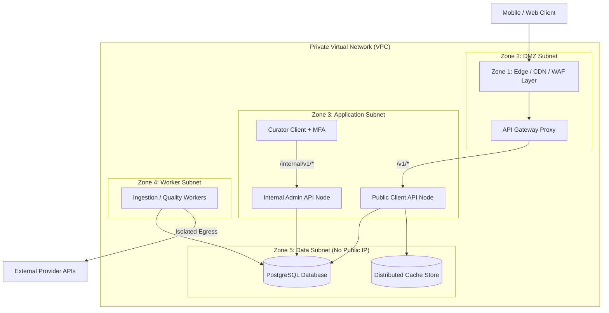
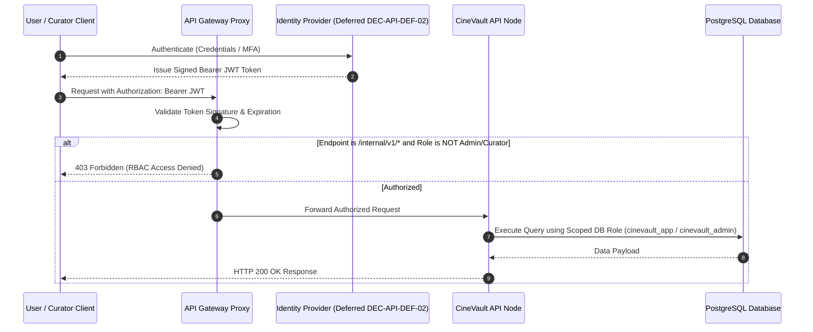
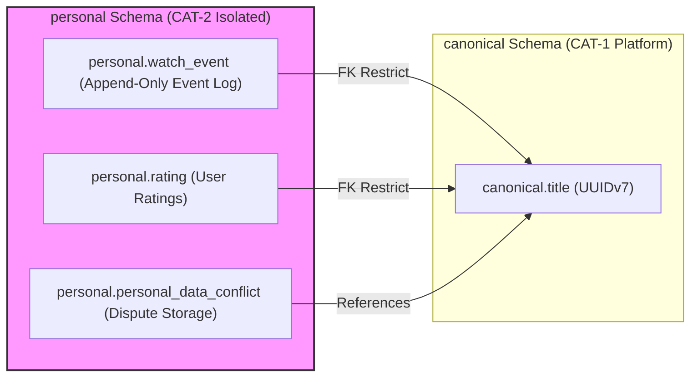
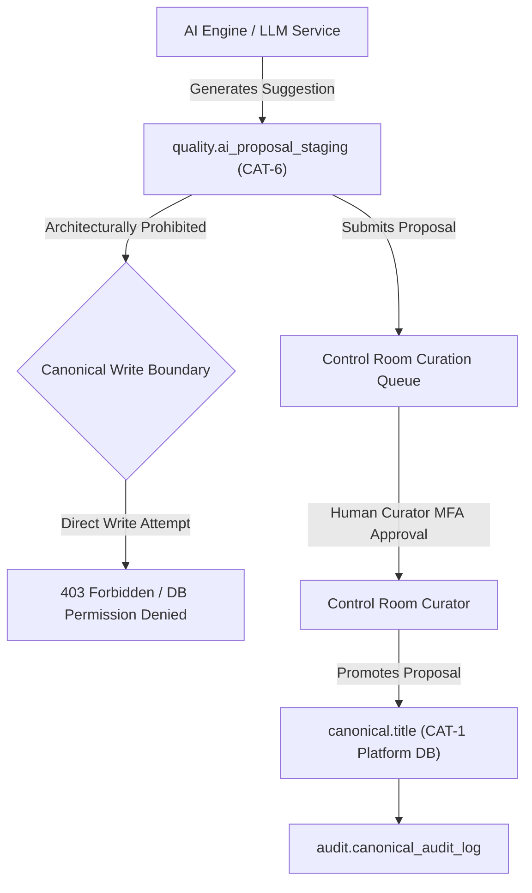
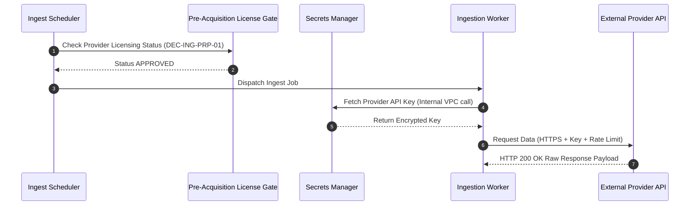
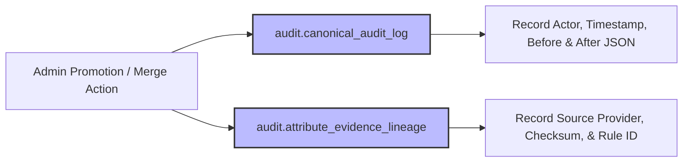

# CineVault OS — Security Architecture V1

**Document Type:** Master Security Architecture & Trust Boundary Specification  
**Status:** Approved & Baseline Locked (Project Owner Approval Pass — 2026-08-08)  
**Date:** 2026-08-08  
**Scope:** Security Objectives, Comprehensive Threat Model, Network Trust Boundaries, Identity & Authentication, Role-Based Access Control, Service Identities, Personal Data Protection, Canonical Data Integrity, Provider Security, Ingestion Pipeline Security, API & Offline Sync Security, Database Security, Encryption, Secrets Management, AI Governance, Auditability, and Incident Response  

---

## 1. Purpose

The purpose of the **CineVault OS Security Architecture V1** is to establish a zero-trust, defense-in-depth security framework that guarantees the confidentiality, integrity, availability, authenticity, privacy, and explainability of all CineVault OS operations.

This specification translates all previously approved governance baselines (`ADR-001` through `ADR-004`, `Data Model V1`, `ERD V1`, `Data Dictionary V1`, `Data Source Registry V1`, `Ingestion Architecture V1`, `Data Quality & Reconciliation Architecture V1`, `API Specification V1`, `Physical Database Design V1`, and `Infrastructure Architecture V1`) into a comprehensive security model. It defines trust perimeters, threat mitigations, personal data isolation controls (`CAT-2`), canonical write protection (`CAT-1`), provider licensing enforcement (**DEC-ING-PRP-01**), AI proposal isolation (**ADR-004**), and audit logging policies without implementing security code, creating production secrets, issuing certificates, or provisioning cloud security infrastructure.

---

## 2. Scope

### In-Scope
* Security Objectives definition (Confidentiality, Integrity, Availability, Authenticity, Authorization, Privacy, Non-repudiation).
* 15-Category Threat Model (Attacker personas, assets, attack surfaces, impact, mitigations, detection, recovery).
* Trust Boundaries & Network Zone Security across 5 infrastructure zones (`Zone 1 Edge`, `Zone 2 DMZ`, `Zone 3 App Subnet`, `Zone 4 Worker Subnet`, `Zone 5 Data Subnet`).
* Conceptual Identity & Authentication Framework (Preserving `DEC-API-DEF-02` as DEFERRED).
* Access Control Matrix distinguishing Human Roles (`Anonymous`, `Authenticated User`, `Curator`, `Administrator`) from Machine / Service Identities (`Ingestion`, `Quality`, `Reconciliation`, `Sync Processor`, `AI Proposal`, `Analytics`).
* Personal Data Security (`CAT-2` isolation in `personal` schema per **ADR-003** / **ADR-004**; non-destruction guarantees during entity merges).
* Canonical Data Integrity (`CAT-1` write protection; AI proposal isolation in `quality.ai_proposal_staging` `CAT-6`).
* External Data Source & Provider Security (Pre-Acquisition Licensing Gate **DEC-ING-PRP-01**, credential isolation, rate-limiting, circuit breakers, zero scraping).
* Ingestion & Quality Pipeline Security (12-state ingestion security, raw payload SHA-256 integrity, syntax/schema validation, anti-poisoning).
* API & Offline Sync Security (3-tier boundary routing, rate-limiting, CORS, idempotency, mutation replay protection via client `mutation_id`).
* Database & Storage Security (PostgreSQL 5-schema RBAC roles, encryption in transit, encryption at rest, private storage targets).
* Control Room / Administrative Security (Multi-Factor Authentication requirement, session timeout policy, break-glass audit logs).
* Security Auditability (`audit.canonical_audit_log`, `audit.attribute_evidence_lineage`).
* Incident Response Protocol & Supply-Chain Security guidelines.
* 6 comprehensive Mermaid security architecture diagrams.

### Out-of-Scope (Prohibited in this Phase)
* Implementing authentication software, OAuth servers, or API security middleware.
* Creating database roles/GRANTs in a live database, writing SQL scripts, generating migrations.
* Generating encryption keys, certificates, API tokens, or production secrets.
* Provisioning cloud WAFs, IAM policies, Terraform scripts, Kubernetes security manifests, Docker containers.

---

## 3. Architectural Principles & Invariants

1. **Defense-in-Depth & Zero-Trust:** Security controls are enforced at every architectural tier. No network zone or service component is inherently trusted based solely on its internal location.
2. **Strict Canonical Governance Locks:** All core data ownership baselines (`CAT-1` through `CAT-6`), UUIDv7 identity rules (**ADR-001**), content hierarchy (**ADR-002**), personal data safety (**ADR-003**, **ADR-004**), 3-tier API boundaries, and 5-schema PostgreSQL physical database partitions remain locked invariants.
3. **Personal Data Isolation & Non-Destruction (ADR-003, ADR-004):** `CAT-2` User Personal Data resides in an isolated PostgreSQL schema (`personal`). Provider updates, database merges, or catalog deletions NEVER delete or mutate user watch logs or ratings. Merges spawn explicit `personal_data_conflict` records.
4. **AI Proposal Non-Canonical Constraint (ADR-004):** AI processing services operate strictly within `CAT-6` proposal storage (`quality.ai_proposal_staging`). Direct AI write paths into `canonical` schema tables are architecturally prohibited and isolated. Physical enforcement remains an implementation/security-control requirement.
5. **No Unlicensed Scraping or Rights Bypass:** Provider adapters execute strictly through approved Pre-Acquisition Licensing Gates (**DEC-ING-PRP-01**). Media proxy caches enforce metadata vs. media rights separation (**DEC-ING-PRP-05**). Provider credentials are never exposed to clients.
6. **Machine-to-Machine Least Privilege:** Services communicate using explicit, least-privilege service identities. Ingestion workers cannot read user personal data; public API nodes cannot access internal admin curation endpoints.
7. **Explainable Audit Lineage:** All administrative, curation, and canonical promotion events generate immutable audit records in `audit.canonical_audit_log` that resist unauthorized modification.

---

## 4. Security Objectives

```text
┌───────────────────────────┬───────────────────────────────────────────────────────────────────────────┐
│ Security Objective        │ Definition & Application to CineVault OS Architecture                    │
├───────────────────────────┼───────────────────────────────────────────────────────────────────────────┤
│ 1. Confidentiality        │ Protect user personal data (`CAT-2`) and provider API keys from access.   │
│ 2. Integrity              │ Prevent unauthorized modification of canonical catalog data (`CAT-1`).  │
│ 3. Availability           │ Maintain API and storage resilience against DoS, rate exhaustion, & outages│
│ 4. Authenticity           │ Verify identity of mobile clients, internal services, and provider calls.  │
│ 5. Authorization          │ Enforce strict least-privilege boundaries across human and service roles.  │
│ 6. Accountability         │ Log all curation, promotion, and administrative actions in audit tables.  │
│ 7. Privacy                │ Guarantee user ownership and non-destruction of watch history per ADR-003.│
│ 8. Non-Repudiation        │ Retain audit decision evidence lineage (`audit.attribute_evidence`).       │
└───────────────────────────┴───────────────────────────────────────────────────────────────────────────┘
```

---

## 5. Comprehensive Threat Model (15 Threat Categories)

```text
┌───────────────────────────────────────┬───────────────────────────────────────┬───────────────────────────────────────┐
│ Threat Category                       │ Impact & Surface                      │ Architectural Mitigation              │
├───────────────────────────────────────┼───────────────────────────────────────┼───────────────────────────────────────┤
│ 1. Unauthenticated Attacker           │ API abuse, data scraping              │ Gateway rate-limiting, CORS, TLS      │
│ 2. Authenticated Malicious User       │ Personal data tampering, sync spam    │ Mutation ID replay protection, limits │
│ 3. Compromised User Account           │ Watch history exfiltration            │ Isolated `personal` schema, auth lock │
│ 4. Compromised Admin Account          │ Unauthorized canonical overwrites     │ Mandatory MFA, break-glass audit log  │
│ 5. Compromised Provider Credential    │ Provider quota theft, credential leak │ Encrypted Secrets Manager, key rotate │
│ 6. Malicious Provider Payload         │ Injection attacks, schema corruption  │ 8-layer quality checks, SHA-256 hash  │
│ 7. AI Poisoning / Incorrect Proposal  │ Catalog pollution by AI hallucinations│ CAT-6 proposal boundary, human review │
│ 8. Insider Threat                     │ Data wipe, silent catalog modification│ RBAC roles, immutable `audit` schema  │
│ 9. Database Compromise                │ Full data exfiltration                │ Private VPC subnet, TLS, Encryption   │
│ 10. API Rate Abuse & DoS              │ Service unavailability                │ Distributed rate-limiting, WAF        │
│ 11. Queue Poisoning                   │ Worker crash, processing deadlock     │ Schema validation, Dead-Letter Queue  │
│ 12. Replay & Sync Manipulation        │ Duplicate watch logs, out-of-order log│ Client UUIDv7 `mutation_id` checks    │
│ 13. Data Exfiltration                 │ Bulk user data scraping               │ Pagination limits, egress rate limits │
│ 14. Media Rights Abuse                │ Copyright violation                   │ HTTPS URL storage only; no media blobs│
│ 15. Supply-Chain Vulnerabilities      │ Compromised container / package       │ Dependency scanning, signed images    │
└───────────────────────────────────────┴───────────────────────────────────────┴───────────────────────────────────────┘
```

---

## 6. Network Trust Boundaries & Security Zones

Security perimeters preserve the approved 5 infrastructure network zones (**DEC-INFRA-PRP-06**):

```text
┌─────────────────────────────────────────────────────────────────────────────────┐
│                            NETWORK TRUST PERIMETERS                             │
├──────────────┬──────────────────────┬───────────────────────────────────────────┤
│ Zone Name    │ Components           │ Security Boundary & Controls              │
├──────────────┼──────────────────────┼───────────────────────────────────────────┤
│ Zone 1: Edge │ Edge / CDN / WAF     │ Public HTTPS (Ports 80/443). DDoS filter. │
│              │ Layer (Vendor Neutral│ Untrusted traffic filter.                 │
│ Zone 2: DMZ  │ API Gateway Proxy    │ Inbound from Edge; routes `/v1/` traffic. │
│              │                      │ Blocks `/internal/v1/` from public client.│
│ Zone 3: App  │ `public_api_service` │ Inbound from DMZ; access to DB Read Pool. │
│              │ `internal_admin_api` │ Internal IP / VPN restriction for Admin.  │
│ Zone 4: Work │ Workers, Schedulers  │ Isolated subnet; egress to Provider APIs. │
│ Zone 5: Data │ PostgreSQL, Cache,   │ Strict private subnet; zero public IP.    │
│              │ Storage Target       │ Access restricted to App/Worker nodes.    │
└──────────────┴──────────────────────┴───────────────────────────────────────────┘
```

---

## 7. Identity & Authentication Framework

> [!IMPORTANT]
> **AUTHENTICATION PROVIDER SELECTION IS DEFERRED (`DEC-API-DEF-02`)**  
> This specification defines conceptual authentication boundaries and token rules. Specific OAuth2/OIDC provider technology (Auth0, Keycloak, Firebase Auth, Cognito, Supabase Auth) remains DEFERRED.

### Authentication Categories
* **End Users:** Authenticated via bearer tokens (JWT) issued by the identity provider for public client endpoints (`/v1/me/...`).
* **Administrators & Curators:** Authenticated via identity provider tokens with mandatory Multi-Factor Authentication (MFA) for internal curation endpoints (`/internal/v1/...`).
* **Service-to-Service (M2M):** Internal compute workloads (ingestion workers, sync processors) authenticate via short-lived TLS client certificates (mTLS) or encrypted service tokens.
* **Provider APIs:** Outbound API calls to external providers (TMDb, TVDB, KOBIS) use server-side stored API keys injected via Secrets Manager.

---

## 8. Access Control Matrix (Human Roles vs Service Identities)

The security architecture explicitly distinguishes **Human RBAC Roles** from **Service Identities (Machine Workload Capabilities)**:

### 8.1 Human RBAC Roles
```text
┌───────────────────────┬───────────────────────────────┬───────────────────────────────────────────┐
│ Human Role Name       │ Endpoint / Target Access      │ Permitted Actions                         │
├───────────────────────┼───────────────────────────────┼───────────────────────────────────────────┤
│ `Anonymous User`      │ `GET /v1/titles/*`            │ Read public canonical catalog & artwork   │
│ `Authenticated User`  │ `/v1/me/*`                    │ Read/Write own personal library (`CAT-2`) │
│ `Curator / Moderator` │ `/internal/v1/reconciliation/*`│ Review candidates, promote `CAT-6` to `1` │
│ `System Administrator`│ `/internal/v1/*`              │ Full admin curation, audit log review     │
└───────────────────────┴───────────────────────────────┴───────────────────────────────────────────┘
```

### 8.2 Machine / Workload Service Identities
```text
┌─────────────────────────┬───────────────────────────────┬───────────────────────────────────────────┐
│ Service Identity        │ Database Schema / Target      │ Workload Capabilities                     │
├─────────────────────────┼───────────────────────────────┼───────────────────────────────────────────┤
│ `Ingestion Service`     │ `ingestion` schema            │ Write raw payloads (`CAT-5`)              │
│ `Quality Service`       │ `ingestion` & `quality`       │ Validate payloads, write quarantine       │
│ `Reconciliation Engine` │ `quality` & `canonical` read  │ Match candidates, generate evidence       │
│ `Sync Processor`        │ `personal` schema             │ Process user sync outbox mutations        │
│ `AI Proposal Engine`    │ `quality.ai_proposal_staging` │ Write AI proposals (`CAT-6`); 0 write to 1│
│ `Analytics Service`     │ `canonical` read-only         │ Read-only platform telemetry (`CAT-3`)    │
└─────────────────────────┴───────────────────────────────┴───────────────────────────────────────────┘
```

---

## 9. Personal Data Security (ADR-003, ADR-004)

All user personal data (`CAT-2`) is isolated in the PostgreSQL `personal` schema:

```text
┌────────────────────────────────────────────────────────────────────────┐
│                   PERSONAL DATA SECURITY INVARIANTS                    │
├───────────────────────────────────┬────────────────────────────────────┤
│ Security Guarantee                │ Architectural Mechanism            │
├───────────────────────────────────┼────────────────────────────────────┤
│ 1. Schema Isolation               │ Stored exclusively in `personal` DB │
│                                   │ schema (`personal.watch_event`, etc)│
│ 2. Append-Only Integrity          │ In-place UPDATE/DELETE blocked;    │
│                                   │ soft tombstones for corrections    │
│ 3. Non-Destruction on Entity Merge│ Title merges NEVER delete user logs│
│                                   │ Spawns `personal_data_conflict`    │
│ 4. User Ownership & Portability   │ Full JSON export & hard deletion   │
│                                   │ upon explicit user account delete  │
└───────────────────────────────────┴────────────────────────────────────┘
```

---

## 10. Canonical Data Integrity & Write Protection

```text
┌─────────────────────────────────────────────────────────────────────────────────┐
│                       CANONICAL CATALOG WRITE PROTECTION                        │
├─────────────────────────────────────────────────────────────────────────────────┤
│ 1. Public API clients (`/v1/*`) have ZERO write access to `canonical` schema    │
│ 2. External provider adapters write ONLY to `ingestion.raw_payload_capture`     │
│ 3. AI proposals write ONLY to `quality.ai_proposal_staging` (`CAT-6`).          │
│    Direct AI write paths into `canonical` are architecturally prohibited.      │
│ 4. Canonical promotion (`canonical` schema) requires:                           │
│    a. Unambiguous automated reconciliation pass (DEC-QUAL-PRP-04), OR           │
│    b. Explicit human curation approval via `/internal/v1/...` (DEC-QUAL-PRP-06)│
│ 5. All promotions log audit lineage to `audit.attribute_evidence_lineage`       │
└─────────────────────────────────────────────────────────────────────────────────┘
```

---

## 11. External Data Source & Provider Security

* **Pre-Acquisition Licensing Gate (DEC-ING-PRP-01):** Ingestion scheduler verifies provider licensing status before issuing HTTP requests. Unauthorized providers are blocked.
* **Credential Isolation Model (DEC-SEC-PRP-06):** Provider API keys are stored in server-side Secrets Manager and injected into worker runtime environments. Provider keys are NEVER sent to mobile/web clients.
* **Zero Scraping Policy:** All external fetching executes exclusively through official provider APIs. Web scraping is strictly prohibited.
* **Rate Limiting & Circuit Breaking:** Provider calls use centralized rate limiters and circuit breakers to prevent quota exhaustion and IP bans during provider outages.

---

## 12. Ingestion & Pipeline Security

```text
┌─────────────────────────────────────────────────────────────────────────────────┐
│                         INGESTION PIPELINE SECURITY PIPELINE                    │
├─────────────────────────────────────────────────────────────────────────────────┤
│ 1. Ingestion Worker fetches raw response over encrypted TLS channel             │
│ 2. Payload SHA-256 checksum calculated and stored in `raw_payload_capture`      │
│ 3. Payload size capped (Max 10MB per payload) to prevent DB memory exhaustion   │
│ 4. `quality_worker` executes 8-layer quality checks (Syntax, Schema, License)   │
│ 5. Failed payloads isolated in `quality.quarantine_record` (`CAT-6`)            │
└─────────────────────────────────────────────────────────────────────────────────┘
```

---

## 13. API & Offline Sync Security

* **3-Tier Boundary Enforcement (DEC-API-PRP-02):** API Gateway routes `/v1/` to public nodes and blocks public access to `/internal/v1/` admin endpoints.
* **Defense-in-Depth API Controls (DEC-SEC-PRP-03):** Implements gateway rate-limiting, CORS perimeters, header sanitization, and RFC 7807 problem details error safety.
* **Idempotency & Replay Protection (DEC-API-PRP-06, DEC-API-PRP-07):** State-changing endpoints (`POST /v1/me/watch-events`, `POST /v1/sync/push`) require a client-generated `mutation_id` (UUIDv7) or `X-Idempotency-Key` header. Duplicate submissions return cached ACK responses without re-executing side effects.

---

## 14. Database & Storage Security

* **5-Schema Isolation (DEC-PHYS-PRP-01):** PostgreSQL tables separated into `canonical`, `personal`, `ingestion`, `quality`, and `audit` schemas.
* **Role-Based Database Access (DEC-PHYS-PRP-08):**
  * `cinevault_app`: Read access to `canonical`; Read/Write access to `personal`.
  * `cinevault_ingest`: Write access to `ingestion`; Read/Write access to `quality`.
  * `cinevault_admin`: Full access across `canonical`, `quality`, `audit`.
  * `cinevault_analytics`: Read-only access to `canonical` (Zero access to `personal`).
* **Encryption Requirement (DEC-SEC-INH-11):** Encryption in transit for all database connections; encryption at rest for database disks and WAL archives.

---

## 15. Encryption & Key Management Architecture

> [!NOTE]
> **Cryptographic Standards Proposal (`DEC-SEC-PRP-09`):** TLS 1.3 for data in transit and AES-256 for data at rest are proposed cryptographic standards. Cloud KMS vendor selection remains DEFERRED.

```text
┌───────────────────────┬───────────────────────────────┬───────────────────────────────────────────┐
│ Layer                 │ Proposed Encryption Standard  │ Key Management Policy                     │
├───────────────────────┼───────────────────────────────┼───────────────────────────────────────────┤
│ Data in Transit       │ TLS 1.3 / HTTPS (DEC-SEC-PRP-09)│ Automated certificate rotation            │
│ Data at Rest          │ AES-256 (DEC-SEC-PRP-09)      │ Encrypted storage volumes (KMS target)    │
│ Secret Injection      │ Environment Variables         │ Injected at container launch via Secrets  │
│ Database Connection   │ PostgreSQL SSL Mode `require` │ Server certificate verification           │
└───────────────────────┴───────────────────────────────┴───────────────────────────────────────────┘
```

---

## 16. AI Security & Boundary Enforcement (DEC-SEC-PRP-07)

```text
┌─────────────────────────────────────────────────────────────────────────────────┐
│                          AI GOVERNANCE SECURITY BOUNDARY                        │
├─────────────────────────────────────────────────────────────────────────────────┤
│ 1. AI processing operates strictly within `quality.ai_proposal_staging` (`CAT-6`)│
│ 2. Direct AI write paths into `canonical` tables are architecturally prohibited.  │
│ 3. AI proposals MUST include confidence scores and supporting source evidence   │
│ 4. Human curation review via Control Room is MANDATORY before canonical promotion │
│ 5. Prompt injection defense: User synopses & provider content sanitized         │
└─────────────────────────────────────────────────────────────────────────────────┘
```

---

## 17. Control Room & Administrative Security

* **Mandatory Multi-Factor Authentication (DEC-SEC-PRP-02):** Control Room access (`/internal/v1/...`) requires MFA-authenticated curator accounts.
* **Privileged Session Timeout Policy (DEC-SEC-PRP-10):** Proposed 15-minute curator session timeout with mandatory re-authentication for destructive entity merges or splits.
* **Break-Glass Audit Logging:** Administrative overrides generate elevated audit events in `audit.canonical_audit_log`.

---

## 18. Security Auditability & Evidence Lineage (DEC-SEC-PRP-08, DEC-SEC-PRP-11)

> [!NOTE]
> **Audit Integrity Protection (`DEC-SEC-PRP-11`):** Audit records must resist unauthorized modification and ensure tamper-evident logging. Specific cryptographic signing systems or SIEM vendors remain DEFERRED.

* **Operational Audit (`audit.canonical_audit_log`):** Records actor, timestamp, action type, target ID, previous state snapshot, and resulting state snapshot.
* **Evidence Lineage (`audit.attribute_evidence_lineage`):** Records promoted canonical attribute value, source provider, raw payload checksum, applied authority rule, and confidence band (**DEC-QUAL-PRP-05**).

---

## 19. Architecture Diagrams

### Diagram 1: Security Trust Boundaries & Network Zones



---

### Diagram 2: Authentication & Authorization Flow



---

### Diagram 3: Personal Data Security & Isolation Boundary



---

### Diagram 4: Canonical Integrity & AI Isolation Security Flow



---

### Diagram 5: Provider Credential Isolation & Access Flow



---

### Diagram 6: Security Audit & Evidence Lineage Flow



---

## 20. Deferred Security Decisions

| Decision ID | Deferred Topic | Target Phase |
|---|---|---|
| `DEC-API-DEF-02` | Authentication Provider & OAuth Server Technology | Security Implementation Phase |
| `DEC-API-DEF-03` | API Gateway Technology Selection (Kong vs Envoy vs NGINX) | Edge Infrastructure Phase |
| `DEC-API-DEF-04` | Physical Cache Storage Technology & Key Schemas | Cache Implementation Phase |
| `DEC-PHYS-DEF-04` | Backup / DR Cloud Storage Infrastructure Target | Operations Phase |
| `DEC-INFRA-DEF-01` | Cloud Infrastructure Provider & WAF Selection | Cloud Procurement Phase |

---

## 21. Key Architectural Risks

1. **Stolen Admin Credentials:** High risk of unauthorized catalog mutation; mitigated by mandatory Multi-Factor Authentication (MFA), session timeout policy, and immutable audit logs.
2. **Provider Key Leakage:** High risk of quota theft; mitigated by server-side Secrets Manager storage and zero client exposure.
3. **AI Proposal Injection / Hallucination:** Risk of catalog corruption; mitigated by strict `CAT-6` staging isolation and mandatory human curation approval.

---

## 22. Open Questions

1. **MFA Protocol Standard (`DEC-SEC-OPN-01`):** Evaluation between TOTP (Authenticator Apps) vs WebAuthn/FIDO2 hardware keys for Control Room curators.
2. **SIEM / Security Analytics Integration (`DEC-SEC-OPN-02`):** Technology selection for centralized security log aggregation and threat detection.

---

## 23. Governance Gate & Sign-Off

The **Security Architecture V1** proposals (`DEC-SEC-PRP-01` through `DEC-SEC-PRP-11`) have received explicit Project Owner approval via the Control Room workflow on **2026-08-08**.

* **Current Governance Status:** `APPROVED AND BASELINE LOCKED`
* **Owner Approval Date:** 2026-08-08
* **Next Phase:** Implementation Readiness Gate & Technology Evaluation

---
