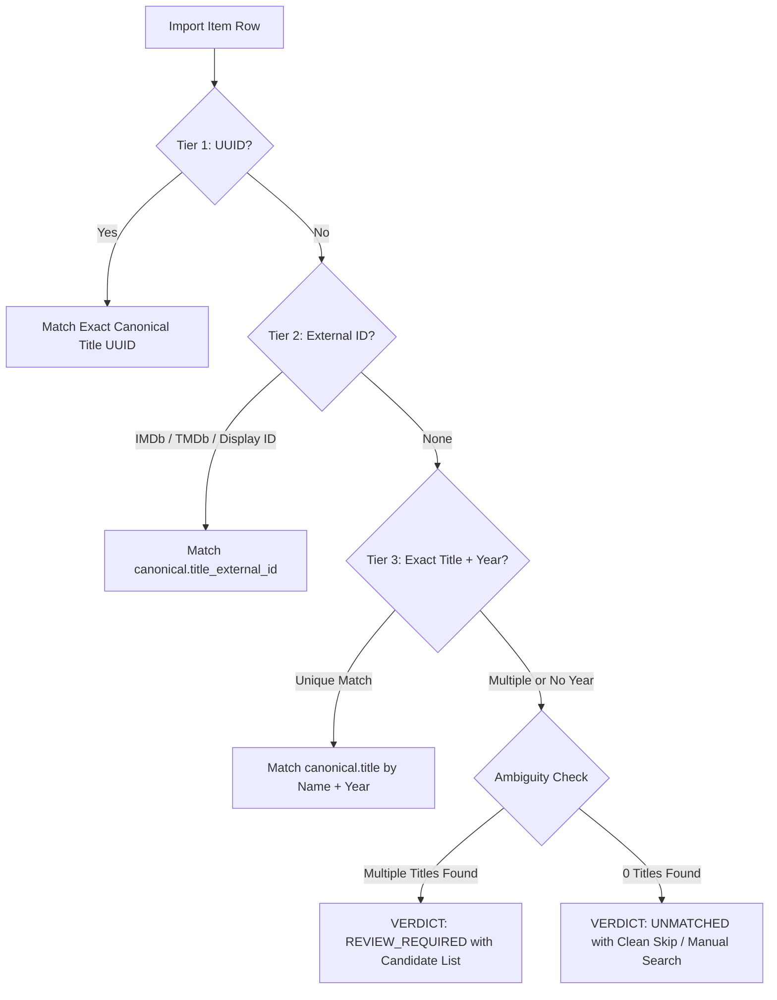

# CineVault OS — Personal Data Portability & Export Format Specification

**Document Version:** 2.0.0  
**Phase:** W8 (Import / Export & Personal Data Portability)  
**Status:** Canonical & Production Verified  

---

## 1. Executive Overview & Guiding Philosophy

CineVault is built on the **Data Ownership First** principle (ADR-004). A user's personal viewing history, ratings, private logs, reviews, and custom lists belong entirely to them.

The Personal Data Portability system satisfies 8 non-negotiable guarantees:

1. **Complete & Lossless**: Exports contain all relational personal tables without lossy aggregation.
2. **Deterministic Identity Resolution**: 4-tier matching prevents false catalog matches.
3. **Idempotent Import**: Repeated imports of identical watch events or notes deduplicate safely without duplicate rows.
4. **Loss-Aware Conflict Strategies**: Users choose explicit resolution policies (`KEEP_EXISTING`, `OVERWRITE`, `MERGE`).
5. **Spreadsheet Formula Injection Defense**: User text starting with `=`, `+`, `-`, `@`, `\t`, `\r` is escaped on export and cleanly unescaped on import.
6. **Strict User Data Isolation**: Zero IDOR leakage across user boundaries.
7. **Multi-Format Versatility**: JSON v2.0 (lossless backup), CSV ZIP (data science / relational migration), Excel `.xlsx` (spreadsheet analysis), Markdown `.md` (human-readable archive).
8. **Free-First & Local**: No third-party cloud lock-in or paid APIs required.

---

## 2. Export Format Specifications

### 2.1 Format 1: Lossless JSON v2.0 Archive

- **MIME Type:** `application/json`
- **Filename Pattern:** `cinevault_export_{username}_{YYYYMMDD_HHMMSS}.json`
- **Root Schema (`schema_version: "2.0.0"`):**

```json
{
  "schema_version": "2.0.0",
  "exported_at": "2026-08-30T15:30:00.000000+00:00",
  "user_id": "018f4a00-0000-7000-8000-000000000099",
  "user_profile": {
    "user_id": "018f4a00-0000-7000-8000-000000000099",
    "email": "user@cinevault.local",
    "display_name": "Cinephile Dev",
    "role": "authenticated_user",
    "created_at": "2026-01-01T00:00:00Z"
  },
  "library": [
    {
      "title_id": "018f2e4a-7b31-7000-8000-123456789ac4",
      "canonical_title": "Blade Runner 2049",
      "production_year": 2017,
      "added_at": "2026-08-01T12:00:00Z",
      "status_override": "COMPLETED"
    }
  ],
  "watchlist": [
    {
      "title_id": "018f2e4a-7b31-7000-8000-123456789ac5",
      "canonical_title": "Dune: Part Two",
      "production_year": 2024,
      "added_at": "2026-08-05T10:00:00Z",
      "status_override": "WATCHLIST"
    }
  ],
  "watch_history": [
    {
      "watch_event_id": "6e05d43f-566f-4b7a-9c92-091647b9b28c",
      "title_id": "018f2e4a-7b31-7000-8000-123456789ac4",
      "canonical_title": "Blade Runner 2049",
      "production_year": 2017,
      "watched_at": "2026-08-10T20:00:00Z",
      "season_number": null,
      "episode_number": null,
      "episode_name": null,
      "notes": "IMAX re-release screening with Dolby Atmos",
      "device_type": "Theater"
    }
  ],
  "ratings": [
    {
      "rating_id": "f8523894-822b-49c4-9ba9-e238e45a341b",
      "title_id": "018f2e4a-7b31-7000-8000-123456789ac4",
      "canonical_title": "Blade Runner 2049",
      "production_year": 2017,
      "rating_value": 10,
      "rated_at": "2026-08-10T22:45:00Z"
    }
  ],
  "user_title_states": [
    {
      "title_id": "018f2e4a-7b31-7000-8000-123456789ac4",
      "canonical_title": "Blade Runner 2049",
      "production_year": 2017,
      "manual_status_override": "COMPLETED",
      "is_favorite": true,
      "updated_at": "2026-08-10T22:45:00Z"
    }
  ],
  "private_notes": [
    {
      "note_id": "6f63d27f-a810-4962-b15a-051a1e5eec2a",
      "title_id": "018f2e4a-7b31-7000-8000-123456789ac4",
      "canonical_title": "Blade Runner 2049",
      "production_year": 2017,
      "note_text": "Roger Deakins' color palette is breathtaking.",
      "created_at": "2026-08-10T22:50:00Z"
    }
  ],
  "reviews": [
    {
      "review_id": "4a72d3f1-0000-7000-8000-000000000001",
      "title_id": "018f2e4a-7b31-7000-8000-123456789ac4",
      "canonical_title": "Blade Runner 2049",
      "production_year": 2017,
      "review_title": "A Masterpiece of Neo-Noir Cinema",
      "review_text": "Expands the philosophical core of the original film.",
      "contains_spoilers": false,
      "created_at": "2026-08-11T09:00:00Z"
    }
  ],
  "custom_lists": [
    {
      "list_id": "8b92c4e0-0000-7000-8000-000000000001",
      "title": "All-Time Sci-Fi Pantheon",
      "description": "The definitive sci-fi masterworks.",
      "is_private": false,
      "items": [
        {
          "item_id": "018f2e4a-0000-7000-8000-000000000001",
          "title_id": "018f2e4a-7b31-7000-8000-123456789ac4",
          "canonical_title": "Blade Runner 2049",
          "production_year": 2017,
          "position": 1,
          "custom_note": "Unmatched atmosphere and pacing"
        }
      ]
    }
  ],
  "streak": {
    "current_streak": 5,
    "longest_streak": 28,
    "last_watch_date": "2026-08-30"
  }
}
```

---

### 2.2 Format 2: Relational CSV ZIP Bundle

- **MIME Type:** `application/zip`
- **Filename Pattern:** `cinevault_export_{username}_{YYYYMMDD_HHMMSS}.zip`
- **Contents:**
  1. `manifest.json`: Export metadata, schema version, table inventory, row counts.
  2. `library.csv`: Personal library entries with status overrides and timestamps.
  3. `watch_history.csv`: Append-only historical watch events (title, season, episode, timestamp, notes, device).
  4. `ratings.csv`: User 1–10 star ratings and rated timestamps.
  5. `notes.csv`: Private cinephile logs and personal viewing reflections.
  6. `reviews.csv`: Published or draft critiques and spoiler flags.
  7. `custom_lists.csv`: Curated user collections and custom ordering.

---

### 2.3 Format 3: Multi-Sheet Excel Workbook (`.xlsx`)

- **MIME Type:** `application/vnd.openxmlformats-officedocument.spreadsheetml.sheet`
- **Filename Pattern:** `cinevault_export_{username}_{YYYYMMDD_HHMMSS}.xlsx`
- **Sheets:**
  - `Overview`: User profile summary, streak telemetry, total counts, and schema info.
  - `Library & Watchlist`: Canonical title, release year, status override, date added.
  - `Watch Events`: Watched timestamp, title, season/episode numbering, viewing notes.
  - `Ratings`: Title, release year, numerical score (1–10), date rated.
  - `Notes & Reviews`: Private notes, review titles, review text, spoiler status.
  - `Collections`: Custom list names, privacy flags, title item order, item notes.

---

### 2.4 Format 4: Human-Readable Markdown (`.md`)

- **MIME Type:** `text/markdown`
- **Filename Pattern:** `cinevault_export_{username}_{YYYYMMDD_HHMMSS}.md`
- **Layout:**
  - Header: CineVault Personal Media Archive, User ID, Export Date.
  - Section 1: Overview & Streak Statistics.
  - Section 2: Library & Watchlist Tables.
  - Section 3: Chronological Watch Log History.
  - Section 4: Star Ratings.
  - Section 5: Private Cinephile Notes & Published Reviews.
  - Section 6: Curated Custom Collections.

---

## 3. Four-Tier Identity Resolution Engine

When importing external files (Letterboxd CSV, Trakt, Samsung Notes text, CineVault JSON), CineVault resolves catalog records through a 4-tier deterministic waterfall:



1. **Tier 1 (UUID Match):** Exact 1.0 confidence match against `canonical.title.title_id`.
2. **Tier 2 (External ID / Display ID):** Exact 1.0 confidence match against external identifiers (IMDb `tt...`, TMDb ID, CineVault Display ID).
3. **Tier 3 (Exact Canonical Title + Production Year):** High confidence (0.95) when both name and year match a single canonical title.
4. **Tier 4 (Disambiguation / Review Required):** If multiple candidate titles match the name (e.g. remakes, sequels) or the year is absent, CineVault **NEVER** arbitrarily picks one. Instead, it returns `REVIEW_REQUIRED` alongside candidate cards (`title`, `year`, `poster_url`, `display_id`) enabling 1-click user disambiguation.

---

## 4. Conflict Resolution Strategies

When imported records collide with existing personal records:

| Conflict Strategy | Behavior |
| :--- | :--- |
| **`KEEP_EXISTING` (Default)** | Existing ratings, status overrides, and notes in the database are preserved untouched. New watch events are appended only if distinct. |
| **`OVERWRITE`** | Incoming import values overwrite existing ratings, title status overrides, and favorite flags. |
| **`MERGE`** | Non-null imported fields fill in missing database values without overwriting existing non-null data. |

---

## 5. Security & Privacy Guarantees

1. **Spreadsheet Formula Injection Defense:**
   - Any user-authored string starting with `=`, `+`, `-`, `@`, `\t`, `\r` is escaped with a leading single quote (`'`) during CSV and XLSX generation.
   - When parsed back during import, `strip_formula_prefix` removes the protective quote so user notes remain unmodified.
2. **Strict User Isolation & IDOR Protection:**
   - Export and import queries filter strictly on `request.state.user_id`.
   - Foreign keys to titles are validated against the global catalog; personal foreign keys (`user_id`) cannot be spoofed.
